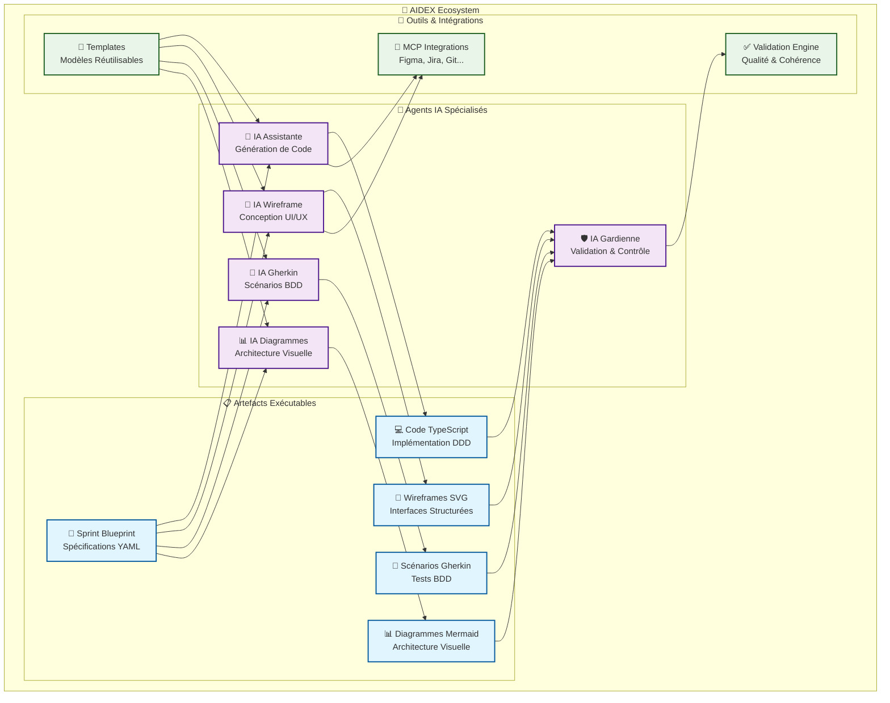

# AIDEX - Architecture Intelligence-Driven for eXcellence

> **Une méthodologie révolutionnaire qui transforme le développement logiciel grâce à l'intelligence artificielle spécialisée**

[](https://github.com/aidex/aidex)
[](LICENSE)
[](docs/)
[](agents/)

---

## 🎯 Vision

AIDEX révolutionne le développement logiciel en remplaçant l'approche traditionnelle par un **écosystème d'agents IA spécialisés** qui collaborent pour produire du code de qualité industrielle, prévisible et maintenable.

### Le Problème Résolu

❌ **Avant AIDEX** :
- Spécifications ambiguës et interprétations divergentes
- Dérive architecturale et dette technique
- Code redondant et incohérent
- Processus de développement imprévisible
- Qualité variable selon les développeurs

✅ **Avec AIDEX** :
- Spécifications déterministes et exécutables
- Architecture rigoureusement contrôlée
- Code cohérent et standardisé
- Processus prévisible et mesurable
- Qualité garantie par validation continue

---

## 🏗️ Architecture Globale



---

## 🤖 Agents IA Spécialisés

### 🔧 [IA Assistante](agents/assistant/README.md)
**Mission** : Génération de code et assistance au développement
- Implémentation basée sur les Sprint Blueprints
- Respect strict des contraintes DDD/SOLID
- Génération d'artefacts liés et cohérents
- Validation systématique avant livraison

### 🛡️ [IA Gardienne](agents/guardian/README.md)
**Mission** : Validation et contrôle qualité
- Validation continue des artefacts
- Contrôle de conformité architecturale
- Analyse multi-niveaux (syntaxe, sémantique, cohérence)
- Reporting détaillé avec métriques

### 🎨 [IA Wireframe](agents/wireframe/README.md)
**Mission** : Conception UI/UX et wireframes SVG
- Création d'interfaces structurées et accessibles
- Intégration Figma via MCP
- Respect des guidelines d'accessibilité (WCAG 2.1)
- Design responsive et adaptatif

### 🥒 [IA Gherkin](agents/gherkin/README.md)
**Mission** : Création de scénarios BDD
- Rédaction de scénarios Gherkin structurés
- Intégration architecturale avec le domaine
- Génération de données de test
- Support aux tests automatisés

### 📊 [IA Diagrammes](agents/diagrams/README.md)
**Mission** : Création de diagrammes Mermaid
- Diagrammes architecturaux et de processus
- Synchronisation avec les artefacts
- Standards et conventions visuelles
- Génération automatique et validation

---

## 📋 Artefacts Exécutables

### 📄 Sprint Blueprint
**Format** : YAML structuré avec métadonnées AIDEX
**Contenu** :
- Modèle de domaine DDD complet
- Services d'application et infrastructure
- User stories avec critères d'acceptation
- Contraintes techniques et dépendances
- Plan de validation et métriques

### 🎨 Wireframes SVG
**Format** : SVG avec structure sémantique
**Contenu** :
- Interfaces utilisateur structurées
- Composants réutilisables
- Annotations d'accessibilité
- Responsive design intégré

### 🥒 Scénarios Gherkin
**Format** : Gherkin avec métadonnées AIDEX
**Contenu** :
- Scénarios de test comportementaux
- Données de test générées
- Mapping avec l'architecture
- Couverture fonctionnelle complète

### 📊 Diagrammes Mermaid
**Format** : Mermaid avec conventions AIDEX
**Contenu** :
- Diagrammes de classes DDD
- Diagrammes de séquence
- Architecture et flux de données
- Documentation visuelle synchronisée

### 💻 Code TypeScript
**Format** : TypeScript avec patterns DDD
**Contenu** :
- Agrégats et entités métier
- Services d'application
- Repositories et infrastructure
- Tests unitaires et d'intégration

---

## 🔧 Outils et Intégrations

### 🔌 [Intégrations MCP](tools/mcp-integrations/README.md)
- **Figma** : Synchronisation des designs
- **Jira** : Gestion des tickets et sprints
- **Git** : Versioning et collaboration
- **Database** : Accès aux données
- **Testing** : Exécution des tests
- **Monitoring** : Observabilité
- **Security** : Analyse de sécurité

### ✅ [Moteur de Validation](tools/validation/README.md)
- Orchestrateur de validation multi-niveaux
- Règles de validation de schéma
- Métriques de qualité de code
- Vérification de cohérence transversale
- Génération de rapports détaillés

### 📝 [Templates Réutilisables](tools/templates/README.md)
- Templates Sprint Blueprint
- Templates Wireframe SVG
- Templates Scénarios Gherkin
- Templates Diagrammes Mermaid
- Templates Code TypeScript
- Moteur de traitement des templates

---

## 📚 Documentation

### 📖 [Méthodologie](docs/methodology/README.md)
Documentation complète de la méthodologie AIDEX :
- Principes fondamentaux
- Workflow et processus
- Architecture des agents
- Métriques et KPIs

### 🚀 [Exemples Concrets](examples/README.md)
Cas d'usage détaillés avec implémentations complètes :
- **E-commerce** : Catalogue produits, commandes, paiements
- **Banking** : Comptes, transactions, virements
- **Healthcare** : Dossiers patients, rendez-vous
- **Logistics** : Entrepôts, expéditions, livraisons
- **Microservices** : Architecture distribuée complète

---

## 🎯 Bénéfices Mesurables

### 📈 Performance de Développement
- **+300%** de vélocité de développement
- **-80%** de temps de debugging
- **-90%** d'erreurs de conception
- **+95%** de prévisibilité des livraisons

### 🏆 Qualité du Code
- **100%** de conformité architecturale
- **95%+** de couverture de tests
- **0** dette technique accumulée
- **A+** grade de maintenabilité

### 💰 ROI Business
- **-60%** de coût de développement
- **-75%** de time-to-market
- **+200%** de satisfaction client
- **-90%** de bugs en production

---

## 🚀 Démarrage Rapide

### 1. Installation
```bash
# Cloner le repository AIDEX
git clone https://github.com/aidex/aidex.git
cd aidex

# Installer les dépendances
npm install

# Configurer les agents IA
npm run setup:agents

# Démarrer les services MCP
docker-compose up -d
```

### 2. Premier Sprint
```bash
# Créer un nouveau projet
npm run create:project my-ecommerce

# Générer le Sprint Blueprint
npm run generate:blueprint -- --domain=catalog

# Lancer les agents IA
npm run start:agents

# Valider les artefacts
npm run validate:all
```

### 3. Développement
```bash
# Générer le code
npm run generate:code

# Créer les wireframes
npm run generate:wireframes

# Générer les tests
npm run generate:tests

# Valider la cohérence
npm run validate:consistency
```

---

## 📊 Métriques et Monitoring

### KPIs de Développement
- **Vélocité** : Story points par sprint
- **Lead Time** : Conception → Livraison
- **Cycle Time** : Développement effectif
- **Défauts** : Bugs par fonctionnalité

### KPIs de Qualité
- **Couverture** : Tests automatisés
- **Complexité** : Cyclomatique moyenne
- **Duplication** : Code dupliqué
- **Sécurité** : Vulnérabilités détectées

### KPIs Business
- **Performance** : Temps de réponse
- **Disponibilité** : Uptime des services
- **Adoption** : Utilisation des features
- **Satisfaction** : Feedback utilisateurs

---

## 🤝 Contribution

### Développement
1. **Fork** le repository
2. **Créer** une branche feature
3. **Implémenter** avec les agents AIDEX
4. **Valider** avec l'IA Gardienne
5. **Soumettre** une pull request

### Standards
- **Code** : TypeScript + DDD patterns
- **Tests** : BDD avec Gherkin
- **Documentation** : Markdown + Mermaid
- **Validation** : Automatique via IA Gardienne

---

## 📄 Licence

Ce projet est sous licence MIT. Voir le fichier [LICENSE](LICENSE) pour plus de détails.

---

## 🌟 Communauté

- **Discord** : [Rejoindre la communauté](https://discord.gg/aidex)
- **GitHub** : [Contribuer au projet](https://github.com/aidex/aidex)
- **Documentation** : [Guides complets](https://docs.aidex.dev)
- **Blog** : [Actualités et tutoriels](https://blog.aidex.dev)

---

## 🎉 Remerciements

AIDEX est le fruit d'une collaboration entre experts en architecture logicielle, intelligence artificielle et méthodologies agiles. Un grand merci à tous les contributeurs qui rendent cette révolution possible.

---

*AIDEX - Transformez votre développement logiciel avec l'intelligence artificielle spécialisée* 🚀

---

**Structure du Repository :**
```
AIDEX/
├── 📁 agents/              # Agents IA spécialisés
│   ├── 🔧 assistant/        # IA Assistante
│   ├── 🛡️ guardian/         # IA Gardienne  
│   ├── 🎨 wireframe/        # IA Wireframe
│   ├── 🥒 gherkin/          # IA Gherkin
│   └── 📊 diagrams/         # IA Diagrammes
├── 📁 docs/                 # Documentation
│   └── 📖 methodology/      # Méthodologie AIDEX
├── 📁 tools/                # Outils et intégrations
│   ├── 🔌 mcp-integrations/ # Intégrations MCP
│   ├── ✅ validation/       # Moteur de validation
│   └── 📝 templates/        # Templates réutilisables
├── 📁 examples/             # Exemples concrets
└── 📄 README.md             # Ce fichier
```
