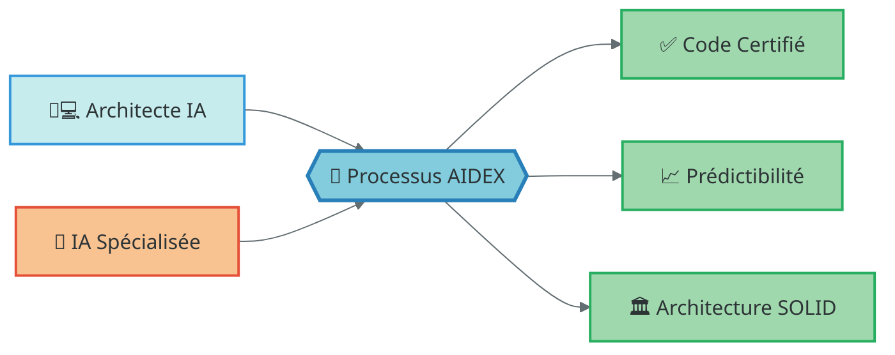
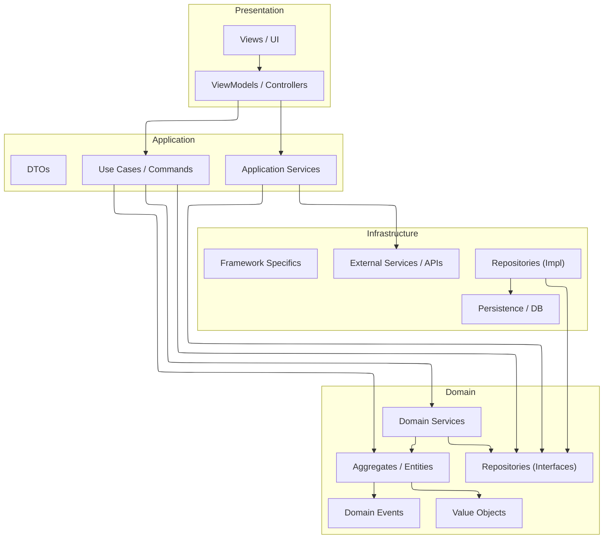
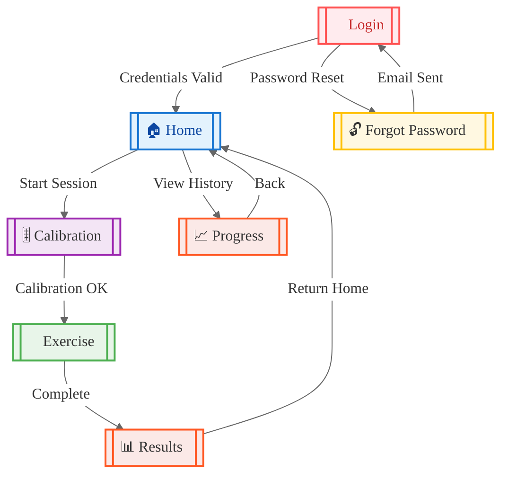
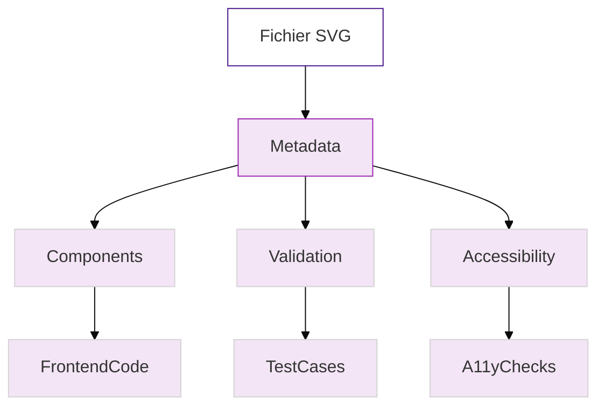
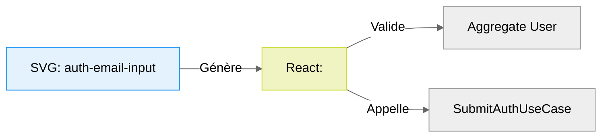
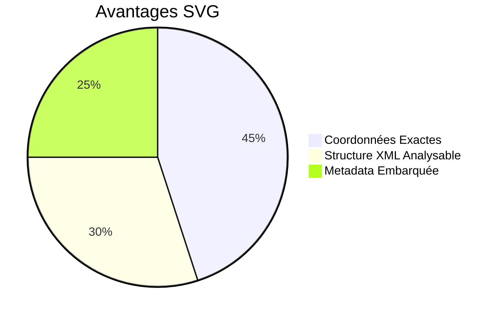
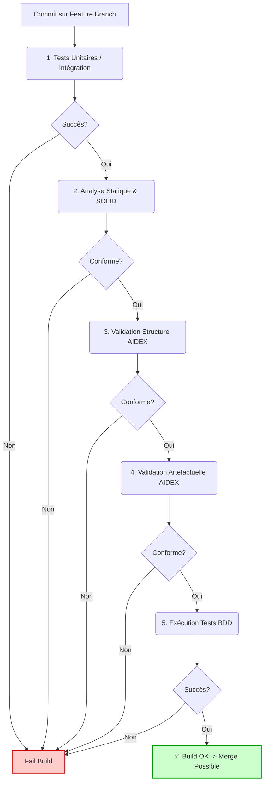

# ✨ AIDEX: AI-Integrated Development Experience ✨

**Une méthodologie agile pour une collaboration Homme-IA déterministe et efficace.**

---

## 🚀 Introduction

Bienvenue dans AIDEX (AI-Integrated Development Experience) ! Face à l'essor des IA génératives de code, le développement logiciel entre dans une nouvelle ère. Cependant, cette collaboration homme-IA présente des défis uniques : ambiguïté, perte de contrôle architectural, code redondant, et manque de prévisibilité.

**AIDEX est une méthodologie agile conçue spécifiquement pour structurer et optimiser cette collaboration.** Elle combine la flexibilité de l'agilité avec une **rigueur déterministe** grâce à des **artefacts exécutables** et un **cadrage précis** de l'intervention de l'IA.

L'objectif ? Permettre aux développeurs de tirer pleinement parti de la puissance de l'IA tout en garantissant la qualité, la cohérence et la maintenabilité du code produit.



---

## 🎯 Le Problème Adressé

Le développement assisté par IA, bien que prometteur, souffre souvent de :

*   **Ambiguïté d'Interprétation :** L'IA peut mal interpréter des spécifications vagues ou des principes architecturaux souples.
*   **Dérive Architecturale :** Des modifications incrémentales par l'IA peuvent éroder la structure globale sans contrôle strict.
*   **Code Redondant ou Mort :** L'IA peut recréer des fonctionnalités ou laisser du code inutilisé sans une vision globale claire.
*   **Manque de Prévisibilité :** Les résultats peuvent varier même avec des prompts similaires, rendant le processus peu fiable.
*   **Difficulté de Validation :** Valider le code généré par IA peut être aussi long, voire plus long, que de l'écrire soi-même sans cadre précis.

---

## 💡 La Solution AIDEX

AIDEX transforme la collaboration avec l'IA d'un dialogue potentiellement flou en une **exécution de contrat technique précis**. Au cœur de la méthodologie se trouve le **"AIDEX Sprint Blueprint"**, un document unique et détaillé qui sert de guide d'exécution strict pour l'IA et le développeur.

AIDEX repose sur **5 Piliers Fondamentaux** :

1.  **Spécificité Déterministe (Blueprint Central)** 📜
2.  **Rigidité Architecturale Contrôlée (DDD & SOLID comme Contraintes)** 🏛️
3.  **Artefacts Exécutables (Diagrammes & Tests comme Spécifications)** ⚙️
4.  **Intervention Scénarisée de l'IA (Scope Contrôlé)** 🤖➡️🎯
5.  **Validation Continue Intégrée** ✅

---

## 🏛️ Pilier 1 : Spécificité Déterministe (Blueprint Central)

Chaque Sprint démarre avec la création d'un **AIDEX Sprint Blueprint**. Ce n'est pas juste une liste de tâches, mais un **contrat d'exécution détaillé et immuable** contenant :

*   **Objectifs du Sprint :** Clairs et mesurables.
*   **Cartographie des Fichiers :** Liste *exacte* des fichiers à créer ou modifier, avec leur chemin absolu et leur responsabilité. L'IA ne touche *que* ces fichiers pour les tâches assignées.
*   **Diagrammes Mermaid Requis :** Spécifications visuelles de l'architecture, des flux, des états, etc. (Voir Pilier 3).
*   **Wireframes SVG Requis :** Contrats techniques pour l'UI, avec ID uniques et métadonnées (Voir Pilier 3).
*   **Scénarios Gherkin :** Spécifications comportementales exécutables (Voir Pilier 3).
*   **Règles Techniques Spécifiques :** Contraintes DDD/SOLID particulières au Sprint, métriques de performance ou de qualité attendues.

*Exemple simplifié de Cartographie dans un Blueprint :*


### Cartographie des Fichiers

| Chemin Absolu                                        | Statut   | Responsabilité Principale         | Artefacts Liés        |
| :--------------------------------------------------- | :------- | :-------------------------------- | :-------------------- |
| `src/domain/TherapySession/SessionAggregate.swift`   | Modifier | Gérer l'état d'une session        | `SessionStateDiagram` |
| `src/application/usecases/StartSessionUseCase.swift` | Créer    | Orchestrer le début d'une session | `Gherkin-StartSession`|
| `src/presentation/views/SessionView.swift`           | Modifier | Afficher l'interface de session   | `SessionView.svg`     |
| `src/infrastructure/repositories/SessionRepo.swift`  | Créer    | Persistance des sessions          | `ERD-Session`         |


---

## 🏗️ Pilier 2 : Rigidité Architecturale Contrôlée (DDD & SOLID)

AIDEX utilise DDD et SOLID non pas comme des guides philosophiques, mais comme des **contraintes techniques mesurables** pour l'IA.

### DDD Strict (Domain-Driven Design)

*   **Structure de Dossiers Imposée :** Une hiérarchie fixe (domain, application, infrastructure, presentation) doit être respectée.
*   **Manifestes (Optionnels ou intégrés au Blueprint) :** Chaque module/contexte délimité peut avoir un `_manifest.md` définissant ses règles internes et ses frontières, que l'IA doit respecter.
*   **Communication Inter-Couches Réglementée :** Les dépendances sont strictement contrôlées (ex: Domaine ne dépend *jamais* de l'Infrastructure).

*Exemple de Structure DDD visualisée :*



### SOLID comme Contrat

Chaque principe SOLID est traduit en règles concrètes et vérifiables :

*   **(S) Responsabilité Unique :** Limite stricte du nombre de méthodes publiques, de lignes par fichier, de dépendances. L'IA doit proposer une décomposition si une tâche viole ces limites.
*   **(O) Ouvert/Fermé :** Extensions via patrons spécifiés (Stratégie, Décorateur) définis dans le Blueprint. Modification directe du code existant interdite sauf si explicitement demandée.
*   **(L) Substitution de Liskov :** Vérifiée par des tests de contrat automatisés inclus dans le pipeline CI.
*   **(I) Ségrégation d'Interface :** Nombre maximum de méthodes par interface. L'IA doit proposer des interfaces spécifiques au client.
*   **(D) Inversion de Dépendance :** Dépendances injectées via interfaces définies dans la couche *appelante* (ou domaine). Interdiction d'instanciation directe de dépendances inter-couches.

---

## ⚙️ Pilier 3 : Artefacts Exécutables

Les diagrammes et les tests ne sont plus de la documentation passive, mais des **spécifications actives** que l'IA doit comprendre et respecter.

### Diagrammes Mermaid

*   **Contrat Visuel :** Le code *doit* correspondre aux diagrammes (`classDiagram` pour la structure du domaine, `stateDiagram` pour les états, `sequenceDiagram` pour les interactions, `flowchart` pour les processus, `graph` pour la navigation UI).
*   **Standardisation :** Des conventions strictes sont appliquées à chaque type de diagramme (nommage, orientation, niveau de détail).

*Exemple : Diagramme de Navigation UI*



### Wireframes SVG

*   **Contrat UI Précis :** Les SVG définissent la disposition, les composants *exacts* (avec `id` uniques) et même les comportements de base via métadonnées.
*   **Déterminisme Vectoriel :** Pas d'ambiguïté sur la position, la taille ou les relations entre éléments.
*   **Analyse par l'IA :** Le format XML du SVG est parsable et peut être utilisé pour générer le code UI et vérifier sa conformité.

Voici une version améliorée avec une documentation technique enrichie et des diagrammes intégrés :

# Wireframes Structurés en SVG

## Architecture du Format



## Exemple Détaillé avec Mise en Œuvre DDD

```svg
<!-- windsurf-app/src/ui/auth/login.svg -->
<svg xmlns="http://www.w3.org/2000/svg" 
     xmlns:aide="http://aide.org/ns"
     viewBox="0 0 800 600">

  <!-- Couche Composants -->
  <rect id="auth-email-input" 
        x="50" y="100" 
        width="300" height="40" 
        fill="#fff" stroke="#90caf9"/>
        
  <rect id="auth-submit-btn"
        x="50" y="160"
        width="120" height="40"
        fill="#2196f3" stroke="#1565c0"/>

  <!-- Métadonnées Structurées -->
  <metadata>
    <aide:component id="auth-email-input">
      <aide:validation 
        rule="^[a-zA-Z0-9._%+-]+@[a-zA-Z0-9.-]+\.[a-zA-Z]{2,}$"
        trigger="onBlur"
        errorMessage="Format email invalide"/>
        
      <aide:accessibility 
        role="textbox"
        aria-label="Adresse email"
        tabindex="1"/>
        
      <aide:binding 
        aggregate="UserAggregate"
        property="email"
        service="AuthService"/>
    </aide:component>

    <aide:component id="auth-submit-btn">
      <aide:action 
        type="click" 
        useCase="SubmitAuthUseCase"
        preConditions="valid(auth-email-input)"
        postConditions="userAuthenticated"/>
        
      <aide:accessibility 
        role="button"
        aria-label="Soumettre"
        keyboard-shortcut="Enter"/>
    </aide:component>
  </metadata>
</svg>
```

## Correspondance Code/Design



## Pourquoi SVG ?

1. **Précision Absolue**


2. **Cycle de Vie Intégré**
```
[Spécification SVG] --> [Génération Code] --> [Vérification Conformité]
                       ▲                      │
                       └──[Modification]◄─────┘
```

## Bonnes Pratiques

### Convention de Nommage
| Type         | Pattern               | Exemple          |
|--------------|-----------------------|------------------|
| Champ Saisie | `[context]-[type]-input` | `auth-email-input` |
| Bouton       | `[context]-[action]-btn` | `profile-save-btn` |

### Workflow Recommandé
1. Définir les `id` selon la convention
2. Annoter avec le namespace `aide:`
3. Lier aux aggregates DDD
4. Générer les tests Gherkin à partir des métadonnées

## Alternatives (Pourquoi Pas...)

| Format  | Problèmes Résolus par SVG       |
|---------|----------------------------------|
| PNG/JPG | Pas de métadonnées structurées  |
| Figma   | Dépendance à un service externe |
| PDF     | Difficulté d'analyse automatisée |

Cette approche combine la précision technique nécessaire aux IA avec la maintenabilité requise pour les développeurs humains, tout en restant compatible avec l'écosystème GitHub.


### Scénarios Gherkin (BDD)

*   **Contrat Comportemental :** Chaque `Feature` ou `Scenario` décrit un comportement attendu précis.
*   **Annotations Techniques :** Enrichi avec des tags (`@module`, `@perf`, `@ui`) pour guider l'implémentation et les tests.
*   **Lien Code-Test :** Chaque étape (`Given`, `When`, `Then`) doit correspondre à une action ou vérification spécifique dans le code.

*Extrait Gherkin avec annotations :*

```gherkin
# Fichier : features/authentication/login.feature
@module:Authentification @ui:LoginView.svg @perf:max_response_time=300ms
Scénario: Connexion réussie avec des identifiants valides
  Étant donné je suis sur la vue "<login-view>" définie dans "auth/LoginView.svg#screen-root"
    Et le service "<AuthService>" est disponible
    Et l'agrégat "<UserAggregate>" contient un utilisateur avec :
      | email           | password_hash                      |
      | test@windsurf.fr | $2a$10$N9qo8uLOickgx2ZMRZoMye3Z4d8T8.ZKNj.Ywq8VRQ2m3U2.6Qc7W |
  
  Quand je remplis le champ "#auth-email-input" avec "test@windsurf.fr"
    Et je remplis le champ "#auth-password-input" avec "Windsurf2024!"
    Et je clique sur le bouton "#auth-submit-btn" situé à (x=350, y=280)
  
  Alors je dois être redirigé vers la vue "<home-view>" dans les 300ms
    Et l'entité "<CurrentUser>" doit contenir :
      | property      | value          |
      | email         | test@windsurf.fr |
      | display_name  | SurfMaster     |
    Et le composant "#welcome-message" doit afficher "Bienvenue SurfMaster"
    Et l'événement de domaine "<UserLoggedInEvent>" doit être enregistré

# Scénarios complémentaires
@validation
Exemples: Cas de connexion invalide
  | email             | password       | erreur_attendue               |
  | invalid-email     | Windsurf2024!  | Format email invalide          |
  | test@windsurf.fr  | wrong-password | Identifiants incorrects        |
  | ""                | Windsurf2024!  | Email requis                   |

@security @bruteforce
Scénario: Blocage après 5 tentatives échouées
  Quand je tente de me connecter 5 fois avec des identifiants invalides
  Alors le composant "#auth-email-input" doit être désactivé
    Et le message "#account-locked-warning" doit contenir "Compte temporairement verrouillé"
    Et un email de vérification doit être envoyé via "<EmailService>"

```

---

## 🤖➡️🎯 Pilier 4 : Intervention Scénarisée de l'IA

L'IA est un outil puissant, mais son intervention est **strictement encadrée** :

*   **Périmètre Limité :** L'IA n'agit que sur les fichiers et les tâches *explicitement* listés dans le Blueprint pour une tâche donnée.
*   **Instructions Basées sur le Blueprint :** Les prompts doivent référencer les sections pertinentes du Blueprint (ex: "Implémente le `StartSessionUseCase` en respectant le `sequenceDiagram-StartSession` et la cartographie de fichiers BP-16").
*   **Rôles Clairs :** L'IA excelle pour la génération de code boilerplate, l'implémentation d'algorithmes définis, la création de tests unitaires basiques, la refactorisation locale et la documentation initiale. Les décisions architecturales majeures restent humaines.
*   **Validation Humaine Systématique :** Tout code généré par l'IA est sujet à revue par le développeur *avant* intégration, en vérifiant la conformité au Blueprint.

---

## ✅ Pilier 5 : Validation Continue Intégrée

La validation n'est pas une étape finale, mais un processus continu :

*   **Validation par Artefact :** Chaque diagramme, wireframe, scénario Gherkin est validé par rapport aux objectifs *avant* le début du codage.
*   **Pré-Revue par IA :** Le code soumis peut passer par une pré-revue automatisée par une IA "gardienne" vérifiant la conformité au Blueprint et aux règles SOLID/DDD.
*   **Pipeline CI/CD Enrichi :**
    1.  Tests Unitaires & Intégration
    2.  Analyse Statique (Linting, SOLID checks)
    3.  **Validation Structurelle AIDEX** (Conformité de la structure des dossiers)
    4.  **Validation Artefactuelle AIDEX** (Correspondance Code vs Diagrammes/SVG via outils spécifiques ou IA)
    5.  Exécution des Tests BDD (Gherkin)
    6.  Déploiement (si succès)

*Pipeline CI/CD AIDEX :*



---

## 🔄 Le Workflow AIDEX (Cycle de Sprint)

AIDEX adapte le cycle Scrum :

1.  **Sprint Planning :**
    *   Sélection des User Stories/Tâches du Backlog Produit.
    *   **CRÉATION DU SPRINT BLUEPRINT :** Le livrable principal du planning. Définit *tout* le travail du sprint de manière déterministe. C'est une étape collaborative intense (Architecte/Lead Dev, potentiellement assisté par IA pour la structure initiale).

2.  **Développement (Itérations Quotidiennes) :**
    *   Le développeur prend une tâche du Blueprint.
    *   Il utilise l'IA pour générer des parties du code/tests/artefacts, *en se basant strictement sur le Blueprint*.
    *   Le développeur valide/corrige/complète le travail de l'IA.
    *   Le code est commité sur une feature branch (GitFlow).
    *   Le pipeline CI/CD AIDEX valide la conformité.

3.  **Daily Standup :**
    *   Focalisé sur la progression par rapport au Blueprint.
    *   Identification des blocages ou des ambiguïtés *dans le Blueprint* (nécessitant potentiellement un amendement formel).
    *   Discussion sur l'efficacité de l'IA et les prompts utilisés.

4.  **Sprint Review :**
    *   Démonstration des fonctionnalités *complétées et validées* conformément au Blueprint.
    *   Le feedback est recueilli et utilisé pour alimenter le Backlog Produit.

5.  **Sprint Retrospective :**
    *   Analyse du processus du Sprint.
    *   Évaluation spécifique de la collaboration Homme-IA : Qu'est-ce qui a bien fonctionné ? Où l'IA a-t-elle failli ? Les prompts étaient-ils efficaces ? Le Blueprint était-il assez précis ?
    *   Identification des améliorations pour la *qualité des Blueprints futurs* et les *stratégies d'interaction avec l'IA*.

---

## 🎭 Rôles et Responsabilités

| Rôle                    | Acteur(s)             | Responsabilités Clés dans AIDEX                                                                                                                               |
| :---------------------- | :-------------------- | :------------------------------------------------------------------------------------------------------------------------------------------------------------ |
| **Product Owner**       | Humain                | Définit la vision produit, gère le Backlog Produit, priorise les fonctionnalités, valide les User Stories au niveau métier.                                    |
| **Architecte / Lead Dev** | Humain                | **Gardien de l'architecture**, **auteur principal du Sprint Blueprint**, définit les règles DDD/SOLID, valide les choix techniques majeurs, supervise la qualité. |
| **Développeur**         | Humain                | **Exécute le Blueprint**, guide l'IA avec des prompts précis basés sur le Blueprint, valide/corrige/intègre le code généré, écrit le code complexe/créatif.     |
| **IA Assistante**       | IA                    | **Génère du code/tests/artefacts** sur demande *dans le cadre strict du Blueprint*, effectue des refactorisations locales, aide à la documentation initiale.    |
| **IA Gardienne (CI/CD)**| IA (outils/scripts) | **Valide automatiquement** la conformité du code et des artefacts par rapport au Blueprint et aux règles définies (structure, SOLID, correspondance).             |
| **Scrum Master / Coach**| Humain                | Facilite le processus AIDEX, aide à lever les blocages, s'assure que la méthodologie est comprise et appliquée, anime les rétrospectives sur la collaboration Homme-IA. |

---

## 🎉 Bénéfices d'AIDEX

*   **Prévisibilité Accrue :** Le Blueprint réduit l'incertitude liée à l'IA.
*   **Qualité Contrôlée :** Les contraintes architecturales et la validation continue garantissent la qualité.
*   **Cohérence Architecturale :** Maintien de la structure globale malgré l'intervention de l'IA.
*   **Efficacité Optimisée :** L'IA accélère les tâches répétitives/structurées, libérant le développeur pour la complexité.
*   **Réduction du Code Mort/Redondant :** Le cadrage strict empêche l'IA de dévier.
*   **Documentation Intégrée :** Les artefacts (diagrammes, Gherkin) servent de documentation vivante.
*   **Onboarding Facilité :** Le Blueprint fournit un contexte clair pour les nouveaux arrivants (humains ou IA).
*   **Collaboration Structurée :** Définit clairement les rôles et les attentes entre humains et IA.

---

## 🚀 Participez !

AIDEX est une méthodologie en évolution. Nous cherchons activement des retours, des suggestions et des contributions de la communauté.

*   **Essayez AIDEX :** Adaptez ces principes à vos projets assistés par IA.
*   **Partagez votre Expérience :** Ouvrez une `Issue` pour discuter de vos succès, de vos défis ou proposer des améliorations.
*   **Contribuez :** Proposez des `Pull Requests` pour améliorer ce document, ajouter des exemples ou affiner les règles.

Ensemble, définissons le futur du développement logiciel en collaboration avec l'intelligence artificielle !

---

## 📄 Licence

[Choisissez une licence appropriée, ex: MIT, Apache 2.0]
```

**Quelques points à considérer pour l'implémentation :**

1.  **Outillage pour la Validation Artefactuelle :** C'est le point le plus complexe. Il faudra développer ou trouver des outils (ou utiliser des IA spécifiques) capables de comparer le code généré avec les diagrammes Mermaid et les SVG. Cela pourrait impliquer de parser les diagrammes/SVG et d'analyser l'AST (Abstract Syntax Tree) du code.
2.  **Qualité du Blueprint :** Le succès d'AIDEX dépend *énormément* de la précision et de l'exhaustivité du Blueprint. C'est un investissement initial important à chaque Sprint Planning.
3.  **Adaptabilité :** Bien que rigide dans son exécution, le processus *d'amendement* du Blueprint en cours de sprint doit être défini (par exemple, via une décision collégiale et une mise à jour formelle).
4.  **Formation :** Les développeurs doivent apprendre à créer des Blueprints efficaces et à formuler des prompts précis basés sur ces Blueprints.

Ce README.md fournit une base solide pour présenter AIDEX. Vous pouvez l'adapter et ajouter des liens vers des exemples plus concrets ou des outils spécifiques au fur et à mesure que le projet évolue.
