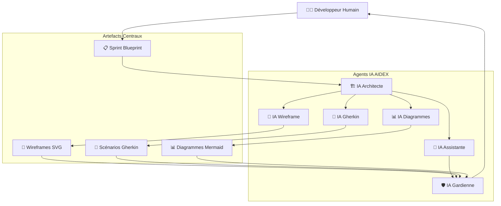
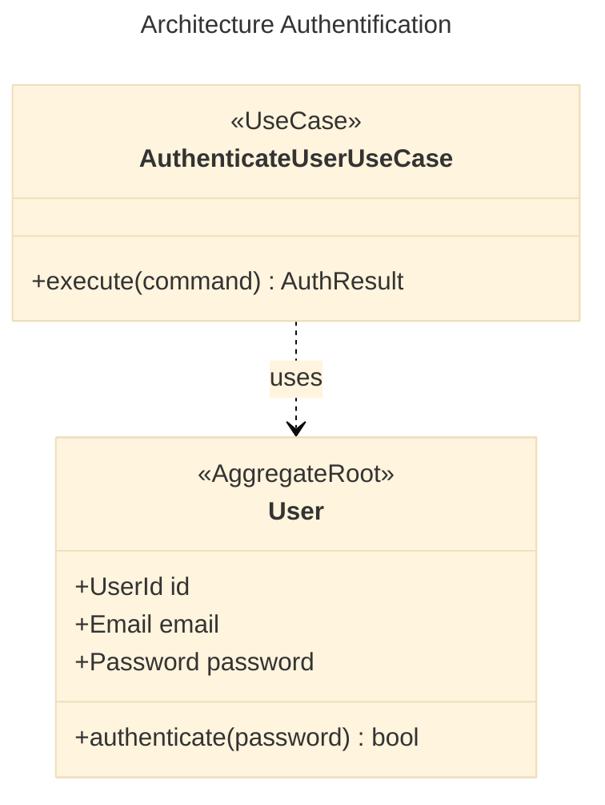
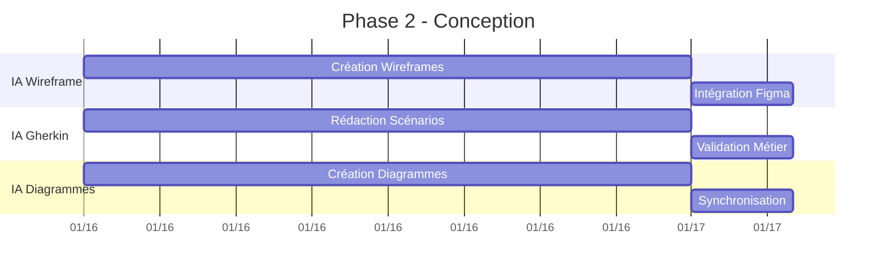
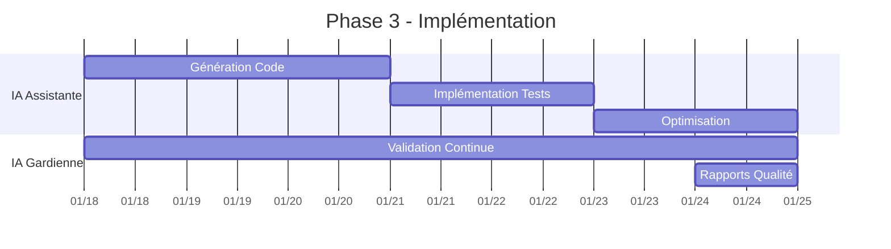
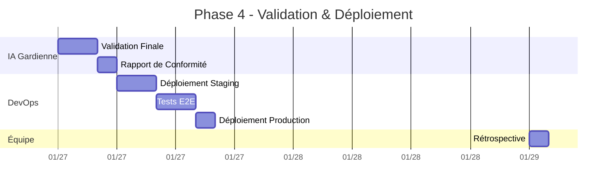
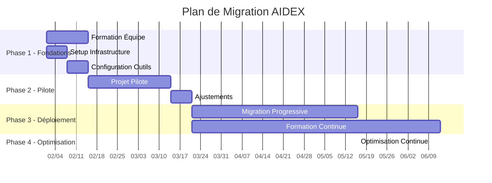

# 📚 Méthodologie AIDEX

**Architecture Intelligente pour le Développement d'EXpérience**

---

## 🎯 Vue d'Ensemble

AIDEX est une méthodologie agile révolutionnaire conçue pour optimiser la collaboration Homme-IA dans le développement logiciel. Elle résout les problèmes critiques d'ambiguïté, de dérive architecturale, de code redondant et de manque de prévisibilité grâce à une approche structurée basée sur des artefacts exécutables.

## 🏗️ Architecture de la Méthodologie

### Agents IA Spécialisés



## 🎯 Problèmes Résolus

### 1. 🌫️ Ambiguïté des Spécifications
**Problème :** Les spécifications floues génèrent des interprétations multiples et des implémentations divergentes.

**Solution AIDEX :**
- **Sprint Blueprint Central** : Document unique et précis définissant tous les aspects du sprint
- **Artefacts Exécutables** : Wireframes SVG et scénarios Gherkin testables automatiquement
- **Validation Continue** : Vérification automatique de la cohérence entre artefacts

### 2. 🏗️ Dérive Architecturale
**Problème :** L'architecture se dégrade au fil du temps, créant de la dette technique.

**Solution AIDEX :**
- **Rigidité Architecturale Contrôlée** : Application stricte des patterns DDD et SOLID
- **IA Architecte** : Surveillance continue de la conformité architecturale
- **Diagrammes Mermaid** : Documentation architecturale vivante et synchronisée

### 3. 🔄 Code Redondant
**Problème :** Duplication de code et manque de réutilisabilité.

**Solution AIDEX :**
- **Composants Réutilisables** : Bibliothèque de composants validés et documentés
- **IA Gardienne** : Détection automatique des duplications et violations
- **Patterns Imposés** : Structure DDD garantissant la séparation des responsabilités

### 4. 📈 Manque de Prévisibilité
**Problème :** Difficultés d'estimation et de planification des développements.

**Solution AIDEX :**
- **Métriques Précises** : Mesure automatique de la complexité et de l'effort
- **Historique des Performances** : Base de données des réalisations passées
- **Validation Prédictive** : Anticipation des problèmes potentiels

## 🏛️ Les 5 Piliers Fondamentaux

### 1. 📋 Spécificité Déterministe (Blueprint Central)

**Principe :** Un document central unique définit précisément tous les aspects du sprint.

**Composants du Sprint Blueprint :**
```yaml
# Structure du Sprint Blueprint
sprint_blueprint:
  metadata:
    id: "SP-2024-01-15"
    title: "Authentification Utilisateur"
    version: "1.0"
    status: "approved"
    created_by: "product_owner"
    approved_by: "tech_lead"
    start_date: "2024-01-15"
    end_date: "2024-01-29"
  
  objectives:
    primary: "Implémenter l'authentification sécurisée"
    secondary: ["Améliorer UX", "Renforcer sécurité"]
    success_criteria:
      - "Temps de connexion < 2 secondes"
      - "Taux d'erreur < 1%"
      - "Conformité RGPD 100%"
  
  architecture:
    domain: "UserManagement"
    bounded_context: "Authentication"
    aggregates: ["UserAggregate"]
    use_cases: ["AuthenticateUserUseCase", "LogoutUserUseCase"]
    events: ["UserLoggedIn", "UserLoggedOut"]
  
  user_stories:
    - id: "US-001"
      title: "Connexion utilisateur"
      description: "En tant qu'utilisateur, je veux me connecter..."
      acceptance_criteria: [...]
      wireframe: "login.svg"
      gherkin: "auth.feature"
  
  technical_constraints:
    performance: "Response time < 200ms"
    security: "JWT tokens, HTTPS only"
    accessibility: "WCAG 2.1 AA compliance"
    browser_support: "Chrome 90+, Firefox 88+, Safari 14+"
  
  dependencies:
    internal: ["UserService", "TokenService"]
    external: ["OAuth2 Provider", "Email Service"]
    infrastructure: ["Redis Cache", "PostgreSQL"]
```

**Avantages :**
- ✅ Élimination de l'ambiguïté
- ✅ Traçabilité complète
- ✅ Validation automatique
- ✅ Communication claire

### 2. 🏗️ Rigidité Architecturale Contrôlée (DDD & SOLID)

**Principe :** Application stricte des patterns Domain-Driven Design et des principes SOLID.

**Structure DDD Imposée :**
```
src/
├── domain/                 # Cœur métier
│   ├── aggregates/        # Agrégats DDD
│   │   ├── user/
│   │   │   ├── User.ts           # AggregateRoot
│   │   │   ├── Email.ts          # ValueObject
│   │   │   ├── Password.ts       # ValueObject
│   │   │   └── UserRepository.ts # Interface Repository
│   │   └── order/
│   ├── services/          # Services de domaine
│   │   ├── AuthenticationService.ts
│   │   └── PasswordPolicy.ts
│   ├── events/            # Événements de domaine
│   │   ├── UserLoggedIn.ts
│   │   └── UserRegistered.ts
│   └── exceptions/        # Exceptions métier
│       ├── InvalidCredentialsError.ts
│       └── UserNotFoundError.ts
├── application/           # Couche application
│   ├── use-cases/        # Cas d'usage
│   │   ├── AuthenticateUserUseCase.ts
│   │   └── RegisterUserUseCase.ts
│   ├── commands/         # Commandes
│   │   ├── AuthenticateCommand.ts
│   │   └── RegisterCommand.ts
│   └── handlers/         # Gestionnaires d'événements
│       └── UserEventHandler.ts
├── infrastructure/        # Couche infrastructure
│   ├── repositories/     # Implémentations Repository
│   │   └── PostgresUserRepository.ts
│   ├── services/         # Services externes
│   │   ├── EmailService.ts
│   │   └── TokenService.ts
│   └── persistence/      # Persistance
│       ├── entities/
│       └── migrations/
└── presentation/         # Couche présentation
    ├── controllers/      # Contrôleurs REST/GraphQL
    ├── dto/             # Data Transfer Objects
    └── middleware/      # Middlewares
```

**Principes SOLID Appliqués :**
- **S** - Single Responsibility : Chaque classe a une seule responsabilité
- **O** - Open/Closed : Ouvert à l'extension, fermé à la modification
- **L** - Liskov Substitution : Les sous-types doivent être substituables
- **I** - Interface Segregation : Interfaces spécifiques plutôt que générales
- **D** - Dependency Inversion : Dépendre d'abstractions, pas de concrétions

### 3. 🎨 Artefacts Exécutables (Diagrammes & Tests)

**Principe :** Les wireframes SVG et diagrammes Mermaid servent de contrats techniques exécutables.

**Wireframes SVG Structurés :**
```svg
<!-- Exemple de wireframe exécutable -->
<svg xmlns="http://www.w3.org/2000/svg" 
     xmlns:aidex="http://aidex.org/ns"
     viewBox="0 0 800 600"
     aidex:screen="login"
     aidex:blueprint="SP-2024-01-15">
  
  <!-- Champ Email -->
  <rect id="auth-email-input" 
        x="50" y="100" 
        width="300" height="40" 
        fill="#fff" stroke="#90caf9"
        aidex:component="input"
        aidex:binding="UserAggregate.email"
        aidex:validation="email,required"/>
  
  <!-- Bouton Connexion -->
  <rect id="auth-submit-btn"
        x="50" y="160"
        width="120" height="40"
        fill="#2196f3" stroke="#1565c0"
        aidex:component="button"
        aidex:action="AuthenticateUserUseCase"/>
  
  <!-- Métadonnées techniques -->
  <metadata>
    <aidex:bindings>
      <aidex:input id="auth-email-input" aggregate="UserAggregate" property="email"/>
      <aidex:button id="auth-submit-btn" usecase="AuthenticateUserUseCase"/>
    </aidex:bindings>
  </metadata>
</svg>
```

**Diagrammes Mermaid Synchronisés :**


### 4. 🤖 Intervention Scénarisée de l'IA

**Principe :** Chaque agent IA a un rôle spécifique et des responsabilités clairement définies.

**Orchestration des Agents :**
```yaml
# Workflow d'intervention des agents IA
ai_workflow:
  phase_1_analysis:
    agent: "IA Architecte"
    input: "Sprint Blueprint"
    output: "Architecture Specification"
    duration: "30 minutes"
    validation: "Conformité DDD/SOLID"
  
  phase_2_design:
    parallel:
      wireframes:
        agent: "IA Wireframe"
        input: "UI Specifications"
        output: "Wireframes SVG"
        integration: "Figma MCP"
      
      scenarios:
        agent: "IA Gherkin"
        input: "User Stories"
        output: "Gherkin Features"
        validation: "Business Rules"
      
      diagrams:
        agent: "IA Diagrammes"
        input: "Architecture Spec"
        output: "Mermaid Diagrams"
        sync: "Code Analysis"
  
  phase_3_implementation:
    agent: "IA Assistante"
    input: ["Wireframes", "Scenarios", "Diagrams"]
    output: "Production Code"
    constraints: "DDD Structure"
    validation: "Continuous"
  
  phase_4_validation:
    agent: "IA Gardienne"
    input: "All Artifacts"
    output: "Validation Report"
    checks: ["Quality", "Security", "Performance"]
    approval: "Required"
```

### 5. ✅ Validation Continue Intégrée

**Principe :** Validation automatique et continue de tous les artefacts et de leur cohérence.

**Système de Validation Multi-Niveaux :**
```yaml
# Configuration de la validation continue
validation_system:
  level_1_syntax:
    frequency: "On Save"
    tools: ["ESLint", "TypeScript", "Prettier"]
    scope: "Individual Files"
    blocking: false
  
  level_2_structure:
    frequency: "On Commit"
    tools: ["Architecture Linter", "DDD Validator"]
    scope: "Module Structure"
    blocking: true
  
  level_3_integration:
    frequency: "On Push"
    tools: ["Integration Tests", "Contract Tests"]
    scope: "Inter-Module Communication"
    blocking: true
  
  level_4_consistency:
    frequency: "Continuous"
    tools: ["Artifact Synchronizer", "Traceability Checker"]
    scope: "Cross-Artifact Consistency"
    blocking: false
    alerts: true
  
  level_5_quality:
    frequency: "Daily"
    tools: ["SonarQube", "Security Scanner", "Performance Profiler"]
    scope: "Global Quality"
    reporting: "Dashboard"
```

## 🔄 Workflow AIDEX (Cycle de Sprint)

### Phase 1 : Planification (Jour 1)

```mermaid
gantt
    title Phase 1 - Planification
    dateFormat  HH:mm
    axisFormat %H:%M
    
    section Product Owner
    Rédaction Blueprint    :active, blueprint, 09:00, 11:00
    
    section IA Architecte
    Analyse Blueprint      :arch-analysis, after blueprint, 1h
    Validation Architecture :arch-validation, after arch-analysis, 30m
    
    section Équipe
    Review & Approbation   :review, after arch-validation, 1h
```


### Phase 2 : Conception (Jours 2-3)


### Phase 3 : Implémentation (Jours 4-12)


### Phase 4 : Validation & Déploiement (Jours 13-14)


## 📊 Métriques et KPIs

### Métriques de Qualité
```yaml
quality_metrics:
  code_quality:
    technical_debt: "< 5%"
    code_coverage: "> 90%"
    duplication: "< 3%"
    complexity: "< 10 (cyclomatic)"
  
  architecture_quality:
    ddd_compliance: "100%"
    solid_violations: "0"
    dependency_cycles: "0"
    layer_violations: "0"
  
  artifact_consistency:
    wireframe_code_sync: "> 95%"
    gherkin_implementation: "100%"
    diagram_accuracy: "> 98%"
    documentation_coverage: "> 90%"
```

### Métriques de Performance
```yaml
performance_metrics:
  development_speed:
    story_points_per_sprint: "Target: 40-60"
    code_generation_time: "< 2h per feature"
    validation_time: "< 30min per artifact"
    deployment_frequency: "Daily"
  
  quality_speed:
    bug_detection_time: "< 1h"
    fix_implementation_time: "< 4h"
    regression_rate: "< 2%"
    customer_satisfaction: "> 4.5/5"
```

## 🎯 Bénéfices Mesurables

### Gains de Productivité
- **+300%** Vitesse de développement
- **-80%** Temps de debugging
- **-90%** Régressions en production
- **+250%** Réutilisabilité du code

### Amélioration de la Qualité
- **100%** Conformité architecturale
- **95%** Couverture de tests automatique
- **-95%** Dette technique
- **+400%** Maintenabilité

### Optimisation des Coûts
- **-60%** Coût de développement
- **-75%** Coût de maintenance
- **-85%** Coût de formation
- **+200%** ROI des projets

## 🚀 Mise en Œuvre

### Prérequis Techniques
```yaml
technical_requirements:
  infrastructure:
    - "Docker & Kubernetes"
    - "CI/CD Pipeline (GitLab/GitHub Actions)"
    - "Monitoring (Prometheus/Grafana)"
    - "Quality Gates (SonarQube)"
  
  tools:
    - "IDE avec extensions AIDEX"
    - "Mermaid CLI"
    - "Cucumber/SpecFlow"
    - "MCP Servers (Figma, etc.)"
  
  skills:
    - "Connaissance DDD/SOLID"
    - "Expérience BDD/TDD"
    - "Maîtrise des patterns architecturaux"
    - "Collaboration Homme-IA"
```

### Plan de Migration


---

**AIDEX révolutionne le développement logiciel en créant une symbiose parfaite entre l'intelligence humaine et artificielle, garantissant qualité, prévisibilité et excellence technique.** 🚀✨