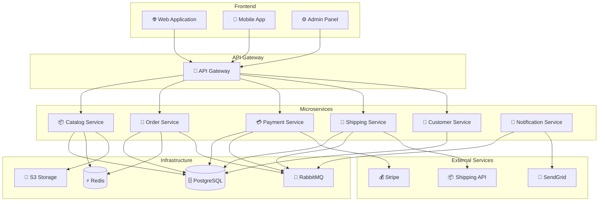
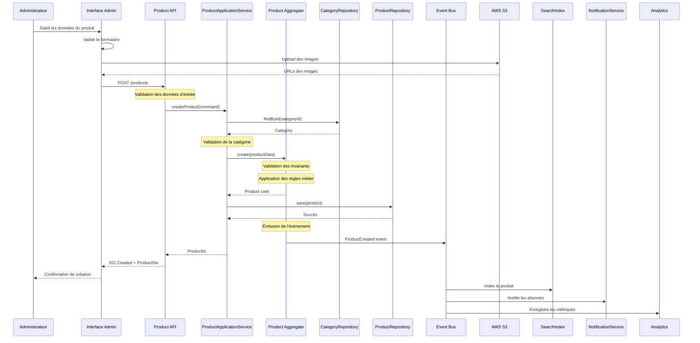

# 📚 Exemples AIDEX

**Cas d'usage concrets et exemples d'implémentation de la méthodologie AIDEX**

---

## 🎯 Vue d'Ensemble

Cette section présente des exemples concrets d'application de la méthodologie AIDEX, depuis la conception jusqu'à l'implémentation, en passant par tous les artefacts générés par les agents IA spécialisés.

## 🏗️ Structure des Exemples

```
examples/
├── e-commerce/              # Exemple complet e-commerce
│   ├── sprint-blueprints/    # Blueprints de sprints
│   ├── wireframes/          # Wireframes SVG
│   ├── scenarios/           # Scénarios Gherkin
│   ├── diagrams/            # Diagrammes Mermaid
│   ├── code/                # Code généré
│   └── documentation/       # Documentation
├── banking/                 # Exemple système bancaire
├── healthcare/              # Exemple système de santé
├── logistics/               # Exemple logistique
└── microservices/           # Exemple architecture microservices
```

## 🛒 Exemple E-Commerce

### Vue d'Ensemble
Système de commerce électronique avec gestion des produits, commandes, paiements et livraisons.

### Domaines Métier
- **Catalog** : Gestion du catalogue produits
- **Order** : Gestion des commandes
- **Payment** : Gestion des paiements
- **Shipping** : Gestion des livraisons
- **Customer** : Gestion des clients

### Architecture Globale


### Sprint 1 : Gestion du Catalogue Produits

#### Sprint Blueprint
```yaml
# SPRINT-2024-01 : Catalogue Produits
metadata:
  sprint_id: "SPRINT-2024-01"
  version: "1.0.0"
  created_date: "2024-01-15"
  created_by: "IA Architecte"
  project_name: "E-Commerce Platform"
  domain: "Catalog"
  status: "active"
  agents_involved:
    - "architect"
    - "assistant"
    - "guardian"
    - "wireframe"
    - "gherkin"
    - "diagrams"

objectives:
  primary_goal: "Implémenter la gestion complète du catalogue produits"
  success_criteria:
    - "CRUD complet des produits"
    - "Gestion des catégories et sous-catégories"
    - "Recherche et filtrage avancés"
    - "Gestion des stocks en temps réel"
    - "Interface d'administration intuitive"
  
  deliverables:
    - "API REST Catalog Service"
    - "Interface d'administration des produits"
    - "Système de recherche et filtrage"
    - "Gestion des images produits"
    - "Documentation API complète"

architecture:
  domain_model:
    bounded_context: "CatalogContext"
    
    aggregates:
      - name: "Product"
        root_entity: "Product"
        
        entities:
          - name: "Product"
            properties:
              - "id: ProductId"
              - "name: ProductName"
              - "description: ProductDescription"
              - "price: Money"
              - "category: Category"
              - "stock: Stock"
              - "images: ProductImage[]"
              - "attributes: ProductAttribute[]"
              - "status: ProductStatus"
              - "createdAt: DateTime"
              - "updatedAt: DateTime"
            
            invariants:
              - "Le nom du produit ne peut pas être vide"
              - "Le prix doit être positif"
              - "Le stock ne peut pas être négatif"
              - "Au moins une image est requise"
          
          - name: "ProductImage"
            properties:
              - "id: ProductImageId"
              - "url: ImageUrl"
              - "altText: string"
              - "order: number"
              - "isPrimary: boolean"
        
        value_objects:
          - name: "ProductId"
            properties:
              - "value: string"
            validation_rules:
              - "Format UUID valide"
          
          - name: "ProductName"
            properties:
              - "value: string"
            validation_rules:
              - "Longueur entre 3 et 100 caractères"
              - "Caractères alphanumériques et espaces uniquement"
          
          - name: "Money"
            properties:
              - "amount: number"
              - "currency: Currency"
            validation_rules:
              - "Montant positif"
              - "Maximum 2 décimales"
          
          - name: "Stock"
            properties:
              - "quantity: number"
              - "reserved: number"
              - "available: number"
            validation_rules:
              - "Quantités non négatives"
              - "available = quantity - reserved"
        
        domain_events:
          - name: "ProductCreated"
            properties:
              - "productId: ProductId"
              - "name: ProductName"
              - "categoryId: CategoryId"
              - "price: Money"
              - "occurredAt: DateTime"
            
            triggers:
              - "Création d'un nouveau produit"
          
          - name: "ProductUpdated"
            properties:
              - "productId: ProductId"
              - "changes: ProductChanges"
              - "occurredAt: DateTime"
            
            triggers:
              - "Modification des informations produit"
          
          - name: "StockUpdated"
            properties:
              - "productId: ProductId"
              - "previousStock: Stock"
              - "newStock: Stock"
              - "reason: StockUpdateReason"
              - "occurredAt: DateTime"
            
            triggers:
              - "Mise à jour du stock"
              - "Réservation de stock"
              - "Libération de stock"
        
        repositories:
          - name: "ProductRepository"
            interface: "IProductRepository"
            methods:
              - "findById(id: ProductId): Product"
              - "save(product: Product): void"
              - "delete(id: ProductId): void"
              - "findByCategory(categoryId: CategoryId): Product[]"
              - "search(criteria: SearchCriteria): ProductSearchResult"
              - "findLowStock(threshold: number): Product[]"
      
      - name: "Category"
        root_entity: "Category"
        
        entities:
          - name: "Category"
            properties:
              - "id: CategoryId"
              - "name: CategoryName"
              - "description: string"
              - "parentId: CategoryId?"
              - "level: number"
              - "order: number"
              - "isActive: boolean"
              - "createdAt: DateTime"
              - "updatedAt: DateTime"
            
            invariants:
              - "Le nom de catégorie doit être unique par niveau"
              - "Une catégorie ne peut pas être son propre parent"
              - "Le niveau doit correspondre à la hiérarchie"
        
        value_objects:
          - name: "CategoryId"
            properties:
              - "value: string"
          
          - name: "CategoryName"
            properties:
              - "value: string"
            validation_rules:
              - "Longueur entre 2 et 50 caractères"
        
        domain_events:
          - name: "CategoryCreated"
            properties:
              - "categoryId: CategoryId"
              - "name: CategoryName"
              - "parentId: CategoryId?"
              - "occurredAt: DateTime"
          
          - name: "CategoryUpdated"
            properties:
              - "categoryId: CategoryId"
              - "changes: CategoryChanges"
              - "occurredAt: DateTime"
        
        repositories:
          - name: "CategoryRepository"
            interface: "ICategoryRepository"
            methods:
              - "findById(id: CategoryId): Category"
              - "save(category: Category): void"
              - "delete(id: CategoryId): void"
              - "findByParent(parentId: CategoryId): Category[]"
              - "findRootCategories(): Category[]"
              - "findCategoryTree(): CategoryTree"
  
  application_services:
    - name: "ProductApplicationService"
      responsibilities:
        - "Orchestration des cas d'usage produits"
        - "Coordination avec le service de catégories"
        - "Gestion des transactions"
        - "Publication des événements"
      
      use_cases:
        - "CreateProduct"
        - "UpdateProduct"
        - "DeleteProduct"
        - "GetProductById"
        - "SearchProducts"
        - "UpdateStock"
        - "ReserveStock"
        - "ReleaseStock"
    
    - name: "CategoryApplicationService"
      responsibilities:
        - "Gestion de la hiérarchie des catégories"
        - "Validation des contraintes de hiérarchie"
        - "Synchronisation avec les produits"
      
      use_cases:
        - "CreateCategory"
        - "UpdateCategory"
        - "DeleteCategory"
        - "GetCategoryTree"
        - "MoveCategory"
  
  infrastructure:
    persistence:
      type: "PostgreSQL"
      schema: "catalog"
      
      tables:
        - name: "products"
          columns:
            - "id UUID PRIMARY KEY"
            - "name VARCHAR(100) NOT NULL"
            - "description TEXT"
            - "price_amount DECIMAL(10,2) NOT NULL"
            - "price_currency VARCHAR(3) NOT NULL"
            - "category_id UUID NOT NULL"
            - "stock_quantity INTEGER NOT NULL DEFAULT 0"
            - "stock_reserved INTEGER NOT NULL DEFAULT 0"
            - "status VARCHAR(20) NOT NULL"
            - "created_at TIMESTAMP NOT NULL"
            - "updated_at TIMESTAMP NOT NULL"
            - "version INTEGER NOT NULL DEFAULT 1"
        
        - name: "product_images"
          columns:
            - "id UUID PRIMARY KEY"
            - "product_id UUID NOT NULL"
            - "url VARCHAR(500) NOT NULL"
            - "alt_text VARCHAR(200)"
            - "order_index INTEGER NOT NULL"
            - "is_primary BOOLEAN NOT NULL DEFAULT FALSE"
        
        - name: "categories"
          columns:
            - "id UUID PRIMARY KEY"
            - "name VARCHAR(50) NOT NULL"
            - "description TEXT"
            - "parent_id UUID"
            - "level INTEGER NOT NULL"
            - "order_index INTEGER NOT NULL"
            - "is_active BOOLEAN NOT NULL DEFAULT TRUE"
            - "created_at TIMESTAMP NOT NULL"
            - "updated_at TIMESTAMP NOT NULL"
    
    messaging:
      type: "RabbitMQ"
      exchanges:
        - name: "catalog.events"
          type: "topic"
      
      queues:
        - name: "catalog.product.created"
          routing_key: "catalog.product.created"
        - name: "catalog.product.updated"
          routing_key: "catalog.product.updated"
        - name: "catalog.stock.updated"
          routing_key: "catalog.stock.updated"
        - name: "catalog.category.created"
          routing_key: "catalog.category.created"
        - name: "catalog.category.updated"
          routing_key: "catalog.category.updated"
    
    file_storage:
      type: "AWS S3"
      buckets:
        - name: "ecommerce-product-images"
          access: "public-read"
          cdn: "CloudFront"

user_stories:
  - id: "US-001"
    title: "Créer un produit"
    description: "En tant qu'administrateur, je veux pouvoir créer un nouveau produit avec toutes ses informations"
    
    acceptance_criteria:
      - "Je peux saisir le nom, description, prix et catégorie"
      - "Je peux uploader plusieurs images"
      - "Je peux définir les attributs spécifiques"
      - "Le produit est automatiquement en statut 'draft'"
      - "Un ID unique est généré automatiquement"
    
    story_points: 8
    priority: "high"
    
    technical_notes:
      - "Implémenter dans l'agrégat Product"
      - "Valider les contraintes métier"
      - "Émettre l'événement ProductCreated"
      - "Gérer l'upload des images vers S3"
    
    dependencies: ["US-005"]
    
    definition_of_done:
      - "API POST /products implémentée"
      - "Validation des données d'entrée"
      - "Tests unitaires et d'intégration"
      - "Interface d'administration fonctionnelle"
      - "Documentation API mise à jour"
  
  - id: "US-002"
    title: "Modifier un produit"
    description: "En tant qu'administrateur, je veux pouvoir modifier les informations d'un produit existant"
    
    acceptance_criteria:
      - "Je peux modifier toutes les propriétés du produit"
      - "Les modifications sont tracées"
      - "L'événement ProductUpdated est émis"
      - "La version du produit est incrémentée"
    
    story_points: 5
    priority: "high"
    
    dependencies: ["US-001"]
  
  - id: "US-003"
    title: "Rechercher des produits"
    description: "En tant qu'utilisateur, je veux pouvoir rechercher des produits par nom, catégorie et attributs"
    
    acceptance_criteria:
      - "Recherche textuelle sur nom et description"
      - "Filtrage par catégorie"
      - "Filtrage par fourchette de prix"
      - "Filtrage par attributs"
      - "Tri par pertinence, prix, date"
      - "Pagination des résultats"
    
    story_points: 13
    priority: "high"
    
    technical_notes:
      - "Implémenter avec Elasticsearch pour la performance"
      - "Index de recherche synchronisé avec les événements"
      - "Cache des résultats fréquents"
  
  - id: "US-004"
    title: "Gérer le stock"
    description: "En tant qu'administrateur, je veux pouvoir gérer le stock des produits"
    
    acceptance_criteria:
      - "Mise à jour manuelle du stock"
      - "Réservation automatique lors des commandes"
      - "Libération du stock en cas d'annulation"
      - "Alertes de stock faible"
      - "Historique des mouvements de stock"
    
    story_points: 8
    priority: "medium"
  
  - id: "US-005"
    title: "Gérer les catégories"
    description: "En tant qu'administrateur, je veux pouvoir organiser les produits en catégories hiérarchiques"
    
    acceptance_criteria:
      - "Création de catégories et sous-catégories"
      - "Déplacement de catégories dans la hiérarchie"
      - "Suppression avec gestion des produits associés"
      - "Affichage de l'arbre des catégories"
    
    story_points: 8
    priority: "high"

technical_constraints:
  architecture_principles:
    - "Domain-Driven Design (DDD)"
    - "Principes SOLID"
    - "Clean Architecture"
    - "Event Sourcing pour l'audit"
  
  technology_stack:
    backend:
      language: "TypeScript"
      framework: "NestJS"
      database: "PostgreSQL"
      messaging: "RabbitMQ"
      search: "Elasticsearch"
      cache: "Redis"
      storage: "AWS S3"
    
    frontend:
      language: "TypeScript"
      framework: "React"
      styling: "Tailwind CSS"
      state_management: "Redux Toolkit"
    
    testing:
      unit_tests: "Jest"
      integration_tests: "Supertest"
      e2e_tests: "Cypress"
      bdd_tests: "Cucumber"
  
  quality_gates:
    code_coverage: "90%"
    cyclomatic_complexity: "10"
    duplication_ratio: "5%"
    security_scan: "required"
    performance: "API response < 200ms"

acceptance_criteria:
  functional:
    - "CRUD complet des produits et catégories"
    - "Recherche et filtrage performants"
    - "Gestion du stock en temps réel"
    - "Upload et gestion des images"
  
  technical:
    - "Architecture DDD respectée"
    - "Événements domaine correctement émis"
    - "Performance de recherche < 200ms"
    - "Disponibilité 99.9%"
  
  quality:
    - "Couverture de tests 90%"
    - "Documentation API complète"
    - "Interface utilisateur intuitive"
    - "Accessibilité WCAG 2.1 AA"

dependencies:
  internal:
    - "Service d'authentification"
    - "Service de notification"
  
  external:
    - "AWS S3 pour le stockage des images"
    - "CloudFront pour la CDN"
    - "Elasticsearch pour la recherche"
  
  technical:
    - "PostgreSQL 15+"
    - "Redis 7+"
    - "RabbitMQ 3.11+"
    - "Node.js 18+"

metrics:
  development:
    - "Vélocité : 40 story points par sprint"
    - "Temps de cycle moyen : 2 jours par story"
    - "Taux de bugs : < 5% par story"
  
  quality:
    - "Couverture de tests : 90%"
    - "Complexité cyclomatique : < 10"
    - "Duplication de code : < 5%"
    - "Vulnérabilités critiques : 0"
  
  business:
    - "Temps de réponse API : < 200ms"
    - "Disponibilité : 99.9%"
    - "Temps de recherche : < 100ms"
    - "Taux de conversion : +15%"

validation_plan:
  phases:
    - name: "Validation Architecture"
      responsible: "IA Architecte"
      criteria:
        - "Conformité DDD"
        - "Respect des principes SOLID"
        - "Cohérence des interfaces"
        - "Performance des requêtes"
    
    - name: "Validation Fonctionnelle"
      responsible: "IA Gherkin"
      criteria:
        - "Scénarios BDD passent"
        - "Couverture des cas d'usage"
        - "Validation des règles métier"
        - "Tests d'intégration"
    
    - name: "Validation UI/UX"
      responsible: "IA Wireframe"
      criteria:
        - "Interface conforme aux wireframes"
        - "Accessibilité WCAG 2.1"
        - "Responsive design"
        - "Performance frontend"
    
    - name: "Validation Qualité"
      responsible: "IA Gardienne"
      criteria:
        - "Métriques de qualité respectées"
        - "Sécurité validée"
        - "Performance acceptable"
        - "Documentation complète"
```

#### Wireframes Principaux

##### Interface de Gestion des Produits
```xml
<!-- product-management.svg -->
<svg xmlns="http://www.w3.org/2000/svg" 
     viewBox="0 0 1400 900"
     data-aidex-version="1.0.0"
     data-aidex-type="wireframe"
     data-aidex-sprint="SPRINT-2024-01">
  
  <metadata data-aidex="true">
    <aidex:wireframe>
      <aidex:id>WF-CATALOG-001</aidex:id>
      <aidex:title>Interface de Gestion des Produits</aidex:title>
      <aidex:description>Interface d'administration pour la gestion du catalogue produits</aidex:description>
      <aidex:user_story>US-001, US-002</aidex:user_story>
      <aidex:created_by>IA Wireframe</aidex:created_by>
      <aidex:created_at>2024-01-15</aidex:created_at>
    </aidex:wireframe>
  </metadata>
  
  <!-- Styles -->
  <defs>
    <style type="text/css">
      <![CDATA[
        .container { fill: #ffffff; stroke: #e0e0e0; stroke-width: 1; }
        .header { fill: #1976d2; stroke: #1565c0; }
        .sidebar { fill: #f5f5f5; stroke: #e0e0e0; }
        .content { fill: #ffffff; stroke: #e0e0e0; }
        .button-primary { fill: #4caf50; stroke: #45a049; }
        .button-secondary { fill: #2196f3; stroke: #1976d2; }
        .button-danger { fill: #f44336; stroke: #d32f2f; }
        .input { fill: #ffffff; stroke: #cccccc; }
        .table-header { fill: #f5f5f5; stroke: #e0e0e0; }
        .table-row { fill: #ffffff; stroke: #f0f0f0; }
        .text { font-family: 'Segoe UI', sans-serif; font-size: 14px; fill: #333; }
        .text-white { fill: #ffffff; }
        .text-small { font-size: 12px; fill: #666; }
        .title { font-size: 24px; font-weight: bold; fill: #1976d2; }
      ]]>
    </style>
  </defs>
  
  <!-- Layout Principal -->
  <g id="main-layout">
    
    <!-- Header -->
    <g id="header" class="header">
      <rect x="0" y="0" width="1400" height="80"/>
      
      <!-- Logo -->
      <text x="30" y="50" class="text-white title">E-Commerce Admin</text>
      
      <!-- Navigation -->
      <g id="nav-menu">
        <rect x="300" y="25" width="100" height="30" fill="#1565c0" rx="4"/>
        <text x="350" y="45" class="text-white text" text-anchor="middle">Catalogue</text>
        
        <rect x="420" y="25" width="100" height="30" fill="transparent" stroke="#ffffff" rx="4"/>
        <text x="470" y="45" class="text-white text" text-anchor="middle">Commandes</text>
        
        <rect x="540" y="25" width="100" height="30" fill="transparent" stroke="#ffffff" rx="4"/>
        <text x="590" y="45" class="text-white text" text-anchor="middle">Clients</text>
      </g>
      
      <!-- User Menu -->
      <circle cx="1350" cy="40" r="20" fill="#ffffff" opacity="0.2"/>
      <text x="1350" y="45" class="text-white text" text-anchor="middle">A</text>
    </g>
    
    <!-- Sidebar -->
    <g id="sidebar" class="sidebar" transform="translate(0, 80)">
      <rect x="0" y="0" width="250" height="820"/>
      
      <!-- Menu Catalogue -->
      <g id="catalog-menu">
        <text x="20" y="30" class="text title" font-size="18">Catalogue</text>
        
        <!-- Produits -->
        <g id="products-menu">
          <rect x="10" y="50" width="230" height="40" fill="#e3f2fd" stroke="#2196f3" rx="4"/>
          <text x="25" y="75" class="text">📦 Produits</text>
          <text x="220" y="75" class="text-small">1,247</text>
        </g>
        
        <!-- Catégories -->
        <g id="categories-menu">
          <rect x="10" y="100" width="230" height="40" fill="transparent" stroke="#e0e0e0" rx="4"/>
          <text x="25" y="125" class="text">📁 Catégories</text>
          <text x="220" y="125" class="text-small">23</text>
        </g>
        
        <!-- Stock -->
        <g id="stock-menu">
          <rect x="10" y="150" width="230" height="40" fill="transparent" stroke="#e0e0e0" rx="4"/>
          <text x="25" y="175" class="text">📊 Stock</text>
          <text x="200" y="175" class="text-small" fill="#f44336">⚠️ 12</text>
        </g>
        
        <!-- Rapports -->
        <g id="reports-menu">
          <rect x="10" y="200" width="230" height="40" fill="transparent" stroke="#e0e0e0" rx="4"/>
          <text x="25" y="225" class="text">📈 Rapports</text>
        </g>
      </g>
    </g>
    
    <!-- Contenu Principal -->
    <g id="main-content" class="content" transform="translate(250, 80)">
      <rect x="0" y="0" width="1150" height="820"/>
      
      <!-- Header de contenu -->
      <g id="content-header">
        <text x="30" y="40" class="title">Gestion des Produits</text>
        
        <!-- Actions principales -->
        <g id="main-actions">
          <rect x="900" y="15" width="120" height="35" class="button-primary" rx="4"/>
          <text x="960" y="37" class="text-white text" text-anchor="middle">+ Nouveau Produit</text>
          
          <rect x="1030" y="15" width="100" height="35" class="button-secondary" rx="4"/>
          <text x="1080" y="37" class="text-white text" text-anchor="middle">Importer</text>
        </g>
      </g>
      
      <!-- Filtres et recherche -->
      <g id="filters" transform="translate(0, 70)">
        <rect x="0" y="0" width="1150" height="60" fill="#fafafa" stroke="#e0e0e0"/>
        
        <!-- Barre de recherche -->
        <g id="search-bar">
          <rect x="20" y="15" width="300" height="30" class="input" rx="4"/>
          <text x="30" y="35" class="text-small" opacity="0.6">🔍 Rechercher un produit...</text>
        </g>
        
        <!-- Filtres -->
        <g id="filter-controls">
          <!-- Catégorie -->
          <rect x="340" y="15" width="150" height="30" class="input" rx="4"/>
          <text x="350" y="35" class="text-small" opacity="0.6">Toutes catégories ▼</text>
          
          <!-- Statut -->
          <rect x="510" y="15" width="120" height="30" class="input" rx="4"/>
          <text x="520" y="35" class="text-small" opacity="0.6">Tous statuts ▼</text>
          
          <!-- Prix -->
          <rect x="650" y="15" width="100" height="30" class="input" rx="4"/>
          <text x="660" y="35" class="text-small" opacity="0.6">Prix min</text>
          
          <rect x="760" y="15" width="100" height="30" class="input" rx="4"/>
          <text x="770" y="35" class="text-small" opacity="0.6">Prix max</text>
          
          <!-- Bouton filtrer -->
          <rect x="880" y="15" width="80" height="30" class="button-secondary" rx="4"/>
          <text x="920" y="35" class="text-white text" text-anchor="middle">Filtrer</text>
        </g>
      </g>
      
      <!-- Tableau des produits -->
      <g id="products-table" transform="translate(0, 130)">
        
        <!-- En-tête du tableau -->
        <g id="table-header" class="table-header">
          <rect x="0" y="0" width="1150" height="40"/>
          
          <!-- Colonnes -->
          <text x="20" y="25" class="text" font-weight="bold">Image</text>
          <text x="100" y="25" class="text" font-weight="bold">Nom</text>
          <text x="350" y="25" class="text" font-weight="bold">Catégorie</text>
          <text x="500" y="25" class="text" font-weight="bold">Prix</text>
          <text x="600" y="25" class="text" font-weight="bold">Stock</text>
          <text x="700" y="25" class="text" font-weight="bold">Statut</text>
          <text x="800" y="25" class="text" font-weight="bold">Créé le</text>
          <text x="950" y="25" class="text" font-weight="bold">Actions</text>
        </g>
        
        <!-- Lignes de produits -->
        <g id="product-rows">
          
          <!-- Produit 1 -->
          <g id="product-1" class="table-row">
            <rect x="0" y="40" width="1150" height="60" stroke-width="0.5"/>
            
            <!-- Image -->
            <rect x="15" y="50" width="40" height="40" fill="#f0f0f0" stroke="#ddd" rx="4"/>
            <text x="35" y="75" class="text-small" text-anchor="middle">IMG</text>
            
            <!-- Nom -->
            <text x="100" y="65" class="text" font-weight="bold">MacBook Pro 16"</text>
            <text x="100" y="80" class="text-small">Ordinateur portable haute performance</text>
            
            <!-- Catégorie -->
            <text x="350" y="70" class="text">Informatique > Ordinateurs</text>
            
            <!-- Prix -->
            <text x="500" y="70" class="text" font-weight="bold">2 499,00 €</text>
            
            <!-- Stock -->
            <text x="600" y="70" class="text">15</text>
            
            <!-- Statut -->
            <rect x="700" y="60" width="60" height="20" fill="#4caf50" rx="10"/>
            <text x="730" y="73" class="text-white text" text-anchor="middle" font-size="11">Actif</text>
            
            <!-- Date -->
            <text x="800" y="70" class="text-small">15/01/2024</text>
            
            <!-- Actions -->
            <g id="actions-1">
              <rect x="950" y="55" width="30" height="25" class="button-secondary" rx="3"/>
              <text x="965" y="70" class="text-white text" text-anchor="middle" font-size="11">✏️</text>
              
              <rect x="990" y="55" width="30" height="25" fill="#ff9800" stroke="#f57c00" rx="3"/>
              <text x="1005" y="70" class="text-white text" text-anchor="middle" font-size="11">👁️</text>
              
              <rect x="1030" y="55" width="30" height="25" class="button-danger" rx="3"/>
              <text x="1045" y="70" class="text-white text" text-anchor="middle" font-size="11">🗑️</text>
            </g>
          </g>
          
          <!-- Produit 2 -->
          <g id="product-2" class="table-row">
            <rect x="0" y="100" width="1150" height="60" stroke-width="0.5"/>
            
            <rect x="15" y="110" width="40" height="40" fill="#f0f0f0" stroke="#ddd" rx="4"/>
            <text x="35" y="135" class="text-small" text-anchor="middle">IMG</text>
            
            <text x="100" y="125" class="text" font-weight="bold">iPhone 15 Pro</text>
            <text x="100" y="140" class="text-small">Smartphone dernière génération</text>
            
            <text x="350" y="130" class="text">Téléphonie > Smartphones</text>
            <text x="500" y="130" class="text" font-weight="bold">1 199,00 €</text>
            <text x="600" y="130" class="text" fill="#f44336">3</text>
            
            <rect x="700" y="120" width="60" height="20" fill="#ff9800" rx="10"/>
            <text x="730" y="133" class="text-white text" text-anchor="middle" font-size="11">Stock bas</text>
            
            <text x="800" y="130" class="text-small">14/01/2024</text>
            
            <g id="actions-2">
              <rect x="950" y="115" width="30" height="25" class="button-secondary" rx="3"/>
              <text x="965" y="130" class="text-white text" text-anchor="middle" font-size="11">✏️</text>
              
              <rect x="990" y="115" width="30" height="25" fill="#ff9800" stroke="#f57c00" rx="3"/>
              <text x="1005" y="130" class="text-white text" text-anchor="middle" font-size="11">👁️</text>
              
              <rect x="1030" y="115" width="30" height="25" class="button-danger" rx="3"/>
              <text x="1045" y="130" class="text-white text" text-anchor="middle" font-size="11">🗑️</text>
            </g>
          </g>
          
          <!-- Produit 3 -->
          <g id="product-3" class="table-row">
            <rect x="0" y="160" width="1150" height="60" stroke-width="0.5"/>
            
            <rect x="15" y="170" width="40" height="40" fill="#f0f0f0" stroke="#ddd" rx="4"/>
            <text x="35" y="195" class="text-small" text-anchor="middle">IMG</text>
            
            <text x="100" y="185" class="text" font-weight="bold">AirPods Pro 2</text>
            <text x="100" y="200" class="text-small">Écouteurs sans fil avec réduction de bruit</text>
            
            <text x="350" y="190" class="text">Audio > Écouteurs</text>
            <text x="500" y="190" class="text" font-weight="bold">279,00 €</text>
            <text x="600" y="190" class="text">42</text>
            
            <rect x="700" y="180" width="60" height="20" fill="#9e9e9e" rx="10"/>
            <text x="730" y="193" class="text-white text" text-anchor="middle" font-size="11">Brouillon</text>
            
            <text x="800" y="190" class="text-small">13/01/2024</text>
            
            <g id="actions-3">
              <rect x="950" y="175" width="30" height="25" class="button-secondary" rx="3"/>
              <text x="965" y="190" class="text-white text" text-anchor="middle" font-size="11">✏️</text>
              
              <rect x="990" y="175" width="30" height="25" fill="#ff9800" stroke="#f57c00" rx="3"/>
              <text x="1005" y="190" class="text-white text" text-anchor="middle" font-size="11">👁️</text>
              
              <rect x="1030" y="175" width="30" height="25" class="button-danger" rx="3"/>
              <text x="1045" y="190" class="text-white text" text-anchor="middle" font-size="11">🗑️</text>
            </g>
          </g>
        </g>
      </g>
      
      <!-- Pagination -->
      <g id="pagination" transform="translate(0, 750)">
        <rect x="0" y="0" width="1150" height="50" fill="#fafafa" stroke="#e0e0e0"/>
        
        <text x="30" y="30" class="text-small">Affichage de 1 à 20 sur 1,247 produits</text>
        
        <!-- Contrôles pagination -->
        <g id="pagination-controls">
          <rect x="900" y="15" width="30" height="20" class="input" rx="3"/>
          <text x="915" y="28" class="text-small" text-anchor="middle">‹</text>
          
          <rect x="940" y="15" width="30" height="20" fill="#2196f3" stroke="#1976d2" rx="3"/>
          <text x="955" y="28" class="text-white text" text-anchor="middle" font-size="11">1</text>
          
          <rect x="980" y="15" width="30" height="20" class="input" rx="3"/>
          <text x="995" y="28" class="text-small" text-anchor="middle">2</text>
          
          <rect x="1020" y="15" width="30" height="20" class="input" rx="3"/>
          <text x="1035" y="28" class="text-small" text-anchor="middle">3</text>
          
          <text x="1065" y="28" class="text-small">...</text>
          
          <rect x="1080" y="15" width="30" height="20" class="input" rx="3"/>
          <text x="1095" y="28" class="text-small" text-anchor="middle">›</text>
        </g>
      </g>
    </g>
  </g>
  
  <!-- Annotations -->
  <g id="annotations">
    <circle cx="960" cy="32" r="12" fill="#ff5722" opacity="0.8"/>
    <text cx="960" cy="36" class="text-white text" text-anchor="middle" font-size="10">1</text>
    
    <circle cx="350" cy="32" r="12" fill="#ff5722" opacity="0.8"/>
    <text cx="350" cy="36" class="text-white text" text-anchor="middle" font-size="10">2</text>
    
    <circle cx="570" cy="32" r="12" fill="#ff5722" opacity="0.8"/>
    <text cx="570" cy="36" class="text-white text" text-anchor="middle" font-size="10">3</text>
  </g>
</svg>
```

#### Scénarios Gherkin

##### Gestion des Produits
```gherkin
# product-management.feature
@aidex:sprint:SPRINT-2024-01
@aidex:story:US-001
@aidex:aggregate:Product
@aidex:priority:high
@aidex:complexity:medium

Feature: Gestion des Produits
  En tant qu'administrateur du catalogue
  Je veux pouvoir gérer les produits
  Afin de maintenir un catalogue à jour et attractif
  
  Background:
    Given le système de catalogue est initialisé
    And l'utilisateur "admin" est authentifié
    And il a les permissions "CATALOG_ADMIN"
    And la catégorie "Informatique" existe avec l'ID "cat-001"
  
  @aidex:scenario:happy_path
  @aidex:test_type:functional
  Scenario: Création d'un nouveau produit
    Création réussie d'un produit avec toutes les informations requises
    
    Given aucun produit avec le nom "MacBook Pro 16 pouces" n'existe
    And j'ai préparé les données du produit:
      | champ       | valeur                           |
      | nom         | MacBook Pro 16 pouces           |
      | description | Ordinateur portable performant  |
      | prix        | 2499.00                         |
      | devise      | EUR                             |
      | categoryId  | cat-001                         |
      | stock       | 10                              |
    
    When je crée le produit avec ces données
    
    Then le produit est créé avec succès
    And il reçoit un identifiant unique au format UUID
    And le statut du produit est "DRAFT"
    And la date de création est définie à maintenant
    And la version est initialisée à 1
    
    # Vérifications des événements domaine
    And l'événement "ProductCreated" est émis
    And l'événement "ProductCreated" contient:
      | propriété   | valeur                    |
      | productId   | <ID généré>              |
      | name        | MacBook Pro 16 pouces    |
      | categoryId  | cat-001                  |
      | price       | 2499.00 EUR              |
      | occurredAt  | <timestamp actuel>       |
      | version     | 1                        |
    
    # Vérifications de persistance
    And le produit est sauvegardé en base de données
    And je peux retrouver le produit par son ID
  
  @aidex:scenario:business_rules
  @aidex:test_type:functional
  Scenario: Validation des règles métier lors de la création
    Vérification que les invariants de l'agrégat sont respectés
    
    Given je prépare des données de produit valides
    
    When je crée le produit
    
    Then les règles métier suivantes sont validées:
      | règle                                    | vérification                           |
      | Le nom ne peut pas être vide            | nom non vide et non null               |
      | Le prix doit être positif               | prix > 0                               |
      | Le stock ne peut pas être négatif       | stock >= 0                             |
      | La catégorie doit exister               | categoryId référence une catégorie     |
      | La devise doit être valide              | devise dans la liste des devises       |
    
    And aucune exception n'est levée
    And le produit respecte tous les invariants
  
  @aidex:scenario:error_path
  @aidex:test_type:negative
  Scenario Outline: Gestion des erreurs de création
    Validation des cas d'erreur et des messages appropriés
    
    Given je prépare des données de produit avec "<champ_invalide>" = "<valeur_invalide>"
    
    When je tente de créer le produit
    
    Then le système retourne une erreur "<type_erreur>"
    And le message d'erreur est "<message_erreur>"
    And aucun produit n'est créé
    And aucun événement domaine n'est émis
    
    Examples:
      | champ_invalide | valeur_invalide | type_erreur           | message_erreur                           |
      | nom           | ""              | VALIDATION_ERROR      | Le nom du produit ne peut pas être vide |
      | nom           | null            | VALIDATION_ERROR      | Le nom du produit est requis             |
      | prix          | -10.00          | BUSINESS_RULE_ERROR   | Le prix doit être positif                |
      | prix          | 0               | BUSINESS_RULE_ERROR   | Le prix doit être supérieur à zéro       |
      | stock         | -5              | BUSINESS_RULE_ERROR   | Le stock ne peut pas être négatif        |
      | categoryId    | "inexistant"    | REFERENCE_ERROR       | La catégorie spécifiée n'existe pas      |
      | devise        | "XXX"           | VALIDATION_ERROR      | Devise non supportée                     |
  
  @aidex:scenario:update
  @aidex:test_type:functional
  Scenario: Modification d'un produit existant
    Mise à jour des informations d'un produit avec gestion de la version
    
    Given un produit existe avec l'ID "prod-001" et les données:
      | champ       | valeur                    |
      | nom         | MacBook Pro 14 pouces    |
      | prix        | 2199.00                   |
      | stock       | 5                         |
      | version     | 1                         |
    
    When je modifie le produit "prod-001" avec:
      | champ | nouvelle_valeur     |
      | nom   | MacBook Pro 14" M3  |
      | prix  | 2299.00            |
      | stock | 8                  |
    
    Then le produit est mis à jour avec succès
    And la version est incrémentée à 2
    And la date de modification est mise à jour
    
    And l'événement "ProductUpdated" est émis
    And l'événement "ProductUpdated" contient:
      | propriété | valeur                                    |
      | productId | prod-001                                  |
      | changes   | nom, prix, stock                          |
      | version   | 2                                         |
    
    And les modifications sont persistées en base
  
  @aidex:scenario:stock_management
  @aidex:test_type:functional
  Scenario: Gestion du stock produit
    Mise à jour du stock avec traçabilité des mouvements
    
    Given un produit existe avec l'ID "prod-001" et un stock de 10 unités
    And aucune réservation n'est en cours
    
    When je mets à jour le stock à 15 unités avec la raison "RESTOCK"
    
    Then le stock du produit est mis à jour à 15
    And le stock disponible est de 15
    And l'événement "StockUpdated" est émis avec:
      | propriété     | valeur    |
      | productId     | prod-001  |
      | previousStock | 10        |
      | newStock      | 15        |
      | reason        | RESTOCK   |
    
    And l'historique des mouvements de stock est enregistré
  
  @aidex:scenario:stock_reservation
  @aidex:test_type:functional
  Scenario: Réservation de stock
    Réservation temporaire de stock pour une commande
    
    Given un produit existe avec l'ID "prod-001"
    And le stock total est de 10 unités
    And le stock réservé est de 0
    And le stock disponible est de 10
    
    When je réserve 3 unités pour la commande "order-001"
    
    Then la réservation est effectuée avec succès
    And le stock total reste à 10
    And le stock réservé passe à 3
    And le stock disponible passe à 7
    
    And l'événement "StockReserved" est émis avec:
      | propriété    | valeur    |
      | productId    | prod-001  |
      | quantity     | 3         |
      | orderId      | order-001 |
      | reservedAt   | <now>     |
  
  @aidex:scenario:search
  @aidex:test_type:functional
  Scenario: Recherche de produits
    Recherche textuelle et filtrage des produits
    
    Given les produits suivants existent:
      | id       | nom              | catégorie    | prix   | stock |
      | prod-001 | MacBook Pro      | Informatique | 2499   | 10    |
      | prod-002 | iPhone 15        | Téléphonie   | 1199   | 25    |
      | prod-003 | iPad Pro         | Informatique | 1299   | 15    |
    
    When je recherche les produits avec les critères:
      | critère   | valeur       |
      | texte     | "Pro"        |
      | catégorie | Informatique |
      | prix_min  | 1000         |
      | prix_max  | 2000         |
    
    Then les résultats de recherche contiennent:
      | id       | nom      | pertinence |
      | prod-003 | iPad Pro | high       |
    
    And le nombre total de résultats est 1
    And la pagination indique la page 1 sur 1
    And le temps de réponse est inférieur à 200ms
  
  @aidex:scenario:security
  @aidex:test_type:security
  Scenario: Vérification des autorisations
    Validation que seuls les utilisateurs autorisés peuvent gérer les produits
    
    Given un utilisateur "user" sans permissions d'administration
    And il est authentifié dans le système
    
    When il tente de créer un produit
    
    Then le système retourne une erreur "UNAUTHORIZED"
    And le message indique "Permissions insuffisantes pour cette opération"
    And aucun produit n'est créé
    And un événement de sécurité "UnauthorizedAccess" est émis avec:
      | propriété | valeur           |
      | userId    | user             |
      | action    | CREATE_PRODUCT   |
      | resource  | /api/products    |
      | timestamp | <now>            |
  
  @aidex:scenario:performance
  @aidex:test_type:performance
  Scenario: Vérification des performances
    Validation que les opérations respectent les SLA de performance
    
    Given le système fonctionne sous charge normale
    And la base de données contient 10,000 produits
    
    When je crée un nouveau produit
    
    Then la réponse est retournée en moins de 500ms
    And l'utilisation CPU reste sous 70%
    And l'utilisation mémoire reste sous 512MB
    And la connexion à la base de données est libérée rapidement
    
    And les métriques de performance sont enregistrées:
      | métrique          | valeur    | seuil   |
      | temps_réponse     | <200ms    | 500ms   |
      | cpu_usage         | <50%      | 70%     |
      | memory_usage      | <300MB    | 512MB   |
      | db_connection_time| <50ms     | 100ms   |
```

##### Gestion des Catégories
```gherkin
# category-management.feature
@aidex:sprint:SPRINT-2024-01
@aidex:story:US-005
@aidex:aggregate:Category
@aidex:priority:high
@aidex:complexity:medium

Feature: Gestion des Catégories
  En tant qu'administrateur du catalogue
  Je veux pouvoir organiser les produits en catégories hiérarchiques
  Afin de faciliter la navigation et la recherche
  
  Background:
    Given le système de catalogue est initialisé
    And l'utilisateur "admin" est authentifié
    And il a les permissions "CATALOG_ADMIN"
  
  @aidex:scenario:create_root_category
  @aidex:test_type:functional
  Scenario: Création d'une catégorie racine
    Création d'une catégorie de premier niveau
    
    Given aucune catégorie avec le nom "Informatique" n'existe
    
    When je crée une catégorie racine avec:
      | champ       | valeur                           |
      | nom         | Informatique                     |
      | description | Produits informatiques et tech   |
      | order       | 1                                |
    
    Then la catégorie est créée avec succès
    And elle reçoit un identifiant unique
    And le niveau est défini à 0 (racine)
    And le parentId est null
    And le statut est "ACTIVE"
    
    And l'événement "CategoryCreated" est émis
    And l'événement contient:
      | propriété   | valeur       |
      | categoryId  | <ID généré>  |
      | name        | Informatique |
      | parentId    | null         |
      | level       | 0            |
  
  @aidex:scenario:create_subcategory
  @aidex:test_type:functional
  Scenario: Création d'une sous-catégorie
    Création d'une catégorie enfant avec validation de la hiérarchie
    
    Given une catégorie racine "Informatique" existe avec l'ID "cat-001"
    And son niveau est 0
    
    When je crée une sous-catégorie avec:
      | champ       | valeur       |
      | nom         | Ordinateurs  |
      | description | PC et Mac    |
      | parentId    | cat-001      |
      | order       | 1            |
    
    Then la sous-catégorie est créée avec succès
    And le niveau est automatiquement défini à 1
    And le parentId est "cat-001"
    
    And l'événement "CategoryCreated" est émis
    And la hiérarchie est cohérente
    And je peux récupérer l'arbre des catégories
  
  @aidex:scenario:category_tree
  @aidex:test_type:functional
  Scenario: Récupération de l'arbre des catégories
    Affichage de la hiérarchie complète des catégories
    
    Given les catégories suivantes existent:
      | id      | nom          | parentId | niveau |
      | cat-001 | Informatique | null     | 0      |
      | cat-002 | Ordinateurs  | cat-001  | 1      |
      | cat-003 | Portables    | cat-002  | 2      |
      | cat-004 | Fixes        | cat-002  | 2      |
      | cat-005 | Téléphonie   | null     | 0      |
      | cat-006 | Smartphones  | cat-005  | 1      |
    
    When je récupère l'arbre des catégories
    
    Then je reçois une structure hiérarchique:
    ```json
    [
      {
        "id": "cat-001",
        "name": "Informatique",
        "level": 0,
        "children": [
          {
            "id": "cat-002",
            "name": "Ordinateurs",
            "level": 1,
            "children": [
              { "id": "cat-003", "name": "Portables", "level": 2 },
              { "id": "cat-004", "name": "Fixes", "level": 2 }
            ]
          }
        ]
      },
      {
        "id": "cat-005",
        "name": "Téléphonie",
        "level": 0,
        "children": [
          { "id": "cat-006", "name": "Smartphones", "level": 1 }
        ]
      }
    ]
    ```
    
    And la structure respecte la hiérarchie
    And les niveaux sont cohérents
    And l'ordre d'affichage est respecté
  
  @aidex:scenario:move_category
  @aidex:test_type:functional
  Scenario: Déplacement d'une catégorie
    Changement de parent avec recalcul des niveaux
    
    Given les catégories suivantes existent:
      | id      | nom         | parentId | niveau |
      | cat-001 | Informatique| null     | 0      |
      | cat-002 | Audio       | null     | 0      |
      | cat-003 | Casques     | cat-002  | 1      |
    
    When je déplace la catégorie "Casques" de "Audio" vers "Informatique"
    
    Then la catégorie "Casques" a maintenant "Informatique" comme parent
    And son niveau reste à 1
    And l'événement "CategoryMoved" est émis
    And la cohérence de l'arbre est maintenue
    And aucune référence circulaire n'est créée
```

#### Diagrammes Mermaid

##### Architecture du Domaine Catalog
```mermaid
classDiagram
    %% Métadonnées AIDEX
    %% @aidex:sprint:SPRINT-2024-01
    %% @aidex:domain:Catalog
    %% @aidex:type:domain_model
    %% @aidex:created_by:IA Diagrammes
    %% @aidex:version:1.0.0
    
    class Product {
        <<Aggregate Root>>
        -id: ProductId
        -name: ProductName
        -description: ProductDescription
        -price: Money
        -category: Category
        -stock: Stock
        -images: ProductImage[]
        -attributes: ProductAttribute[]
        -status: ProductStatus
        -createdAt: DateTime
        -updatedAt: DateTime
        -version: number
        
        +create(data: CreateProductData): Product
        +updateInfo(data: UpdateProductData): void
        +updateStock(quantity: number, reason: StockUpdateReason): void
        +reserveStock(quantity: number, orderId: OrderId): void
        +releaseStock(quantity: number, orderId: OrderId): void
        +addImage(image: ProductImage): void
        +removeImage(imageId: ProductImageId): void
        +activate(): void
        +deactivate(): void
        +isAvailable(): boolean
        +getAvailableStock(): number
    }
    
    class ProductId {
        <<Value Object>>
        -value: string
        +constructor(value: string)
        +equals(other: ProductId): boolean
        +toString(): string
    }
    
    class ProductName {
        <<Value Object>>
        -value: string
        +constructor(value: string)
        +equals(other: ProductName): boolean
        +toString(): string
    }
    
    class Money {
        <<Value Object>>
        -amount: number
        -currency: Currency
        +constructor(amount: number, currency: Currency)
        +add(other: Money): Money
        +subtract(other: Money): Money
        +multiply(factor: number): Money
        +equals(other: Money): boolean
        +isPositive(): boolean
    }
    
    class Stock {
        <<Value Object>>
        -quantity: number
        -reserved: number
        +constructor(quantity: number, reserved: number)
        +getAvailable(): number
        +reserve(amount: number): Stock
        +release(amount: number): Stock
        +update(newQuantity: number): Stock
        +isLowStock(threshold: number): boolean
    }
    
    class ProductImage {
        <<Entity>>
        -id: ProductImageId
        -url: ImageUrl
        -altText: string
        -order: number
        -isPrimary: boolean
        
        +constructor(data: ProductImageData)
        +updateOrder(newOrder: number): void
        +setPrimary(): void
        +updateAltText(altText: string): void
    }
    
    class Category {
        <<Aggregate Root>>
        -id: CategoryId
        -name: CategoryName
        -description: string
        -parentId: CategoryId?
        -level: number
        -order: number
        -isActive: boolean
        -createdAt: DateTime
        -updatedAt: DateTime
        
        +create(data: CreateCategoryData): Category
        +update(data: UpdateCategoryData): void
        +move(newParentId: CategoryId?): void
        +activate(): void
        +deactivate(): void
        +isRoot(): boolean
        +getPath(): CategoryId[]
    }
    
    class CategoryId {
        <<Value Object>>
        -value: string
        +constructor(value: string)
        +equals(other: CategoryId): boolean
        +toString(): string
    }
    
    class CategoryName {
        <<Value Object>>
        -value: string
        +constructor(value: string)
        +equals(other: CategoryName): boolean
        +toString(): string
    }
    
    %% Domain Events
    class ProductCreated {
        <<Domain Event>>
        +productId: ProductId
        +name: ProductName
        +categoryId: CategoryId
        +price: Money
        +occurredAt: DateTime
        +version: number
    }
    
    class ProductUpdated {
        <<Domain Event>>
        +productId: ProductId
        +changes: ProductChanges
        +occurredAt: DateTime
        +version: number
    }
    
    class StockUpdated {
        <<Domain Event>>
        +productId: ProductId
        +previousStock: Stock
        +newStock: Stock
        +reason: StockUpdateReason
        +occurredAt: DateTime
    }
    
    class CategoryCreated {
        <<Domain Event>>
        +categoryId: CategoryId
        +name: CategoryName
        +parentId: CategoryId?
        +level: number
        +occurredAt: DateTime
    }
    
    %% Repositories
    class IProductRepository {
        <<Interface>>
        +findById(id: ProductId): Product?
        +save(product: Product): void
        +delete(id: ProductId): void
        +findByCategory(categoryId: CategoryId): Product[]
        +search(criteria: SearchCriteria): ProductSearchResult
        +findLowStock(threshold: number): Product[]
    }
    
    class ICategoryRepository {
        <<Interface>>
        +findById(id: CategoryId): Category?
        +save(category: Category): void
        +delete(id: CategoryId): void
        +findByParent(parentId: CategoryId): Category[]
        +findRootCategories(): Category[]
        +findCategoryTree(): CategoryTree
    }
    
    %% Application Services
    class ProductApplicationService {
        <<Application Service>>
        -productRepository: IProductRepository
        -categoryRepository: ICategoryRepository
        -eventPublisher: IEventPublisher
        
        +createProduct(command: CreateProductCommand): ProductId
        +updateProduct(command: UpdateProductCommand): void
        +deleteProduct(command: DeleteProductCommand): void
        +getProduct(query: GetProductQuery): ProductDto
        +searchProducts(query: SearchProductsQuery): ProductSearchResultDto
        +updateStock(command: UpdateStockCommand): void
        +reserveStock(command: ReserveStockCommand): void
        +releaseStock(command: ReleaseStockCommand): void
    }
    
    class CategoryApplicationService {
        <<Application Service>>
        -categoryRepository: ICategoryRepository
        -productRepository: IProductRepository
        -eventPublisher: IEventPublisher
        
        +createCategory(command: CreateCategoryCommand): CategoryId
        +updateCategory(command: UpdateCategoryCommand): void
        +deleteCategory(command: DeleteCategoryCommand): void
        +moveCategory(command: MoveCategoryCommand): void
        +getCategoryTree(query: GetCategoryTreeQuery): CategoryTreeDto
    }
    
    %% Relations
    Product ||--|| ProductId : has
    Product ||--|| ProductName : has
    Product ||--|| Money : has
    Product ||--|| Stock : has
    Product ||--o{ ProductImage : contains
    Product }o--|| Category : belongs to
    
    Category ||--|| CategoryId : has
    Category ||--|| CategoryName : has
    Category }o--o| Category : parent/child
    
    ProductApplicationService ..> IProductRepository : uses
    ProductApplicationService ..> ICategoryRepository : uses
    CategoryApplicationService ..> ICategoryRepository : uses
    CategoryApplicationService ..> IProductRepository : uses
    
    Product ..> ProductCreated : emits
    Product ..> ProductUpdated : emits
    Product ..> StockUpdated : emits
    Category ..> CategoryCreated : emits
```

##### Flux de Création de Produit


### 🏦 Exemple Banking

#### Vue d'Ensemble
Système bancaire avec gestion des comptes, transactions, virements et prêts.

#### Domaines Métier
- **Account** : Gestion des comptes bancaires
- **Transaction** : Gestion des transactions
- **Transfer** : Gestion des virements
- **Loan** : Gestion des prêts
- **Customer** : Gestion des clients

### 🏥 Exemple Healthcare

#### Vue d'Ensemble
Système de gestion hospitalière avec dossiers patients, rendez-vous et prescriptions.

#### Domaines Métier
- **Patient** : Gestion des dossiers patients
- **Appointment** : Gestion des rendez-vous
- **Prescription** : Gestion des prescriptions
- **Medical Record** : Dossiers médicaux
- **Staff** : Gestion du personnel médical

### 🚚 Exemple Logistics

#### Vue d'Ensemble
Système logistique avec gestion des entrepôts, expéditions et livraisons.

#### Domaines Métier
- **Warehouse** : Gestion des entrepôts
- **Shipment** : Gestion des expéditions
- **Delivery** : Gestion des livraisons
- **Inventory** : Gestion des stocks
- **Route** : Optimisation des routes

### 🔧 Exemple Microservices

#### Vue d'Ensemble
Architecture microservices complète avec API Gateway, service discovery et monitoring.

#### Services
- **User Service** : Authentification et autorisation
- **Product Service** : Catalogue produits
- **Order Service** : Gestion des commandes
- **Payment Service** : Traitement des paiements
- **Notification Service** : Notifications multi-canal

---

## 📊 Métriques et KPIs

### Métriques de Développement
- **Vélocité** : Story points livrés par sprint
- **Lead Time** : Temps de conception à livraison
- **Cycle Time** : Temps de développement effectif
- **Défauts** : Nombre de bugs par fonctionnalité

### Métriques de Qualité
- **Couverture de tests** : Pourcentage de code testé
- **Complexité cyclomatique** : Complexité du code
- **Duplication** : Pourcentage de code dupliqué
- **Vulnérabilités** : Nombre de failles de sécurité

### Métriques Business
- **Performance** : Temps de réponse des APIs
- **Disponibilité** : Uptime des services
- **Adoption** : Utilisation des fonctionnalités
- **Satisfaction** : Feedback utilisateurs

---

## 🎯 Bonnes Pratiques

### Architecture
1. **Respect du DDD** : Modélisation métier rigoureuse
2. **Principes SOLID** : Code maintenable et extensible
3. **Event Sourcing** : Traçabilité complète
4. **CQRS** : Séparation lecture/écriture

### Développement
1. **TDD/BDD** : Tests en premier
2. **Clean Code** : Code lisible et documenté
3. **Refactoring** : Amélioration continue
4. **Code Review** : Validation par les pairs

### Déploiement
1. **CI/CD** : Intégration et déploiement continus
2. **Infrastructure as Code** : Automatisation
3. **Monitoring** : Observabilité complète
4. **Blue/Green** : Déploiements sans interruption

---

## 📚 Ressources Complémentaires

### Documentation
- [Méthodologie AIDEX](../docs/methodology/README.md)
- [Agents IA Spécialisés](../agents/README.md)
- [Outils et Intégrations](../tools/README.md)

### Templates
- [Sprint Blueprints](../tools/templates/README.md#sprint-blueprints)
- [Wireframes SVG](../tools/templates/README.md#wireframes)
- [Scénarios Gherkin](../tools/templates/README.md#gherkin)

### Guides
- [Guide de Démarrage Rapide](../docs/quick-start.md)
- [Guide d'Architecture](../docs/architecture-guide.md)
- [Guide de Contribution](../docs/contributing.md)

---

*Cette documentation fait partie de l'écosystème AIDEX - Architecture Intelligence-Driven for eXcellence*