# 🔗 Intégrations MCP AIDEX

**Model Context Protocol - Intégrations pour la méthodologie AIDEX**

---

## 🎯 Vue d'Ensemble

Les intégrations MCP (Model Context Protocol) permettent aux agents IA d'AIDEX de se connecter et d'interagir avec des outils externes, créant un écosystème cohérent et automatisé pour le développement logiciel.

## 🏗️ Architecture MCP AIDEX

```mermaid
graph TB
    subgraph "Agents IA AIDEX"
        Architect[🏗️ IA Architecte]
        Assistant[🤖 IA Assistante]
        Guardian[🛡️ IA Gardienne]
        Wireframe[🎨 IA Wireframe]
        Gherkin[🥒 IA Gherkin]
        Diagrams[📊 IA Diagrammes]
    end
    
    subgraph "MCP Servers"
        FigmaMCP[🎨 Figma MCP]
        JiraMCP[📋 Jira MCP]
        GitMCP[📚 Git MCP]
        DBMCP[🗄️ Database MCP]
        TestMCP[🧪 Testing MCP]
        DocsMCP[📖 Docs MCP]
        MonitorMCP[📊 Monitoring MCP]
        SecurityMCP[🔒 Security MCP]
    end
    
    subgraph "Outils Externes"
        Figma[🎨 Figma]
        Jira[📋 Jira/Azure DevOps]
        GitHub[📚 GitHub/GitLab]
        Database[🗄️ PostgreSQL/MongoDB]
        TestTools[🧪 Jest/Cypress]
        Confluence[📖 Confluence]
        Datadog[📊 Datadog/Grafana]
        SonarQube[🔒 SonarQube]
    end
    
    Wireframe --> FigmaMCP --> Figma
    Architect --> JiraMCP --> Jira
    Assistant --> GitMCP --> GitHub
    Guardian --> DBMCP --> Database
    Gherkin --> TestMCP --> TestTools
    Diagrams --> DocsMCP --> Confluence
    Guardian --> MonitorMCP --> Datadog
    Guardian --> SecurityMCP --> SonarQube
```



## 🎨 Figma MCP

### Configuration
```yaml
# figma-mcp-config.yaml
figma_mcp:
  server_name: "aidex-figma-mcp"
  version: "1.0.0"
  description: "Intégration Figma pour l'IA Wireframe AIDEX"
  
  authentication:
    type: "personal_access_token"
    token_env: "FIGMA_ACCESS_TOKEN"
    scopes: ["file_read", "file_write", "team_library"]
  
  capabilities:
    - "import_components"
    - "export_wireframes"
    - "sync_design_tokens"
    - "validate_designs"
    - "generate_code_snippets"
  
  endpoints:
    base_url: "https://api.figma.com/v1"
    rate_limit: "100 requests/minute"
    timeout: "30 seconds"
```

### Outils Disponibles
```typescript
// Outils Figma MCP pour l'IA Wireframe
interface FigmaMCPTools {
  // Import de composants depuis Figma
  importComponents(params: {
    fileId: string;
    nodeIds?: string[];
    includeMetadata: boolean;
    format: 'svg' | 'png' | 'json';
  }): Promise<ComponentData[]>;
  
  // Export de wireframes vers Figma
  exportWireframes(params: {
    wireframeSvg: string;
    fileName: string;
    teamId?: string;
    createNewFile: boolean;
  }): Promise<ExportResult>;
  
  // Synchronisation des design tokens
  syncDesignTokens(params: {
    fileId: string;
    tokenTypes: ('colors' | 'typography' | 'spacing')[];
    outputFormat: 'css' | 'scss' | 'json';
  }): Promise<DesignTokens>;
  
  // Validation de la conformité design
  validateDesign(params: {
    wireframeSvg: string;
    figmaFileId: string;
    toleranceLevel: 'strict' | 'moderate' | 'loose';
  }): Promise<ValidationReport>;
  
  // Génération de code depuis les composants
  generateCodeSnippets(params: {
    componentId: string;
    framework: 'react' | 'vue' | 'angular';
    includeStyles: boolean;
  }): Promise<CodeSnippet[]>;
}
```

### Exemple d'Utilisation
```typescript
// Utilisation par l'IA Wireframe
class WireframeAgent {
  async createWireframeFromFigma(figmaFileId: string) {
    // 1. Import des composants Figma
    const components = await this.figmaMCP.importComponents({
      fileId: figmaFileId,
      includeMetadata: true,
      format: 'svg'
    });
    
    // 2. Conversion en wireframe AIDEX
    const wireframe = this.convertToAidexWireframe(components);
    
    // 3. Ajout des métadonnées techniques
    const annotatedWireframe = this.addTechnicalMetadata(wireframe);
    
    // 4. Validation de la conformité
    const validation = await this.figmaMCP.validateDesign({
      wireframeSvg: annotatedWireframe,
      figmaFileId: figmaFileId,
      toleranceLevel: 'moderate'
    });
    
    return {
      wireframe: annotatedWireframe,
      validation: validation,
      components: components
    };
  }
}
```

## 📋 Jira MCP

### Configuration
```yaml
# jira-mcp-config.yaml
jira_mcp:
  server_name: "aidex-jira-mcp"
  version: "1.0.0"
  description: "Intégration Jira pour la gestion de projet AIDEX"
  
  authentication:
    type: "api_token"
    base_url_env: "JIRA_BASE_URL"
    email_env: "JIRA_EMAIL"
    token_env: "JIRA_API_TOKEN"
  
  capabilities:
    - "create_issues"
    - "update_issues"
    - "link_artifacts"
    - "track_progress"
    - "generate_reports"
  
  project_mapping:
    default_project: "AIDEX"
    issue_types:
      epic: "Epic"
      story: "Story"
      task: "Task"
      bug: "Bug"
      subtask: "Sub-task"
```

### Outils Disponibles
```typescript
interface JiraMCPTools {
  // Création d'issues depuis le Sprint Blueprint
  createIssuesFromBlueprint(params: {
    blueprintId: string;
    projectKey: string;
    epicName?: string;
    assignee?: string;
  }): Promise<IssueCreationResult>;
  
  // Mise à jour du statut basé sur les artefacts
  updateIssueProgress(params: {
    issueKey: string;
    artifactType: 'wireframe' | 'gherkin' | 'code' | 'test';
    status: 'completed' | 'in_progress' | 'blocked';
    evidence?: string;
  }): Promise<UpdateResult>;
  
  // Liaison des artefacts aux issues
  linkArtifacts(params: {
    issueKey: string;
    artifacts: {
      type: string;
      url: string;
      description: string;
    }[];
  }): Promise<LinkResult>;
  
  // Génération de rapports de sprint
  generateSprintReport(params: {
    sprintId: string;
    includeMetrics: boolean;
    format: 'json' | 'html' | 'pdf';
  }): Promise<SprintReport>;
}
```

## 📚 Git MCP

### Configuration
```yaml
# git-mcp-config.yaml
git_mcp:
  server_name: "aidex-git-mcp"
  version: "1.0.0"
  description: "Intégration Git pour la gestion de code AIDEX"
  
  authentication:
    type: "ssh_key"
    key_path_env: "SSH_PRIVATE_KEY_PATH"
    passphrase_env: "SSH_PASSPHRASE"
  
  repositories:
    main_repo:
      url: "git@github.com:company/aidex-project.git"
      branch_strategy: "gitflow"
      protected_branches: ["main", "develop"]
  
  automation:
    auto_commit: true
    commit_message_template: "[AIDEX] {agent}: {action} - {description}"
    auto_pr: true
    pr_template: "aidex-pr-template.md"
```

### Outils Disponibles
```typescript
interface GitMCPTools {
  // Création de branches pour les sprints
  createSprintBranch(params: {
    blueprintId: string;
    baseBranch: string;
    branchName?: string;
  }): Promise<BranchResult>;
  
  // Commit automatique des artefacts
  commitArtifacts(params: {
    artifacts: {
      path: string;
      content: string;
      type: 'wireframe' | 'gherkin' | 'diagram' | 'code';
    }[];
    message: string;
    agent: string;
  }): Promise<CommitResult>;
  
  // Création de Pull Request
  createPullRequest(params: {
    sourceBranch: string;
    targetBranch: string;
    title: string;
    description: string;
    reviewers?: string[];
    labels?: string[];
  }): Promise<PullRequestResult>;
  
  // Synchronisation des artefacts
  syncArtifacts(params: {
    artifactTypes: string[];
    direction: 'pull' | 'push' | 'bidirectional';
    conflictResolution: 'auto' | 'manual';
  }): Promise<SyncResult>;
}
```

## 🗄️ Database MCP

### Configuration
```yaml
# database-mcp-config.yaml
database_mcp:
  server_name: "aidex-database-mcp"
  version: "1.0.0"
  description: "Intégration base de données pour AIDEX"
  
  connections:
    primary:
      type: "postgresql"
      host_env: "DB_HOST"
      port_env: "DB_PORT"
      database_env: "DB_NAME"
      username_env: "DB_USERNAME"
      password_env: "DB_PASSWORD"
      ssl: true
    
    test:
      type: "postgresql"
      host: "localhost"
      port: 5433
      database: "aidex_test"
      username: "test_user"
      password: "test_pass"
  
  security:
    read_only_operations: ["select", "explain"]
    allowed_schemas: ["public", "aidex"]
    query_timeout: "30s"
    max_rows: 1000
```

### Outils Disponibles
```typescript
interface DatabaseMCPTools {
  // Génération de schémas depuis les agrégats DDD
  generateSchemaFromAggregates(params: {
    aggregates: string[];
    targetSchema: string;
    includeIndexes: boolean;
    includeConstraints: boolean;
  }): Promise<SchemaDefinition>;
  
  // Validation de la cohérence des données
  validateDataConsistency(params: {
    aggregateType: string;
    validationRules: ValidationRule[];
    sampleSize?: number;
  }): Promise<ConsistencyReport>;
  
  // Génération de données de test
  generateTestData(params: {
    schema: string;
    tables: string[];
    recordCount: number;
    seedData?: any;
  }): Promise<TestDataResult>;
  
  // Migration automatique
  generateMigrations(params: {
    fromSchema: string;
    toSchema: string;
    migrationStrategy: 'safe' | 'aggressive';
  }): Promise<MigrationScript[]>;
}
```

## 🧪 Testing MCP

### Configuration
```yaml
# testing-mcp-config.yaml
testing_mcp:
  server_name: "aidex-testing-mcp"
  version: "1.0.0"
  description: "Intégration outils de test pour AIDEX"
  
  frameworks:
    unit:
      framework: "jest"
      config_path: "jest.config.js"
      coverage_threshold: 90
    
    integration:
      framework: "supertest"
      base_url: "http://localhost:3000"
      timeout: 30000
    
    e2e:
      framework: "cypress"
      config_path: "cypress.config.js"
      browser: "chrome"
      headless: true
    
    bdd:
      framework: "cucumber"
      features_path: "features/"
      step_definitions_path: "step-definitions/"
```

### Outils Disponibles
```typescript
interface TestingMCPTools {
  // Génération de tests depuis les scénarios Gherkin
  generateTestsFromGherkin(params: {
    featureFiles: string[];
    framework: 'jest' | 'mocha' | 'cypress';
    includeStepDefinitions: boolean;
  }): Promise<TestGenerationResult>;
  
  // Exécution de tests automatisés
  runTests(params: {
    testType: 'unit' | 'integration' | 'e2e' | 'bdd';
    testFiles?: string[];
    coverage: boolean;
    parallel: boolean;
  }): Promise<TestExecutionResult>;
  
  // Validation des wireframes par tests visuels
  validateWireframes(params: {
    wireframeSvg: string;
    testUrl: string;
    tolerance: number;
    devices: string[];
  }): Promise<VisualTestResult>;
  
  // Génération de rapports de test
  generateTestReport(params: {
    testResults: TestResult[];
    format: 'html' | 'json' | 'junit';
    includeMetrics: boolean;
  }): Promise<TestReport>;
}
```

## 📊 Monitoring MCP

### Configuration
```yaml
# monitoring-mcp-config.yaml
monitoring_mcp:
  server_name: "aidex-monitoring-mcp"
  version: "1.0.0"
  description: "Intégration monitoring pour AIDEX"
  
  providers:
    metrics:
      type: "prometheus"
      endpoint: "http://prometheus:9090"
      retention: "30d"
    
    logs:
      type: "elasticsearch"
      endpoint: "http://elasticsearch:9200"
      index_pattern: "aidex-*"
    
    traces:
      type: "jaeger"
      endpoint: "http://jaeger:14268"
      sampling_rate: 0.1
    
    alerts:
      type: "alertmanager"
      endpoint: "http://alertmanager:9093"
      webhook_url: "http://aidex-webhook:8080/alerts"
```

### Outils Disponibles
```typescript
interface MonitoringMCPTools {
  // Collecte de métriques de performance
  collectPerformanceMetrics(params: {
    timeRange: string;
    services: string[];
    metrics: string[];
    aggregation: 'avg' | 'sum' | 'max' | 'min';
  }): Promise<MetricsData>;
  
  // Analyse des logs d'erreur
  analyzeErrorLogs(params: {
    timeRange: string;
    logLevel: 'error' | 'warn' | 'info';
    services?: string[];
    pattern?: string;
  }): Promise<LogAnalysis>;
  
  // Création d'alertes personnalisées
  createAlert(params: {
    name: string;
    condition: string;
    threshold: number;
    duration: string;
    severity: 'critical' | 'warning' | 'info';
  }): Promise<AlertResult>;
  
  // Génération de rapports de santé
  generateHealthReport(params: {
    services: string[];
    includeMetrics: boolean;
    includeLogs: boolean;
    format: 'json' | 'html' | 'pdf';
  }): Promise<HealthReport>;
}
```

## 🔒 Security MCP

### Configuration
```yaml
# security-mcp-config.yaml
security_mcp:
  server_name: "aidex-security-mcp"
  version: "1.0.0"
  description: "Intégration sécurité pour AIDEX"
  
  scanners:
    static_analysis:
      tool: "sonarqube"
      endpoint: "http://sonarqube:9000"
      project_key: "aidex-project"
    
    dependency_check:
      tool: "snyk"
      api_token_env: "SNYK_TOKEN"
      severity_threshold: "medium"
    
    container_scan:
      tool: "trivy"
      registry: "docker.io"
      scan_on_build: true
    
    secrets_detection:
      tool: "gitleaks"
      config_path: ".gitleaks.toml"
      scan_history: false
```

### Outils Disponibles
```typescript
interface SecurityMCPTools {
  // Analyse de sécurité du code
  scanCodeSecurity(params: {
    codebase: string;
    scanType: 'static' | 'dynamic' | 'interactive';
    rules: string[];
    excludePaths?: string[];
  }): Promise<SecurityScanResult>;
  
  // Vérification des dépendances
  checkDependencyVulnerabilities(params: {
    packageFiles: string[];
    severityThreshold: 'low' | 'medium' | 'high' | 'critical';
    includeDevDependencies: boolean;
  }): Promise<VulnerabilityReport>;
  
  // Détection de secrets
  detectSecrets(params: {
    paths: string[];
    fileTypes: string[];
    customPatterns?: string[];
  }): Promise<SecretsDetectionResult>;
  
  // Génération de rapport de conformité
  generateComplianceReport(params: {
    standards: ('OWASP' | 'GDPR' | 'SOC2')[];
    includeRemediation: boolean;
    format: 'json' | 'html' | 'pdf';
  }): Promise<ComplianceReport>;
}
```

## 🔧 Configuration Globale MCP

### Fichier de Configuration Principal
```yaml
# aidex-mcp-config.yaml
aidex_mcp:
  version: "1.0.0"
  description: "Configuration MCP globale pour AIDEX"
  
  global_settings:
    timeout: "60s"
    retry_attempts: 3
    retry_delay: "5s"
    log_level: "info"
    metrics_enabled: true
  
  servers:
    - name: "aidex-figma-mcp"
      enabled: true
      config_file: "figma-mcp-config.yaml"
      agents: ["wireframe"]
    
    - name: "aidex-jira-mcp"
      enabled: true
      config_file: "jira-mcp-config.yaml"
      agents: ["architect", "guardian"]
    
    - name: "aidex-git-mcp"
      enabled: true
      config_file: "git-mcp-config.yaml"
      agents: ["assistant", "guardian"]
    
    - name: "aidex-database-mcp"
      enabled: true
      config_file: "database-mcp-config.yaml"
      agents: ["assistant", "guardian"]
    
    - name: "aidex-testing-mcp"
      enabled: true
      config_file: "testing-mcp-config.yaml"
      agents: ["gherkin", "guardian"]
    
    - name: "aidex-monitoring-mcp"
      enabled: true
      config_file: "monitoring-mcp-config.yaml"
      agents: ["guardian"]
    
    - name: "aidex-security-mcp"
      enabled: true
      config_file: "security-mcp-config.yaml"
      agents: ["guardian"]
  
  routing:
    load_balancing: "round_robin"
    circuit_breaker:
      enabled: true
      failure_threshold: 5
      recovery_timeout: "30s"
    
    rate_limiting:
      enabled: true
      requests_per_minute: 100
      burst_size: 20
```

## 🚀 Déploiement et Orchestration

### Docker Compose pour MCP Servers
```yaml
# docker-compose.mcp.yml
version: '3.8'

services:
  aidex-figma-mcp:
    image: aidex/figma-mcp:latest
    environment:
      - FIGMA_ACCESS_TOKEN=${FIGMA_ACCESS_TOKEN}
    volumes:
      - ./config/figma-mcp-config.yaml:/app/config.yaml
    ports:
      - "8001:8000"
    healthcheck:
      test: ["CMD", "curl", "-f", "http://localhost:8000/health"]
      interval: 30s
      timeout: 10s
      retries: 3
  
  aidex-jira-mcp:
    image: aidex/jira-mcp:latest
    environment:
      - JIRA_BASE_URL=${JIRA_BASE_URL}
      - JIRA_EMAIL=${JIRA_EMAIL}
      - JIRA_API_TOKEN=${JIRA_API_TOKEN}
    volumes:
      - ./config/jira-mcp-config.yaml:/app/config.yaml
    ports:
      - "8002:8000"
  
  aidex-git-mcp:
    image: aidex/git-mcp:latest
    environment:
      - SSH_PRIVATE_KEY_PATH=/app/ssh/id_rsa
      - SSH_PASSPHRASE=${SSH_PASSPHRASE}
    volumes:
      - ./config/git-mcp-config.yaml:/app/config.yaml
      - ~/.ssh:/app/ssh:ro
    ports:
      - "8003:8000"
  
  aidex-database-mcp:
    image: aidex/database-mcp:latest
    environment:
      - DB_HOST=${DB_HOST}
      - DB_PORT=${DB_PORT}
      - DB_NAME=${DB_NAME}
      - DB_USERNAME=${DB_USERNAME}
      - DB_PASSWORD=${DB_PASSWORD}
    volumes:
      - ./config/database-mcp-config.yaml:/app/config.yaml
    ports:
      - "8004:8000"
  
  aidex-testing-mcp:
    image: aidex/testing-mcp:latest
    volumes:
      - ./config/testing-mcp-config.yaml:/app/config.yaml
      - ./tests:/app/tests
    ports:
      - "8005:8000"
  
  aidex-monitoring-mcp:
    image: aidex/monitoring-mcp:latest
    environment:
      - PROMETHEUS_ENDPOINT=${PROMETHEUS_ENDPOINT}
      - ELASTICSEARCH_ENDPOINT=${ELASTICSEARCH_ENDPOINT}
    volumes:
      - ./config/monitoring-mcp-config.yaml:/app/config.yaml
    ports:
      - "8006:8000"
  
  aidex-security-mcp:
    image: aidex/security-mcp:latest
    environment:
      - SNYK_TOKEN=${SNYK_TOKEN}
      - SONARQUBE_ENDPOINT=${SONARQUBE_ENDPOINT}
    volumes:
      - ./config/security-mcp-config.yaml:/app/config.yaml
    ports:
      - "8007:8000"

networks:
  default:
    name: aidex-mcp-network
```

### Script de Déploiement
```bash
#!/bin/bash
# deploy-mcp-servers.sh

set -e

echo "🚀 Déploiement des serveurs MCP AIDEX..."

# Vérification des variables d'environnement
required_vars=(
  "FIGMA_ACCESS_TOKEN"
  "JIRA_BASE_URL"
  "JIRA_EMAIL"
  "JIRA_API_TOKEN"
  "DB_HOST"
  "DB_PORT"
  "DB_NAME"
  "DB_USERNAME"
  "DB_PASSWORD"
)

for var in "${required_vars[@]}"; do
  if [[ -z "${!var}" ]]; then
    echo "❌ Variable d'environnement manquante: $var"
    exit 1
  fi
done

# Création des répertoires de configuration
mkdir -p config
mkdir -p logs
mkdir -p data

# Copie des fichiers de configuration
cp templates/*.yaml config/

# Démarrage des services
echo "📦 Démarrage des conteneurs MCP..."
docker-compose -f docker-compose.mcp.yml up -d

# Attente de la disponibilité des services
echo "⏳ Attente de la disponibilité des services..."
sleep 30

# Vérification de la santé des services
services=("figma" "jira" "git" "database" "testing" "monitoring" "security")
for service in "${services[@]}"; do
  port=$((8000 + $(echo "$service" | wc -c)))
  if curl -f "http://localhost:$port/health" > /dev/null 2>&1; then
    echo "✅ Service $service est opérationnel"
  else
    echo "❌ Service $service n'est pas disponible"
  fi
done

echo "🎉 Déploiement des serveurs MCP terminé!"
echo "📊 Dashboard disponible sur: http://localhost:8080/mcp-dashboard"
```

## 📊 Monitoring et Observabilité

### Métriques MCP
```yaml
# Métriques collectées pour chaque serveur MCP
mcp_metrics:
  performance:
    - "request_duration_seconds"
    - "request_rate_per_second"
    - "error_rate_percentage"
    - "concurrent_connections"
  
  reliability:
    - "uptime_percentage"
    - "circuit_breaker_state"
    - "retry_attempts_total"
    - "timeout_errors_total"
  
  business:
    - "artifacts_processed_total"
    - "validation_success_rate"
    - "integration_sync_frequency"
    - "agent_interaction_count"
```

### Dashboard Grafana
```json
{
  "dashboard": {
    "title": "AIDEX MCP Servers",
    "panels": [
      {
        "title": "Request Rate",
        "type": "graph",
        "targets": [
          {
            "expr": "rate(mcp_requests_total[5m])",
            "legendFormat": "{{server}}"
          }
        ]
      },
      {
        "title": "Error Rate",
        "type": "singlestat",
        "targets": [
          {
            "expr": "rate(mcp_errors_total[5m]) / rate(mcp_requests_total[5m]) * 100"
          }
        ]
      },
      {
        "title": "Response Time",
        "type": "heatmap",
        "targets": [
          {
            "expr": "histogram_quantile(0.95, rate(mcp_request_duration_seconds_bucket[5m]))"
          }
        ]
      }
    ]
  }
}
```

---

**Les intégrations MCP transforment AIDEX en un écosystème connecté et intelligent, permettant une collaboration fluide entre les agents IA et les outils externes pour une productivité maximale.** 🔗✨