# 📋 Templates AIDEX

**Modèles et templates pour accélérer la création d'artefacts AIDEX**

---

## 🎯 Vue d'Ensemble

Les templates AIDEX fournissent des modèles standardisés et réutilisables pour tous les types d'artefacts, garantissant la cohérence et accélérant la productivité des agents IA.

## 🏗️ Architecture des Templates

```mermaid
graph TB
    subgraph "Template Categories"
        BlueprintTemplates[📐 Blueprint Templates]
        WireframeTemplates[🎨 Wireframe Templates]
        GherkinTemplates[🥒 Gherkin Templates]
        DiagramTemplates[📊 Diagram Templates]
        CodeTemplates[💻 Code Templates]
        ConfigTemplates[⚙️ Config Templates]
    end
    
    subgraph "Template Engine"
        TemplateProcessor[🔄 Template Processor]
        VariableResolver[🔧 Variable Resolver]
        ConditionalLogic[🔀 Conditional Logic]
        TemplateValidator[✅ Template Validator]
    end
    
    subgraph "Template Sources"
        YAMLTemplates[📄 YAML Templates]
        JSONTemplates[📄 JSON Templates]
        SVGTemplates[🎨 SVG Templates]
        MarkdownTemplates[📝 Markdown Templates]
        CodeSnippets[💻 Code Snippets]
    end
    
    subgraph "Output Artifacts"
        GeneratedBlueprints[📐 Generated Blueprints]
        GeneratedWireframes[🎨 Generated Wireframes]
        GeneratedScenarios[🥒 Generated Scenarios]
        GeneratedDiagrams[📊 Generated Diagrams]
        GeneratedCode[💻 Generated Code]
    end
    
    BlueprintTemplates --> TemplateProcessor
    WireframeTemplates --> TemplateProcessor
    GherkinTemplates --> TemplateProcessor
    DiagramTemplates --> TemplateProcessor
    CodeTemplates --> TemplateProcessor
    ConfigTemplates --> TemplateProcessor
    
    TemplateProcessor --> VariableResolver
    TemplateProcessor --> ConditionalLogic
    TemplateProcessor --> TemplateValidator
    
    YAMLTemplates --> TemplateProcessor
    JSONTemplates --> TemplateProcessor
    SVGTemplates --> TemplateProcessor
    MarkdownTemplates --> TemplateProcessor
    CodeSnippets --> TemplateProcessor
    
    TemplateProcessor --> GeneratedBlueprints
    TemplateProcessor --> GeneratedWireframes
    TemplateProcessor --> GeneratedScenarios
    TemplateProcessor --> GeneratedDiagrams
    TemplateProcessor --> GeneratedCode
```



## 📐 Templates Blueprint

### Template Sprint Blueprint Standard
```yaml
# sprint-blueprint-template.yaml
template_metadata:
  name: "Standard Sprint Blueprint"
  version: "1.0.0"
  description: "Template standard pour les Sprint Blueprints AIDEX"
  author: "AIDEX Framework"
  tags: ["blueprint", "sprint", "standard"]
  
variables:
  - name: "sprint_id"
    type: "string"
    pattern: "^SPRINT-[0-9]{4}-[0-9]{2}$"
    required: true
    description: "Identifiant unique du sprint"
  
  - name: "project_name"
    type: "string"
    required: true
    description: "Nom du projet"
  
  - name: "domain_name"
    type: "string"
    required: true
    description: "Nom du domaine métier"
  
  - name: "aggregates"
    type: "array"
    required: true
    description: "Liste des agrégats DDD"
    items:
      type: "object"
      properties:
        name: { type: "string", required: true }
        root_entity: { type: "string", required: true }
        value_objects: { type: "array", items: { type: "string" } }
        domain_events: { type: "array", items: { type: "string" } }
  
  - name: "user_stories"
    type: "array"
    required: true
    description: "Liste des user stories"
    items:
      type: "object"
      properties:
        id: { type: "string", required: true }
        title: { type: "string", required: true }
        description: { type: "string", required: true }
        acceptance_criteria: { type: "array", items: { type: "string" } }
        story_points: { type: "integer", minimum: 1, maximum: 13 }

template:
  # Métadonnées du Sprint Blueprint
  metadata:
    sprint_id: "{{ sprint_id }}"
    version: "1.0.0"
    created_date: "{{ current_date }}"
    created_by: "IA Architecte"
    project_name: "{{ project_name }}"
    domain: "{{ domain_name }}"
    status: "draft"
    agents_involved:
      - "architect"
      - "assistant"
      - "guardian"
      - "wireframe"
      - "gherkin"
      - "diagrams"
  
  # Objectifs du Sprint
  objectives:
    primary_goal: "{{ primary_goal | default('Implémenter les fonctionnalités core du domaine ' + domain_name) }}"
    success_criteria:
      - "Tous les agrégats sont implémentés et testés"
      - "Les wireframes sont validés par les parties prenantes"
      - "La couverture de tests atteint 90%"
      - "Les scénarios Gherkin passent avec succès"
    
    deliverables:
      - "Code source des agrégats {{ domain_name }}"
      - "Wireframes SVG des interfaces utilisateur"
      - "Scénarios Gherkin de validation"
      - "Diagrammes d'architecture Mermaid"
      - "Documentation technique"
  
  # Architecture DDD
  architecture:
    domain_model:
      bounded_context: "{{ domain_name }}Context"
      
      aggregates:
        
        - name: "{{ aggregate.name }}"
          root_entity: "{{ aggregate.root_entity }}"
          
          entities:
            - name: "{{ aggregate.root_entity }}"
              properties:
                - "id: {{ aggregate.root_entity }}Id"
                - "createdAt: DateTime"
                - "updatedAt: DateTime"
              
              invariants:
                - "L'ID ne peut pas être null ou vide"
                - "La date de création ne peut pas être dans le futur"
          
          value_objects:
            
            - name: "{{ vo }}"
              properties: []
              validation_rules: []
            
          
          domain_events:
            
            - name: "{{ event }}"
              properties:
                - "aggregateId: {{ aggregate.root_entity }}Id"
                - "occurredAt: DateTime"
                - "version: Integer"
              
              triggers:
                - "Création de {{ aggregate.root_entity }}"
                - "Modification de {{ aggregate.root_entity }}"
            
          
          repositories:
            - name: "{{ aggregate.root_entity }}Repository"
              interface: "I{{ aggregate.root_entity }}Repository"
              methods:
                - "findById(id: {{ aggregate.root_entity }}Id): {{ aggregate.root_entity }}"
                - "save({{ aggregate.root_entity | lower }}: {{ aggregate.root_entity }}): void"
                - "delete(id: {{ aggregate.root_entity }}Id): void"
        
    
    application_services:
      
      - name: "{{ aggregate.root_entity }}ApplicationService"
        responsibilities:
          - "Orchestration des cas d'usage {{ aggregate.root_entity }}"
          - "Coordination avec les autres contextes"
          - "Gestion des transactions"
        
        use_cases:
          - "Create{{ aggregate.root_entity }}"
          - "Update{{ aggregate.root_entity }}"
          - "Delete{{ aggregate.root_entity }}"
          - "Get{{ aggregate.root_entity }}ById"
      
    
    infrastructure:
      persistence:
        type: "{{ persistence_type | default('PostgreSQL') }}"
        schema: "{{ domain_name | lower }}"
        
        tables:
          
          - name: "{{ aggregate.root_entity | lower }}s"
            columns:
              - "id UUID PRIMARY KEY"
              - "created_at TIMESTAMP NOT NULL"
              - "updated_at TIMESTAMP NOT NULL"
              - "version INTEGER NOT NULL DEFAULT 1"
          
      
      messaging:
        type: "{{ messaging_type | default('RabbitMQ') }}"
        exchanges:
          - name: "{{ domain_name | lower }}.events"
            type: "topic"
        
        queues:
          
          
          - name: "{{ domain_name | lower }}.{{ event | lower }}"
            routing_key: "{{ domain_name | lower }}.{{ aggregate.name | lower }}.{{ event | lower }}"
          
          
  
  # User Stories
  user_stories:
    
    - id: "{{ story.id }}"
      title: "{{ story.title }}"
      description: "{{ story.description }}"
      
      acceptance_criteria:
        
        - "{{ criterion }}"
        
      
      story_points: {{ story.story_points }}
      priority: "{{ story.priority | default('medium') }}"
      
      technical_notes:
        - "Implémenter dans l'agrégat approprié"
        - "Créer les tests unitaires correspondants"
        - "Valider avec les scénarios Gherkin"
      
      dependencies: {{ story.dependencies | default([]) }}
      
      definition_of_done:
        - "Code implémenté et testé"
        - "Wireframe créé et validé"
        - "Scénarios Gherkin passent"
        - "Documentation mise à jour"
    
  
  # Contraintes Techniques
  technical_constraints:
    architecture_principles:
      - "Domain-Driven Design (DDD)"
      - "Principes SOLID"
      - "Clean Architecture"
      - "Event Sourcing (si applicable)"
    
    technology_stack:
      backend:
        language: "{{ backend_language | default('TypeScript') }}"
        framework: "{{ backend_framework | default('NestJS') }}"
        database: "{{ database | default('PostgreSQL') }}"
        messaging: "{{ messaging | default('RabbitMQ') }}"
      
      frontend:
        language: "{{ frontend_language | default('TypeScript') }}"
        framework: "{{ frontend_framework | default('React') }}"
        styling: "{{ styling | default('Tailwind CSS') }}"
      
      testing:
        unit_tests: "{{ unit_test_framework | default('Jest') }}"
        integration_tests: "{{ integration_test_framework | default('Supertest') }}"
        e2e_tests: "{{ e2e_test_framework | default('Cypress') }}"
        bdd_tests: "{{ bdd_test_framework | default('Cucumber') }}"
    
    quality_gates:
      code_coverage: "{{ code_coverage_threshold | default(90) }}%"
      cyclomatic_complexity: "{{ complexity_threshold | default(10) }}"
      duplication_ratio: "{{ duplication_threshold | default(5) }}%"
      security_scan: "required"
  
  # Critères d'Acceptation Globaux
  acceptance_criteria:
    functional:
      - "Toutes les user stories sont implémentées"
      - "Les règles métier sont respectées"
      - "Les événements domaine sont correctement émis"
    
    technical:
      - "L'architecture DDD est respectée"
      - "Les principes SOLID sont appliqués"
      - "La couverture de tests atteint {{ code_coverage_threshold | default(90) }}%"
      - "Aucune violation de sécurité critique"
    
    quality:
      - "Le code respecte les conventions de nommage"
      - "La documentation est complète et à jour"
      - "Les performances respectent les SLA"
  
  # Dépendances
  dependencies:
    internal:
      - "Contexte d'authentification (si applicable)"
      - "Contexte de notification (si applicable)"
    
    external:
      - "API de paiement (si applicable)"
      - "Service de géolocalisation (si applicable)"
    
    technical:
      - "Base de données {{ database | default('PostgreSQL') }}"
      - "Message broker {{ messaging | default('RabbitMQ') }}"
      - "Cache Redis (si applicable)"
  
  # Métriques et KPIs
  metrics:
    development:
      - "Vélocité de l'équipe"
      - "Temps de cycle par story"
      - "Nombre de bugs par story"
    
    quality:
      - "Couverture de tests"
      - "Complexité cyclomatique moyenne"
      - "Ratio de duplication de code"
    
    business:
      - "Temps de réponse des API"
      - "Taux de disponibilité"
      - "Satisfaction utilisateur"
  
  # Plan de Validation
  validation_plan:
    phases:
      - name: "Validation Architecture"
        responsible: "IA Architecte"
        criteria:
          - "Conformité DDD"
          - "Respect des principes SOLID"
          - "Cohérence des interfaces"
      
      - name: "Validation Fonctionnelle"
        responsible: "IA Gherkin"
        criteria:
          - "Scénarios Gherkin passent"
          - "Couverture des cas d'usage"
          - "Validation des règles métier"
      
      - name: "Validation UI/UX"
        responsible: "IA Wireframe"
        criteria:
          - "Wireframes conformes aux user stories"
          - "Accessibilité WCAG 2.1"
          - "Responsive design"
      
      - name: "Validation Qualité"
        responsible: "IA Gardienne"
        criteria:
          - "Métriques de qualité respectées"
          - "Sécurité validée"
          - "Performance acceptable"
```

### Template Blueprint Microservice
```yaml
# microservice-blueprint-template.yaml
template_metadata:
  name: "Microservice Blueprint"
  version: "1.0.0"
  description: "Template pour les blueprints de microservices"
  extends: "sprint-blueprint-template"
  
additional_variables:
  - name: "service_name"
    type: "string"
    required: true
    description: "Nom du microservice"
  
  - name: "api_version"
    type: "string"
    pattern: "^v[0-9]+$"
    default: "v1"
    description: "Version de l'API"
  
  - name: "deployment_strategy"
    type: "string"
    enum: ["blue-green", "rolling", "canary"]
    default: "rolling"
    description: "Stratégie de déploiement"

template_extensions:
  architecture:
    microservice:
      name: "{{ service_name }}"
      version: "{{ api_version }}"
      
      api:
        base_path: "/api/{{ api_version }}/{{ service_name | lower }}"
        
        endpoints:
          
          - path: "/{{ aggregate.name | lower }}s"
            methods: ["GET", "POST"]
            description: "Gestion des {{ aggregate.name | lower }}s"
          
          - path: "/{{ aggregate.name | lower }}s/{id}"
            methods: ["GET", "PUT", "DELETE"]
            description: "Opérations sur un {{ aggregate.name | lower }} spécifique"
          
        
        authentication:
          type: "JWT"
          required: true
          scopes:
            
            - "{{ service_name | lower }}:{{ aggregate.name | lower }}:read"
            - "{{ service_name | lower }}:{{ aggregate.name | lower }}:write"
            
      
      deployment:
        strategy: "{{ deployment_strategy }}"
        
        containers:
          - name: "{{ service_name | lower }}-api"
            image: "{{ service_name | lower }}:{{ api_version }}"
            ports:
              - "3000:3000"
            
            environment:
              - "NODE_ENV=production"
              - "DATABASE_URL=${DATABASE_URL}"
              - "REDIS_URL=${REDIS_URL}"
            
            resources:
              requests:
                cpu: "100m"
                memory: "128Mi"
              limits:
                cpu: "500m"
                memory: "512Mi"
        
        services:
          - name: "{{ service_name | lower }}-service"
            type: "ClusterIP"
            ports:
              - port: 80
                targetPort: 3000
        
        ingress:
          enabled: true
          host: "{{ service_name | lower }}.{{ domain | default('example.com') }}"
          tls: true
      
      monitoring:
        metrics:
          enabled: true
          path: "/metrics"
          port: 9090
        
        health_checks:
          liveness:
            path: "/health/live"
            interval: "30s"
          
          readiness:
            path: "/health/ready"
            interval: "10s"
        
        logging:
          level: "info"
          format: "json"
          destinations:
            - "stdout"
            - "elasticsearch"
```

## 🎨 Templates Wireframe

### Template Wireframe Standard
```xml
<!-- wireframe-template.svg -->
<svg xmlns="http://www.w3.org/2000/svg" 
     viewBox="0 0 {{ viewport_width | default(1200) }} {{ viewport_height | default(800) }}"
     data-aidex-version="1.0.0"
     data-aidex-type="wireframe"
     data-aidex-sprint="{{ sprint_id }}">
  
  <!-- Métadonnées AIDEX -->
  <metadata data-aidex="true">
    <aidex:wireframe>
      <aidex:id>{{ wireframe_id }}</aidex:id>
      <aidex:title>{{ wireframe_title }}</aidex:title>
      <aidex:description>{{ wireframe_description }}</aidex:description>
      <aidex:user_story>{{ user_story_id }}</aidex:user_story>
      <aidex:created_by>IA Wireframe</aidex:created_by>
      <aidex:created_at>{{ current_date }}</aidex:created_at>
      <aidex:responsive>
        <aidex:breakpoints>
          <aidex:mobile>320px</aidex:mobile>
          <aidex:tablet>768px</aidex:tablet>
          <aidex:desktop>1024px</aidex:desktop>
        </aidex:breakpoints>
      </aidex:responsive>
    </aidex:wireframe>
  </metadata>
  
  <!-- Styles CSS intégrés -->
  <defs>
    <style type="text/css">
      <![CDATA[
        .aidex-container {
          fill: #ffffff;
          stroke: #e0e0e0;
          stroke-width: 1;
        }
        
        .aidex-header {
          fill: #f5f5f5;
          stroke: #d0d0d0;
          stroke-width: 1;
        }
        
        .aidex-navigation {
          fill: #2196f3;
          stroke: #1976d2;
          stroke-width: 1;
        }
        
        .aidex-content {
          fill: #ffffff;
          stroke: #e0e0e0;
          stroke-width: 1;
        }
        
        .aidex-sidebar {
          fill: #fafafa;
          stroke: #e0e0e0;
          stroke-width: 1;
        }
        
        .aidex-footer {
          fill: #f5f5f5;
          stroke: #d0d0d0;
          stroke-width: 1;
        }
        
        .aidex-button {
          fill: #4caf50;
          stroke: #45a049;
          stroke-width: 1;
          cursor: pointer;
        }
        
        .aidex-button:hover {
          fill: #45a049;
        }
        
        .aidex-input {
          fill: #ffffff;
          stroke: #cccccc;
          stroke-width: 1;
        }
        
        .aidex-text {
          font-family: 'Segoe UI', Tahoma, Geneva, Verdana, sans-serif;
          font-size: 14px;
          fill: #333333;
        }
        
        .aidex-title {
          font-family: 'Segoe UI', Tahoma, Geneva, Verdana, sans-serif;
          font-size: 24px;
          font-weight: bold;
          fill: #1976d2;
        }
        
        .aidex-label {
          font-family: 'Segoe UI', Tahoma, Geneva, Verdana, sans-serif;
          font-size: 12px;
          fill: #666666;
        }
      ]]>
    </style>
  </defs>
  
  <!-- Layout Principal -->
  <g id="main-layout" class="aidex-container">
    
    <!-- Header -->
    
    <g id="header" class="aidex-header">
      <rect x="0" y="0" width="{{ viewport_width | default(1200) }}" height="{{ header_height | default(80) }}"/>
      
      <!-- Logo -->
      <g id="logo">
        <rect x="20" y="20" width="{{ logo_width | default(120) }}" height="{{ logo_height | default(40) }}" 
              fill="#1976d2" rx="4"/>
        <text x="80" y="45" class="aidex-text" text-anchor="middle" fill="white">{{ app_name | default('App') }}</text>
      </g>
      
      <!-- Navigation principale -->
      <g id="main-navigation">
        
        <g id="nav-{{ nav_item.id }}" class="aidex-navigation">
          <rect x="{{ 200 + loop.index0 * 120 }}" y="25" width="100" height="30" rx="4"/>
          <text x="{{ 250 + loop.index0 * 120 }}" y="45" class="aidex-text" text-anchor="middle" fill="white">
            {{ nav_item.label }}
          </text>
        </g>
        
      </g>
      
      <!-- Actions utilisateur -->
      <g id="user-actions">
        <g id="user-menu">
          <circle cx="{{ viewport_width | default(1200) - 50 }}" cy="40" r="20" fill="#757575"/>
          <text x="{{ viewport_width | default(1200) - 50 }}" y="45" class="aidex-text" text-anchor="middle" fill="white">
            {{ user_initial | default('U') }}
          </text>
        </g>
      </g>
    </g>
    
    
    <!-- Contenu Principal -->
    <g id="main-content" transform="translate(0, {{ header_height | default(80) }})">
      
      <!-- Sidebar (optionnelle) -->
      
      <g id="sidebar" class="aidex-sidebar">
        <rect x="0" y="0" width="{{ sidebar_width | default(250) }}" 
              height="{{ viewport_height | default(800) - header_height | default(80) - footer_height | default(60) }}"/>
        
        <!-- Menu sidebar -->
        <g id="sidebar-menu">
          
          <g id="sidebar-{{ menu_item.id }}">
            <rect x="10" y="{{ 20 + loop.index0 * 50 }}" width="230" height="40" 
                  fill="transparent" stroke="#e0e0e0" rx="4"/>
            <text x="25" y="{{ 45 + loop.index0 * 50 }}" class="aidex-text">{{ menu_item.label }}</text>
          </g>
          
        </g>
      </g>
      
      
      <!-- Zone de contenu -->
      <g id="content-area" class="aidex-content" 
         transform="translate({{ sidebar_width if include_sidebar else 0 }}, 0)">
        
        <rect x="0" y="0" 
              width="{{ viewport_width | default(1200) - (sidebar_width if include_sidebar else 0) }}" 
              height="{{ viewport_height | default(800) - header_height | default(80) - footer_height | default(60) }}"/>
        
        <!-- Titre de page -->
        <g id="page-title">
          <text x="30" y="50" class="aidex-title">{{ page_title | default('Page Title') }}</text>
        </g>
        
        <!-- Breadcrumb -->
        
        <g id="breadcrumb">
          
          <text x="{{ 30 + loop.index0 * 100 }}" y="80" class="aidex-label">
            {{ crumb.label }} > 
          </text>
          
        </g>
        
        
        <!-- Contenu dynamique -->
        <g id="dynamic-content" transform="translate(30, 100)">
          {{ content_template | safe }}
        </g>
      </g>
    </g>
    
    <!-- Footer -->
    
    <g id="footer" class="aidex-footer" 
       transform="translate(0, {{ viewport_height | default(800) - footer_height | default(60) }})">
      <rect x="0" y="0" width="{{ viewport_width | default(1200) }}" height="{{ footer_height | default(60) }}"/>
      
      <text x="30" y="35" class="aidex-label">{{ footer_text | default('© 2024 Application Name. All rights reserved.') }}</text>
      
      <!-- Links footer -->
      <g id="footer-links">
        
        <text x="{{ viewport_width | default(1200) - 200 + loop.index0 * 80 }}" y="35" class="aidex-label">
          {{ link.label }}
        </text>
        
      </g>
    </g>
    
  </g>
  
  <!-- Annotations et interactions -->
  <g id="annotations" data-aidex-layer="annotations">
    
    <g id="annotation-{{ annotation.id }}">
      <circle cx="{{ annotation.x }}" cy="{{ annotation.y }}" r="12" fill="#ff5722" opacity="0.8"/>
      <text x="{{ annotation.x }}" y="{{ annotation.y + 4 }}" class="aidex-text" 
            text-anchor="middle" fill="white" font-size="10">{{ loop.index }}</text>
      
      <!-- Tooltip annotation -->
      <g id="tooltip-{{ annotation.id }}" opacity="0">
        <rect x="{{ annotation.x + 20 }}" y="{{ annotation.y - 20 }}" 
              width="200" height="40" fill="#333" rx="4" opacity="0.9"/>
        <text x="{{ annotation.x + 30 }}" y="{{ annotation.y - 5 }}" 
              class="aidex-text" fill="white" font-size="12">{{ annotation.text }}</text>
      </g>
    </g>
    
  </g>
  
  <!-- Interactions JavaScript (pour les wireframes interactifs) -->
  <script type="text/javascript">
    <![CDATA[
      // Gestion des annotations
      document.querySelectorAll('[id^="annotation-"]').forEach(annotation => {
        const id = annotation.id.split('-')[1];
        const tooltip = document.getElementById(`tooltip-${id}`);
        
        annotation.addEventListener('mouseenter', () => {
          tooltip.setAttribute('opacity', '1');
        });
        
        annotation.addEventListener('mouseleave', () => {
          tooltip.setAttribute('opacity', '0');
        });
      });
      
      // Gestion des boutons
      document.querySelectorAll('.aidex-button').forEach(button => {
        button.addEventListener('click', (e) => {
          console.log('Button clicked:', e.target.id);
          // Logique d'interaction personnalisée
        });
      });
    ]]>
  </script>
</svg>
```

### Template Formulaire
```xml
<!-- form-wireframe-template.svg -->
<g id="form-template" class="aidex-content">
  <!-- Titre du formulaire -->
  <text x="0" y="0" class="aidex-title">{{ form_title | default('Formulaire') }}</text>
  
  <!-- Description -->
  
  <text x="0" y="30" class="aidex-text">{{ form_description }}</text>
  
  
  <!-- Champs du formulaire -->
  <g id="form-fields" transform="translate(0, {{ 50 if form_description else 30 }})">
    
    <g id="field-{{ field.id }}" transform="translate(0, {{ loop.index0 * 80 }})">
      
      <!-- Label -->
      <text x="0" y="0" class="aidex-label">
        {{ field.label }} *
      </text>
      
      <!-- Champ de saisie -->
      
      <rect x="0" y="10" width="{{ field.width | default(300) }}" height="40" 
            class="aidex-input" rx="4"/>
      <text x="10" y="35" class="aidex-text" opacity="0.6">{{ field.placeholder | default('') }}</text>
      
      
      <rect x="0" y="10" width="{{ field.width | default(300) }}" height="{{ field.height | default(80) }}" 
            class="aidex-input" rx="4"/>
      <text x="10" y="30" class="aidex-text" opacity="0.6">{{ field.placeholder | default('') }}</text>
      
      
      <rect x="0" y="10" width="{{ field.width | default(300) }}" height="40" 
            class="aidex-input" rx="4"/>
      <text x="10" y="35" class="aidex-text" opacity="0.6">{{ field.placeholder | default('Sélectionner...') }}</text>
      <polygon points="{{ field.width | default(300) - 20 }},25 {{ field.width | default(300) - 10 }},25 {{ field.width | default(300) - 15 }},35" 
               fill="#666"/>
      
      
      <rect x="0" y="15" width="20" height="20" class="aidex-input" rx="2"/>
      <text x="30" y="30" class="aidex-text">{{ field.label }}</text>
      
      
      
      <g transform="translate({{ loop.index0 * 120 }}, 0)">
        <circle cx="10" cy="25" r="8" class="aidex-input"/>
        <text x="25" y="30" class="aidex-text">{{ option.label }}</text>
      </g>
      
      
      
      <!-- Message d'erreur -->
      
      <text x="0" y="{{ 70 if field.type == 'textarea' else 60 }}" class="aidex-text" 
            fill="#f44336" font-size="12" opacity="0" id="error-{{ field.id }}">
        {{ field.validation.message | default('Champ requis') }}
      </text>
      
    </g>
    
  </g>
  
  <!-- Actions du formulaire -->
  <g id="form-actions" transform="translate(0, {{ (form_fields | length) * 80 + 100 }})">
    
    <g id="action-{{ action.type }}" transform="translate({{ loop.index0 * 120 }}, 0)">
      <rect x="0" y="0" width="100" height="40" 
            class="aidex-buttonaidex-input" rx="4"/>
      <text x="50" y="25" class="aidex-text" text-anchor="middle" 
            fill="white#333">{{ action.label }}</text>
    </g>
    
  </g>
</g>
```

## 🥒 Templates Gherkin

### Template Scénario Standard
```gherkin
# scenario-template.feature
@aidex:sprint:{{ sprint_id }}
@aidex:story:{{ story_id }}
@aidex:aggregate:{{ aggregate_name }}
@aidex:priority:{{ priority | default('medium') }}
@aidex:complexity:{{ complexity | default('medium') }}

Feature: {{ feature_title }}
  {{ feature_description | indent(2) }}
  
  Background:
    Given le système est initialisé
    And l'utilisateur "{{ user_type | default('utilisateur standard') }}" est authentifié
    
    And {{ background_step }}
    
  
  @aidex:scenario:happy_path
  @aidex:test_type:functional
  Scenario: {{ scenario_title | default('Scénario nominal') }}
    {{ scenario_description | indent(4) }}
    
    Given {{ given_step }}
    
    And {{ additional_given }}
    
    
    When {{ when_step }}
    
    And {{ additional_when }}
    
    
    Then {{ then_step }}
    
    And {{ additional_then }}
    
    
    # Vérifications des événements domaine
    
    And l'événement "{{ domain_event.name }}" est émis
    And l'événement "{{ domain_event.name }}" contient:
      | propriété | valeur |
      
      | {{ property.name }} | {{ property.expected_value }} |
      
    
  
  @aidex:scenario:error_path
  @aidex:test_type:negative
  Scenario Outline: {{ error_scenario_title | default('Gestion des erreurs') }}
    Validation des cas d'erreur et des règles métier
    
    Given {{ given_step }}
    When {{ when_step }} avec des données invalides "<invalid_data>"
    Then le système retourne une erreur "<error_type>"
    And le message d'erreur est "<error_message>"
    And aucun événement domaine n'est émis
    
    Examples:
      | invalid_data | error_type | error_message |
      
      | {{ error_case.invalid_data }} | {{ error_case.error_type }} | {{ error_case.error_message }} |
      
  
  
  @aidex:scenario:security
  @aidex:test_type:security
  Scenario: Vérification des autorisations
    Validation que seuls les utilisateurs autorisés peuvent effectuer l'action
    
    Given un utilisateur non autorisé
    When il tente de {{ when_step | lower }}
    Then le système retourne une erreur "UNAUTHORIZED"
    And l'action n'est pas exécutée
    And un événement de sécurité "UnauthorizedAccess" est émis
  
  
  
  @aidex:scenario:performance
  @aidex:test_type:performance
  Scenario: Vérification des performances
    Validation que l'opération respecte les SLA de performance
    
    Given {{ performance_load_condition | default('une charge normale du système') }}
    When {{ when_step }}
    Then la réponse est retournée en moins de {{ max_response_time | default('500ms') }}
    And l'utilisation CPU reste sous {{ max_cpu_usage | default('70%') }}
    And l'utilisation mémoire reste sous {{ max_memory_usage | default('512MB') }}
  
```

### Template CRUD
```gherkin
# crud-template.feature
@aidex:sprint:{{ sprint_id }}
@aidex:aggregate:{{ aggregate_name }}
@aidex:pattern:crud

Feature: Gestion CRUD de {{ entity_name }}
  En tant que {{ user_role | default('utilisateur') }}
  Je veux pouvoir créer, lire, modifier et supprimer des {{ entity_name | lower }}s
  Afin de {{ business_value | default('gérer efficacement les données') }}
  
  Background:
    Given le système est initialisé
    And l'utilisateur "{{ user_role | default('admin') }}" est authentifié
    And il a les permissions pour gérer les {{ entity_name | lower }}s
  
  @aidex:scenario:create
  @aidex:operation:create
  Scenario: Création d'un {{ entity_name | lower }}
    Given aucun {{ entity_name | lower }} avec l'identifiant "{{ test_id | default('TEST-001') }}" n'existe
    When je crée un {{ entity_name | lower }} avec les données:
      | champ | valeur |
      
      | {{ field.name }} | {{ field.test_value }} |
      
    Then le {{ entity_name | lower }} est créé avec succès
    And il reçoit un identifiant unique
    And l'événement "{{ entity_name }}Created" est émis
    And les données sont persistées en base
  
  @aidex:scenario:read
  @aidex:operation:read
  Scenario: Lecture d'un {{ entity_name | lower }}
    Given un {{ entity_name | lower }} existe avec l'identifiant "{{ test_id | default('TEST-001') }}"
    When je demande les détails du {{ entity_name | lower }} "{{ test_id | default('TEST-001') }}"
    Then les informations du {{ entity_name | lower }} sont retournées
    And toutes les propriétés sont présentes:
      
      | {{ field.name }} |
      
  
  @aidex:scenario:update
  @aidex:operation:update
  Scenario: Modification d'un {{ entity_name | lower }}
    Given un {{ entity_name | lower }} existe avec l'identifiant "{{ test_id | default('TEST-001') }}"
    When je modifie le {{ entity_name | lower }} avec les nouvelles données:
      | champ | nouvelle_valeur |
      
      | {{ field.name }} | {{ field.new_test_value }} |
      
    Then le {{ entity_name | lower }} est mis à jour avec succès
    And l'événement "{{ entity_name }}Updated" est émis
    And les modifications sont persistées en base
    And la version est incrémentée
  
  @aidex:scenario:delete
  @aidex:operation:delete
  Scenario: Suppression d'un {{ entity_name | lower }}
    Given un {{ entity_name | lower }} existe avec l'identifiant "{{ test_id | default('TEST-001') }}"
    When je supprime le {{ entity_name | lower }} "{{ test_id | default('TEST-001') }}"
    Then le {{ entity_name | lower }} est supprimé avec succès
    And l'événement "{{ entity_name }}Deleted" est émis
    And les données sont supprimées de la base
  
  @aidex:scenario:list
  @aidex:operation:list
  Scenario: Liste des {{ entity_name | lower }}s
    Given plusieurs {{ entity_name | lower }}s existent dans le système
    When je demande la liste des {{ entity_name | lower }}s
    Then la liste est retournée avec succès
    And chaque élément contient les informations de base
    And la pagination est appliquée si nécessaire
    And le total d'éléments est indiqué
  
  # Scénarios d'erreur
  @aidex:scenario:error
  @aidex:operation:create
  Scenario Outline: Erreurs de création
    Given je fournis des données invalides pour créer un {{ entity_name | lower }}
    When je tente de créer le {{ entity_name | lower }} avec "<invalid_field>" = "<invalid_value>"
    Then le système retourne une erreur "<error_type>"
    And le message d'erreur indique "<error_message>"
    And aucun {{ entity_name | lower }} n'est créé
    
    Examples:
      | invalid_field | invalid_value | error_type | error_message |
      
      | {{ validation_rule.field }} | {{ validation_rule.invalid_value }} | {{ validation_rule.error_type }} | {{ validation_rule.error_message }} |
      
  
  @aidex:scenario:not_found
  Scenario: {{ entity_name | capitalize }} inexistant
    Given aucun {{ entity_name | lower }} avec l'identifiant "INEXISTANT" n'existe
    When je demande les détails du {{ entity_name | lower }} "INEXISTANT"
    Then le système retourne une erreur "NOT_FOUND"
    And le message indique que le {{ entity_name | lower }} n'existe pas
```

## 📊 Templates Diagrammes

### Template Diagramme de Classes DDD
```mermaid
%%{init: {'theme':'base', 'themeVariables': {'primaryColor':'#2196f3','primaryTextColor':'#fff','primaryBorderColor':'#1976d2','lineColor':'#666','sectionBkColor':'#f5f5f5','altSectionBkColor':'#e3f2fd','gridColor':'#e0e0e0','secondaryColor':'#ff9800','tertiaryColor':'#4caf50'}}}%%

classDiagram
    %% Métadonnées AIDEX
    %% @aidex:sprint:{{ sprint_id }}
    %% @aidex:domain:{{ domain_name }}
    %% @aidex:type:class_diagram
    %% @aidex:generated_by:IA Diagrammes
    %% @aidex:generated_at:{{ current_date }}
    
    %% Bounded Context
    namespace {{ domain_name }}Context {
        
        
        %% Agrégat {{ aggregate.name }}
        class {{ aggregate.root_entity }} {
            <<AggregateRoot>>
            +{{ aggregate.root_entity }}Id id
            +DateTime createdAt
            +DateTime updatedAt
            +Integer version
            
            +{{ property.type }} {{ property.name }}
            
            
            
            +{{ method.return_type }} {{ method.name }}({{ method.parameters | join(', ') }})
            
            
            %% Invariants
            
            %% {{ invariant }}
            
        }
        
        
        class {{ entity.name }} {
            <<Entity>>
            +{{ entity.name }}Id id
            
            +{{ property.type }} {{ property.name }}
            
            
            
            +{{ method.return_type }} {{ method.name }}({{ method.parameters | join(', ') }})
            
        }
        
        
        
        class {{ vo.name }} {
            <<ValueObject>>
            
            +{{ property.type }} {{ property.name }}
            
            
            
            +{{ method.return_type }} {{ method.name }}({{ method.parameters | join(', ') }})
            
            
            +boolean equals({{ vo.name }} other)
            +int hashCode()
        }
        
        
        
        class {{ event.name }} {
            <<DomainEvent>>
            +{{ aggregate.root_entity }}Id aggregateId
            +DateTime occurredAt
            +Integer version
            
            +{{ property.type }} {{ property.name }}
            
        }
        
        
        %% Repository Interface
        class I{{ aggregate.root_entity }}Repository {
            <<interface>>
            +{{ aggregate.root_entity }} findById({{ aggregate.root_entity }}Id id)
            +void save({{ aggregate.root_entity }} {{ aggregate.root_entity | lower }})
            +void delete({{ aggregate.root_entity }}Id id)
            
            +{{ method.return_type }} {{ method.name }}({{ method.parameters | join(', ') }})
            
        }
        
        %% Relations dans l'agrégat
        {{ aggregate.root_entity }} ||--o{ {{ aggregate.entities | map(attribute='name') | join(' : contains\n    ' + aggregate.root_entity + ' ||--o{ ') }}
        
        
        {{ aggregate.root_entity }} ||--|| {{ vo.name }} : uses
        
        
        
        {{ aggregate.root_entity }} ..> {{ event.name }} : emits
        
        
        {{ aggregate.root_entity }} ..> I{{ aggregate.root_entity }}Repository : persisted by
        
        
    }
    
    %% Application Services
    
    class {{ service.name }} {
        <<ApplicationService>>
        
        -{{ dependency.type }} {{ dependency.name }}
        
        
        
        +{{ use_case.return_type }} {{ use_case.name }}({{ use_case.parameters | join(', ') }})
        
    }
    
    %% Relations avec les services
    
    {{ service.name }} ..> I{{ aggregate.root_entity }}Repository : uses
    
    
    
    %% Domain Services (si applicable)
    
    class {{ domain_service.name }} {
        <<DomainService>>
        
        +{{ method.return_type }} {{ method.name }}({{ method.parameters | join(', ') }})
        
    }
    
    
    %% Relations entre agrégats (si applicable)
    
    {{ relation.from }} ..> {{ relation.to }} : {{ relation.type }}
    
```

### Template Diagramme de Séquence
```mermaid
%%{init: {'theme':'base', 'themeVariables': {'primaryColor':'#2196f3','primaryTextColor':'#fff','primaryBorderColor':'#1976d2','lineColor':'#666','sectionBkColor':'#f5f5f5','altSectionBkColor':'#e3f2fd','gridColor':'#e0e0e0','secondaryColor':'#ff9800','tertiaryColor':'#4caf50'}}}%%

sequenceDiagram
    %% Métadonnées AIDEX
    %% @aidex:sprint:{{ sprint_id }}
    %% @aidex:use_case:{{ use_case_name }}
    %% @aidex:type:sequence_diagram
    %% @aidex:generated_by:IA Diagrammes
    %% @aidex:generated_at:{{ current_date }}
    
    participant {{ client_name | default('Client') }}
    participant {{ api_name | default('API') }}
    participant {{ service_name | default('ApplicationService') }}
    
    participant {{ aggregate.name }} as {{ aggregate.root_entity }}
    
    participant {{ repository_name | default('Repository') }}
    participant {{ database_name | default('Database') }}
    
    participant {{ message_broker | default('MessageBroker') }}
    
    
    %% Scénario principal
    Note over {{ client_name | default('Client') }}, {{ database_name | default('Database') }}: {{ scenario_title | default('Scénario principal') }}
    
    {{ client_name | default('Client') }}->>+{{ api_name | default('API') }}: {{ initial_request | default('POST /api/resource') }}
    
    %% Validation des données
    {{ api_name | default('API') }}->>{{ api_name | default('API') }}: Validation des données d'entrée
    
    alt Données valides
        {{ api_name | default('API') }}->>+{{ service_name | default('ApplicationService') }}: {{ service_method | default('executeUseCase(request)') }}
        
        %% Logique métier
        
        {{ service_name | default('ApplicationService') }}->>+{{ step.target }}: {{ step.action }}
        
        
        
        alt {{ condition.condition }}
            {{ step.target }}->>{{ step.target }}: {{ condition.action }}
            
            
            {{ step.target }}-->>{{ message_broker | default('MessageBroker') }}: {{ event.name }}
            
            
        
        else {{ condition.else_condition | default('Autre cas') }}
            {{ step.target }}->>{{ step.target }}: {{ condition.else_action }}
        
        end
        
        
        
        {{ step.target }}->>-{{ service_name | default('ApplicationService') }}: {{ step.return | default('Résultat') }}
        
        
        %% Persistance
        
        {{ service_name | default('ApplicationService') }}->>+{{ repository_name | default('Repository') }}: save({{ aggregate.root_entity | lower }})
        {{ repository_name | default('Repository') }}->>+{{ database_name | default('Database') }}: INSERT/UPDATE
        {{ database_name | default('Database') }}->>-{{ repository_name | default('Repository') }}: Confirmation
        {{ repository_name | default('Repository') }}->>-{{ service_name | default('ApplicationService') }}: {{ aggregate.root_entity }} sauvegardé
        
        
        %% Événements domaine
        
        
        {{ service_name | default('ApplicationService') }}-->>{{ message_broker | default('MessageBroker') }}: {{ event.name }}
        
        
        {{ message_broker | default('MessageBroker') }}-->>{{ subscriber }}: {{ event.name }}
        
        
        
        
        
        {{ service_name | default('ApplicationService') }}->>-{{ api_name | default('API') }}: {{ success_response | default('Succès') }}
        {{ api_name | default('API') }}->>-{{ client_name | default('Client') }}: {{ success_status | default('201 Created') }}
    
    else Données invalides
        {{ api_name | default('API') }}->>-{{ client_name | default('Client') }}: {{ error_response | default('400 Bad Request') }}
    end
    
    %% Gestion d'erreur
    
    
    Note over {{ client_name | default('Client') }}, {{ database_name | default('Database') }}: {{ error.scenario_title }}
    
    {{ client_name | default('Client') }}->>+{{ api_name | default('API') }}: {{ error.request }}
    {{ api_name | default('API') }}->>+{{ service_name | default('ApplicationService') }}: {{ error.service_call }}
    
    {{ service_name | default('ApplicationService') }}->>{{ service_name | default('ApplicationService') }}: {{ error.error_condition }}
    {{ service_name | default('ApplicationService') }}->>-{{ api_name | default('API') }}: {{ error.error_type }}
    {{ api_name | default('API') }}->>-{{ client_name | default('Client') }}: {{ error.http_status }}
    
    
```

## 💻 Templates Code

### Template Agrégat DDD
```typescript
// {{ aggregate_name | lower }}.aggregate.ts

import { AggregateRoot } from '@nestjs/cqrs';
import { {{ aggregate_name }}Id } from './value-objects/{{ aggregate_name | lower }}-id.vo';

import { {{ vo.name }} } from './value-objects/{{ vo.name | lower }}.vo';


import { {{ event.name }} } from './events/{{ event.name | lower }}.event';


import { {{ entity.name }} } from './entities/{{ entity.name | lower }}.entity';


/**
 * Agrégat {{ aggregate_name }}
 * 
 * @description {{ aggregate_description | default('Description de l\'agrégat') }}
 * @domain {{ domain_name }}
 * @sprint {{ sprint_id }}
 * @generated_by IA Assistante
 * @generated_at {{ current_date }}
 */
export class {{ aggregate_name }} extends AggregateRoot {
  private constructor(
    private readonly _id: {{ aggregate_name }}Id,
    
    private _{{ property.name }}: {{ property.type }},
    
    private readonly _createdAt: Date = new Date(),
    private _updatedAt: Date = new Date(),
    private _version: number = 1
  ) {
    super();
    this.validateInvariants();
  }

  // Factory Methods
  public static create(
    
    {{ property.name }}: {{ property.type }},
    
  ): {{ aggregate_name }} {
    const id = {{ aggregate_name }}Id.generate();
    const aggregate = new {{ aggregate_name }}(
      id,
      
      {{ property.name }},
      
    );
    
    aggregate.apply(new {{ aggregate_name }}Created({
      aggregateId: id.value,
      
      {{ property.name }}: {{ property.name }},
      
      occurredAt: new Date(),
      version: 1
    }));
    
    return aggregate;
  }

  public static fromSnapshot(
    id: {{ aggregate_name }}Id,
    
    {{ property.name }}: {{ property.type }},
    
    createdAt: Date,
    updatedAt: Date,
    version: number
  ): {{ aggregate_name }} {
    return new {{ aggregate_name }}(
      id,
      
      {{ property.name }},
      
      createdAt,
      updatedAt,
      version
    );
  }

  // Getters
  public get id(): {{ aggregate_name }}Id {
    return this._id;
  }

  
  public get {{ property.name }}(): {{ property.type }} {
    return this._{{ property.name }};
  }
  

  public get createdAt(): Date {
    return this._createdAt;
  }

  public get updatedAt(): Date {
    return this._updatedAt;
  }

  public get version(): number {
    return this._version;
  }

  // Business Methods
  
  public {{ method.name }}({{ method.parameters | join(', ') }}): {{ method.return_type | default('void') }} {
    this.validateInvariants();
    
    // Logique métier
    {{ method.implementation | default('// TODO: Implémenter la logique métier') }}
    
    this._updatedAt = new Date();
    this._version++;
    
    
    this.apply(new {{ method.domain_event }}({
      aggregateId: this._id.value,
      occurredAt: new Date(),
      version: this._version
    }));
    
    
    
    return {{ method.return_value | default('result') }};
    
  }
  

  // Invariants
  private validateInvariants(): void {
    
    if ({{ invariant.condition }}) {
      throw new Error('{{ invariant.message }}');
    }
    
  }

  // Snapshot
  public toSnapshot(): {{ aggregate_name }}Snapshot {
    return {
      id: this._id.value,
      
      {{ property.name }}: this._{{ property.name }},
      
      createdAt: this._createdAt,
      updatedAt: this._updatedAt,
      version: this._version
    };
  }
}

export interface {{ aggregate_name }}Snapshot {
  id: string;
  
  {{ property.name }}: {{ property.type }};
  
  createdAt: Date;
  updatedAt: Date;
  version: number;
}
```

### Template Repository
```typescript
// {{ aggregate_name | lower }}.repository.ts

import { {{ aggregate_name }} } from '../aggregates/{{ aggregate_name | lower }}.aggregate';
import { {{ aggregate_name }}Id } from '../value-objects/{{ aggregate_name | lower }}-id.vo';

/**
 * Interface Repository pour {{ aggregate_name }}
 * 
 * @description Contrat pour la persistance de l'agrégat {{ aggregate_name }}
 * @domain {{ domain_name }}
 * @sprint {{ sprint_id }}
 * @generated_by IA Assistante
 */
export interface I{{ aggregate_name }}Repository {
  findById(id: {{ aggregate_name }}Id): Promise<{{ aggregate_name }} | null>;
  save({{ aggregate_name | lower }}: {{ aggregate_name }}): Promise<void>;
  delete(id: {{ aggregate_name }}Id): Promise<void>;
  
  {{ method.name }}({{ method.parameters | join(', ') }}): Promise<{{ method.return_type }}>;
  
}
```

### Template Application Service
```typescript
// {{ aggregate_name | lower }}.service.ts

import { Injectable } from '@nestjs/common';
import { CommandBus, QueryBus } from '@nestjs/cqrs';
import { {{ aggregate_name }} } from '../domain/aggregates/{{ aggregate_name | lower }}.aggregate';
import { I{{ aggregate_name }}Repository } from '../domain/repositories/{{ aggregate_name | lower }}.repository';

import { {{ use_case.command_name }} } from './commands/{{ use_case.command_name | lower }}.command';


/**
 * Service d'application pour {{ aggregate_name }}
 * 
 * @description Orchestration des cas d'usage pour {{ aggregate_name }}
 * @domain {{ domain_name }}
 * @sprint {{ sprint_id }}
 * @generated_by IA Assistante
 */
@Injectable()
export class {{ aggregate_name }}ApplicationService {
  constructor(
    private readonly commandBus: CommandBus,
    private readonly queryBus: QueryBus,
    private readonly {{ aggregate_name | lower }}Repository: I{{ aggregate_name }}Repository
  ) {}

  
  async {{ use_case.name }}({{ use_case.parameters | join(', ') }}): Promise<{{ use_case.return_type }}> {
    const command = new {{ use_case.command_name }}({{ use_case.command_parameters | join(', ') }});
    return await this.commandBus.execute(command);
  }
  
}
```

## ⚙️ Templates Configuration

### Template Docker Compose
```yaml
# docker-compose-template.yml
version: '3.8'

services:
  # Application
  {{ service_name | default('app') }}:
    build:
      context: .
      dockerfile: Dockerfile
    ports:
      - "{{ app_port | default('3000') }}:3000"
    environment:
      - NODE_ENV={{ environment | default('development') }}
      - DATABASE_URL=postgresql://{{ db_user | default('user') }}:{{ db_password | default('password') }}@{{ db_host | default('postgres') }}:5432/{{ db_name | default('database') }}
      - REDIS_URL=redis://{{ redis_host | default('redis') }}:6379
      
      - {{ env_var.name }}={{ env_var.value }}
      
    depends_on:
      - postgres
      - redis
      
      - rabbitmq
      
    volumes:
      - ./src:/app/src
      - ./logs:/app/logs
    networks:
      - {{ network_name | default('app-network') }}

  # Base de données
  postgres:
    image: postgres:{{ postgres_version | default('15') }}-alpine
    environment:
      - POSTGRES_DB={{ db_name | default('database') }}
      - POSTGRES_USER={{ db_user | default('user') }}
      - POSTGRES_PASSWORD={{ db_password | default('password') }}
    ports:
      - "{{ db_port | default('5432') }}:5432"
    volumes:
      - postgres_data:/var/lib/postgresql/data
      - ./scripts/init-db.sql:/docker-entrypoint-initdb.d/init-db.sql
    networks:
      - {{ network_name | default('app-network') }}

  # Cache Redis
  redis:
    image: redis:{{ redis_version | default('7') }}-alpine
    ports:
      - "{{ redis_port | default('6379') }}:6379"
    volumes:
      - redis_data:/data
    networks:
      - {{ network_name | default('app-network') }}

  
  # Message Broker
  rabbitmq:
    image: rabbitmq:{{ rabbitmq_version | default('3') }}-management-alpine
    environment:
      - RABBITMQ_DEFAULT_USER={{ rabbitmq_user | default('admin') }}
      - RABBITMQ_DEFAULT_PASS={{ rabbitmq_password | default('admin') }}
    ports:
      - "{{ rabbitmq_port | default('5672') }}:5672"
      - "{{ rabbitmq_management_port | default('15672') }}:15672"
    volumes:
      - rabbitmq_data:/var/lib/rabbitmq
    networks:
      - {{ network_name | default('app-network') }}
  

  
  # Monitoring
  prometheus:
    image: prom/prometheus:{{ prometheus_version | default('latest') }}
    ports:
      - "{{ prometheus_port | default('9090') }}:9090"
    volumes:
      - ./monitoring/prometheus.yml:/etc/prometheus/prometheus.yml
      - prometheus_data:/prometheus
    networks:
      - {{ network_name | default('app-network') }}

  grafana:
    image: grafana/grafana:{{ grafana_version | default('latest') }}
    ports:
      - "{{ grafana_port | default('3001') }}:3000"
    environment:
      - GF_SECURITY_ADMIN_PASSWORD={{ grafana_password | default('admin') }}
    volumes:
      - grafana_data:/var/lib/grafana
      - ./monitoring/grafana/dashboards:/etc/grafana/provisioning/dashboards
      - ./monitoring/grafana/datasources:/etc/grafana/provisioning/datasources
    networks:
      - {{ network_name | default('app-network') }}
  

volumes:
  postgres_data:
  redis_data:
  
  rabbitmq_data:
  
  
  prometheus_data:
  grafana_data:
  

networks:
  {{ network_name | default('app-network') }}:
    driver: bridge
```

## 🔧 Moteur de Templates

### Interface TypeScript
```typescript
// template-engine.interface.ts

export interface TemplateEngine {
  render(templatePath: string, variables: Record<string, any>): Promise<string>;
  validate(templatePath: string): Promise<ValidationResult>;
  listTemplates(category?: string): Promise<TemplateInfo[]>;
}

export interface TemplateInfo {
  name: string;
  path: string;
  category: string;
  version: string;
  description: string;
  variables: TemplateVariable[];
  tags: string[];
}

export interface TemplateVariable {
  name: string;
  type: 'string' | 'number' | 'boolean' | 'array' | 'object';
  required: boolean;
  default?: any;
  pattern?: string;
  description: string;
}

export interface ValidationResult {
  valid: boolean;
  errors: ValidationError[];
}

export interface ValidationError {
  field: string;
  message: string;
  code: string;
}
```

## 📊 Métriques et KPIs

### Métriques de Performance
- **Temps de génération** : < 2 secondes par artefact
- **Taux de réutilisation** : > 80% des templates utilisés
- **Cohérence** : 100% des artefacts générés respectent les standards
- **Couverture** : > 95% des cas d'usage couverts par les templates

### Métriques de Qualité
- **Validation** : 100% des templates validés avant utilisation
- **Documentation** : 100% des templates documentés
- **Tests** : > 90% de couverture des templates
- **Maintenance** : < 24h pour corriger un template défaillant

---

**Les templates AIDEX garantissent la cohérence, la qualité et la productivité de l'écosystème de développement.**