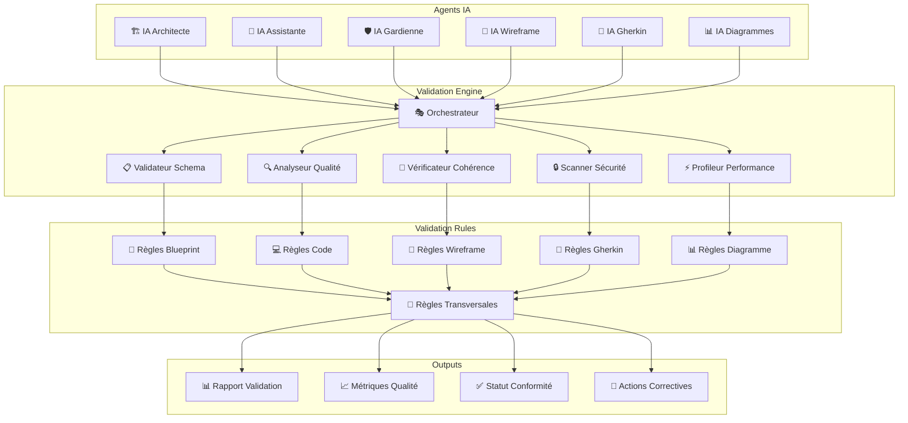

# 🛡️ Outils de Validation AIDEX

**Système de validation automatisé pour la méthodologie AIDEX**

---

## 🎯 Vue d'Ensemble

Les outils de validation AIDEX garantissent la conformité, la qualité et la cohérence de tous les artefacts produits par les agents IA. Ils constituent le système nerveux de la validation continue intégrée (Pilier 5).

## 🏗️ Architecture de Validation



## 🎭 Orchestrateur de Validation

### Configuration
```yaml
# validation-orchestrator.yaml
validation_orchestrator:
  version: "1.0.0"
  description: "Orchestrateur central de validation AIDEX"
  
  execution_modes:
    real_time:
      enabled: true
      trigger: "on_artifact_change"
      timeout: "30s"
      parallel_execution: true
    
    batch:
      enabled: true
      schedule: "0 */4 * * *"  # Toutes les 4 heures
      timeout: "10m"
      comprehensive: true
    
    on_demand:
      enabled: true
      api_endpoint: "/api/v1/validate"
      authentication: "bearer_token"
  
  validation_pipeline:
    stages:
      - name: "schema_validation"
        parallel: false
        required: true
        timeout: "10s"
      
      - name: "quality_analysis"
        parallel: true
        required: true
        timeout: "60s"
      
      - name: "consistency_check"
        parallel: true
        required: true
        timeout: "45s"
      
      - name: "security_scan"
        parallel: true
        required: false
        timeout: "120s"
      
      - name: "performance_profile"
        parallel: true
        required: false
        timeout: "90s"
      
      - name: "cross_validation"
        parallel: false
        required: true
        timeout: "30s"
  
  failure_handling:
    strategy: "fail_fast"
    retry_attempts: 3
    retry_delay: "5s"
    escalation:
      - level: "warning"
        threshold: 1
        action: "log"
      - level: "error"
        threshold: 3
        action: "notify_guardian"
      - level: "critical"
        threshold: 5
        action: "block_deployment"
```

### Interface de l'Orchestrateur
```typescript
interface ValidationOrchestrator {
  // Validation complète d'un artefact
  validateArtifact(params: {
    artifactId: string;
    artifactType: 'blueprint' | 'wireframe' | 'gherkin' | 'diagram' | 'code';
    validationLevel: 'basic' | 'standard' | 'comprehensive';
    async: boolean;
  }): Promise<ValidationResult>;
  
  // Validation de cohérence entre artefacts
  validateConsistency(params: {
    artifactIds: string[];
    crossValidationRules: string[];
    includeTransitiveDependencies: boolean;
  }): Promise<ConsistencyResult>;
  
  // Validation de sprint complet
  validateSprint(params: {
    sprintId: string;
    includeAllArtifacts: boolean;
    generateReport: boolean;
  }): Promise<SprintValidationResult>;
  
  // Configuration des règles de validation
  configureValidationRules(params: {
    ruleSet: string;
    rules: ValidationRule[];
    scope: 'global' | 'project' | 'sprint';
  }): Promise<ConfigurationResult>;
}
```

## 📋 Validateur de Schéma

### Règles de Schéma Blueprint
```yaml
# blueprint-schema-rules.yaml
blueprint_schema:
  version: "1.0.0"
  description: "Règles de validation pour les Sprint Blueprints"
  
  required_sections:
    - "metadata"
    - "objectives"
    - "architecture"
    - "user_stories"
    - "technical_constraints"
    - "acceptance_criteria"
    - "dependencies"
  
  metadata_rules:
    sprint_id:
      type: "string"
      pattern: "^SPRINT-[0-9]{4}-[0-9]{2}$"
      required: true
    
    version:
      type: "string"
      pattern: "^[0-9]+\.[0-9]+\.[0-9]+$"
      required: true
    
    created_date:
      type: "string"
      format: "date-time"
      required: true
    
    agents_involved:
      type: "array"
      items:
        type: "string"
        enum: ["architect", "assistant", "guardian", "wireframe", "gherkin", "diagrams"]
      minItems: 1
      required: true
  
  architecture_rules:
    domain_model:
      required: true
      structure:
        aggregates:
          type: "array"
          minItems: 1
          items:
            properties:
              name:
                type: "string"
                pattern: "^[A-Z][a-zA-Z0-9]*$"
              root_entity:
                type: "string"
                required: true
              value_objects:
                type: "array"
              domain_events:
                type: "array"
    
    bounded_contexts:
      required: true
      type: "array"
      minItems: 1
      items:
        properties:
          name:
            type: "string"
            pattern: "^[A-Z][a-zA-Z0-9]*Context$"
          responsibilities:
            type: "array"
            minItems: 1
          interfaces:
            type: "array"
  
  user_stories_rules:
    format:
      pattern: "^As a .+ I want .+ So that .+$"
      required: true
    
    acceptance_criteria:
      required: true
      minItems: 1
      format: "gherkin"
    
    story_points:
      type: "integer"
      minimum: 1
      maximum: 13
      required: true
    
    dependencies:
      type: "array"
      items:
        type: "string"
        pattern: "^(STORY|EPIC|TASK)-[0-9]+$"
```

### Validateur de Schéma TypeScript
```typescript
class SchemaValidator {
  private schemas: Map<string, JSONSchema> = new Map();
  private ajv: Ajv;
  
  constructor() {
    this.ajv = new Ajv({
      allErrors: true,
      verbose: true,
      strict: true
    });
    
    this.loadSchemas();
  }
  
  async validateBlueprint(blueprint: any): Promise<ValidationResult> {
    const schema = this.schemas.get('blueprint');
    const valid = this.ajv.validate(schema, blueprint);
    
    if (!valid) {
      return {
        valid: false,
        errors: this.ajv.errors?.map(error => ({
          path: error.instancePath,
          message: error.message,
          value: error.data,
          severity: this.determineSeverity(error)
        })) || [],
        warnings: [],
        score: this.calculateScore(this.ajv.errors || [])
      };
    }
    
    // Validation sémantique supplémentaire
    const semanticValidation = await this.validateBlueprintSemantics(blueprint);
    
    return {
      valid: true,
      errors: [],
      warnings: semanticValidation.warnings,
      score: semanticValidation.score,
      metadata: {
        validatedAt: new Date().toISOString(),
        validator: 'schema_validator',
        version: '1.0.0'
      }
    };
  }
  
  async validateWireframe(wireframeSvg: string): Promise<ValidationResult> {
    const parser = new DOMParser();
    const doc = parser.parseFromString(wireframeSvg, 'image/svg+xml');
    
    const errors: ValidationError[] = [];
    const warnings: ValidationWarning[] = [];
    
    // Validation de la structure SVG
    if (!doc.querySelector('svg')) {
      errors.push({
        path: 'root',
        message: 'Document SVG invalide',
        severity: 'error'
      });
    }
    
    // Validation des métadonnées AIDEX
    const metadata = doc.querySelector('metadata[data-aidex]');
    if (!metadata) {
      errors.push({
        path: 'metadata',
        message: 'Métadonnées AIDEX manquantes',
        severity: 'error'
      });
    }
    
    // Validation des IDs et classes
    const elements = doc.querySelectorAll('[id], [class]');
    elements.forEach((element, index) => {
      const id = element.getAttribute('id');
      const className = element.getAttribute('class');
      
      if (id && !/^[a-z][a-zA-Z0-9-]*$/.test(id)) {
        warnings.push({
          path: `elements[${index}].id`,
          message: `ID non conforme aux conventions: ${id}`,
          severity: 'warning'
        });
      }
      
      if (className && !/^[a-z][a-zA-Z0-9-]*( [a-z][a-zA-Z0-9-]*)*$/.test(className)) {
        warnings.push({
          path: `elements[${index}].class`,
          message: `Classe CSS non conforme: ${className}`,
          severity: 'warning'
        });
      }
    });
    
    // Validation de l'accessibilité
    const accessibilityValidation = this.validateAccessibility(doc);
    warnings.push(...accessibilityValidation.warnings);
    
    return {
      valid: errors.length === 0,
      errors,
      warnings,
      score: this.calculateWireframeScore(errors, warnings),
      metadata: {
        validatedAt: new Date().toISOString(),
        validator: 'wireframe_validator',
        elementsCount: elements.length
      }
    };
  }
  
  async validateGherkinScenario(gherkinContent: string): Promise<ValidationResult> {
    const errors: ValidationError[] = [];
    const warnings: ValidationWarning[] = [];
    
    // Parse du contenu Gherkin
    const lines = gherkinContent.split('\n');
    let currentSection = '';
    let hasFeature = false;
    let hasScenario = false;
    
    lines.forEach((line, index) => {
      const trimmedLine = line.trim();
      
      if (trimmedLine.startsWith('Feature:')) {
        hasFeature = true;
        currentSection = 'feature';
      } else if (trimmedLine.startsWith('Scenario:')) {
        hasScenario = true;
        currentSection = 'scenario';
      } else if (trimmedLine.startsWith('Given ')) {
        currentSection = 'given';
      } else if (trimmedLine.startsWith('When ')) {
        currentSection = 'when';
      } else if (trimmedLine.startsWith('Then ')) {
        currentSection = 'then';
      }
      
      // Validation des métadonnées AIDEX
      if (trimmedLine.startsWith('@aidex:')) {
        const metadata = trimmedLine.substring(7);
        if (!this.validateGherkinMetadata(metadata)) {
          warnings.push({
            path: `line[${index + 1}]`,
            message: `Métadonnée AIDEX invalide: ${metadata}`,
            severity: 'warning'
          });
        }
      }
    });
    
    if (!hasFeature) {
      errors.push({
        path: 'structure',
        message: 'Déclaration Feature manquante',
        severity: 'error'
      });
    }
    
    if (!hasScenario) {
      errors.push({
        path: 'structure',
        message: 'Au moins un Scenario est requis',
        severity: 'error'
      });
    }
    
    return {
      valid: errors.length === 0,
      errors,
      warnings,
      score: this.calculateGherkinScore(errors, warnings),
      metadata: {
        validatedAt: new Date().toISOString(),
        validator: 'gherkin_validator',
        linesCount: lines.length
      }
    };
  }
  
  private validateAccessibility(doc: Document): { warnings: ValidationWarning[] } {
    const warnings: ValidationWarning[] = [];
    
    // Vérification des attributs alt pour les images
    const images = doc.querySelectorAll('image');
    images.forEach((img, index) => {
      if (!img.getAttribute('alt') && !img.getAttribute('aria-label')) {
        warnings.push({
          path: `images[${index}]`,
          message: 'Attribut alt ou aria-label manquant pour l\'image',
          severity: 'warning'
        });
      }
    });
    
    // Vérification des contrastes de couleur
    const textElements = doc.querySelectorAll('text');
    textElements.forEach((text, index) => {
      const fill = text.getAttribute('fill');
      const parentFill = text.parentElement?.getAttribute('fill');
      
      if (fill && this.hasLowContrast(fill, parentFill || '#ffffff')) {
        warnings.push({
          path: `text[${index}]`,
          message: 'Contraste de couleur insuffisant',
          severity: 'warning'
        });
      }
    });
    
    return { warnings };
  }
  
  private hasLowContrast(foreground: string, background: string): boolean {
    // Implémentation simplifiée du calcul de contraste WCAG
    // Dans un vrai projet, utiliser une bibliothèque comme 'color-contrast'
    return false; // Placeholder
  }
  
  private calculateScore(errors: any[]): number {
    const errorWeight = 10;
    const maxScore = 100;
    
    const deduction = errors.length * errorWeight;
    return Math.max(0, maxScore - deduction);
  }
  
  private calculateWireframeScore(errors: ValidationError[], warnings: ValidationWarning[]): number {
    const errorWeight = 15;
    const warningWeight = 5;
    const maxScore = 100;
    
    const deduction = (errors.length * errorWeight) + (warnings.length * warningWeight);
    return Math.max(0, maxScore - deduction);
  }
  
  private calculateGherkinScore(errors: ValidationError[], warnings: ValidationWarning[]): number {
    const errorWeight = 20;
    const warningWeight = 3;
    const maxScore = 100;
    
    const deduction = (errors.length * errorWeight) + (warnings.length * warningWeight);
    return Math.max(0, maxScore - deduction);
  }
}
```

## 🔍 Analyseur de Qualité

### Métriques de Qualité Code
```yaml
# code-quality-metrics.yaml
code_quality_metrics:
  version: "1.0.0"
  description: "Métriques de qualité pour le code AIDEX"
  
  complexity_metrics:
    cyclomatic_complexity:
      threshold: 10
      weight: 0.3
      description: "Complexité cyclomatique maximale par méthode"
    
    cognitive_complexity:
      threshold: 15
      weight: 0.2
      description: "Complexité cognitive maximale par méthode"
    
    nesting_depth:
      threshold: 4
      weight: 0.1
      description: "Profondeur d'imbrication maximale"
  
  maintainability_metrics:
    lines_of_code:
      threshold: 200
      weight: 0.1
      description: "Nombre de lignes par classe/module"
    
    method_length:
      threshold: 30
      weight: 0.15
      description: "Nombre de lignes par méthode"
    
    parameter_count:
      threshold: 5
      weight: 0.1
      description: "Nombre de paramètres par méthode"
    
    duplication_ratio:
      threshold: 0.05
      weight: 0.25
      description: "Ratio de duplication de code"
  
  architecture_metrics:
    coupling:
      afferent_coupling:
        threshold: 10
        weight: 0.15
      efferent_coupling:
        threshold: 8
        weight: 0.15
    
    cohesion:
      lcom4:
        threshold: 2
        weight: 0.2
        description: "Lack of Cohesion of Methods"
    
    abstraction:
      abstractness:
        min_threshold: 0.2
        max_threshold: 0.8
        weight: 0.1
  
  ddd_compliance:
    aggregate_size:
      threshold: 7
      weight: 0.2
      description: "Nombre d'entités par agrégat"
    
    bounded_context_isolation:
      dependency_ratio:
        threshold: 0.1
        weight: 0.3
        description: "Ratio de dépendances externes"
    
    domain_purity:
      infrastructure_dependencies:
        threshold: 0
        weight: 0.4
        description: "Dépendances infrastructure dans le domaine"
    
    event_consistency:
      event_coverage:
        threshold: 0.8
        weight: 0.1
        description: "Couverture des événements domaine"
```

### Analyseur de Qualité TypeScript
```typescript
class QualityAnalyzer {
  private metrics: QualityMetrics;
  private rules: QualityRules;
  
  constructor(config: QualityConfig) {
    this.metrics = new QualityMetrics(config.metrics);
    this.rules = new QualityRules(config.rules);
  }
  
  async analyzeCode(codebase: Codebase): Promise<QualityAnalysisResult> {
    const results: QualityAnalysisResult = {
      overall_score: 0,
      category_scores: {},
      violations: [],
      recommendations: [],
      trends: []
    };
    
    // Analyse de la complexité
    const complexityAnalysis = await this.analyzeComplexity(codebase);
    results.category_scores.complexity = complexityAnalysis.score;
    results.violations.push(...complexityAnalysis.violations);
    
    // Analyse de la maintenabilité
    const maintainabilityAnalysis = await this.analyzeMaintainability(codebase);
    results.category_scores.maintainability = maintainabilityAnalysis.score;
    results.violations.push(...maintainabilityAnalysis.violations);
    
    // Analyse de l'architecture
    const architectureAnalysis = await this.analyzeArchitecture(codebase);
    results.category_scores.architecture = architectureAnalysis.score;
    results.violations.push(...architectureAnalysis.violations);
    
    // Analyse de la conformité DDD
    const dddAnalysis = await this.analyzeDDDCompliance(codebase);
    results.category_scores.ddd_compliance = dddAnalysis.score;
    results.violations.push(...dddAnalysis.violations);
    
    // Calcul du score global
    results.overall_score = this.calculateOverallScore(results.category_scores);
    
    // Génération des recommandations
    results.recommendations = this.generateRecommendations(results.violations);
    
    return results;
  }
  
  private async analyzeComplexity(codebase: Codebase): Promise<CategoryAnalysisResult> {
    const violations: QualityViolation[] = [];
    let totalScore = 100;
    
    for (const file of codebase.files) {
      const ast = this.parseFile(file);
      
      // Analyse de la complexité cyclomatique
      const methods = this.extractMethods(ast);
      for (const method of methods) {
        const complexity = this.calculateCyclomaticComplexity(method);
        
        if (complexity > this.rules.complexity.cyclomatic_threshold) {
          violations.push({
            type: 'cyclomatic_complexity',
            severity: 'warning',
            file: file.path,
            line: method.line,
            message: `Complexité cyclomatique trop élevée: ${complexity}`,
            actual_value: complexity,
            expected_value: this.rules.complexity.cyclomatic_threshold,
            suggestion: 'Diviser la méthode en plusieurs méthodes plus simples'
          });
          
          totalScore -= 5;
        }
      }
      
      // Analyse de la profondeur d'imbrication
      const maxNesting = this.calculateMaxNestingDepth(ast);
      if (maxNesting > this.rules.complexity.nesting_threshold) {
        violations.push({
          type: 'nesting_depth',
          severity: 'warning',
          file: file.path,
          message: `Profondeur d'imbrication excessive: ${maxNesting}`,
          actual_value: maxNesting,
          expected_value: this.rules.complexity.nesting_threshold,
          suggestion: 'Extraire des méthodes pour réduire l\'imbrication'
        });
        
        totalScore -= 3;
      }
    }
    
    return {
      score: Math.max(0, totalScore),
      violations
    };
  }
  
  private async analyzeDDDCompliance(codebase: Codebase): Promise<CategoryAnalysisResult> {
    const violations: QualityViolation[] = [];
    let totalScore = 100;
    
    // Analyse des agrégats
    const aggregates = this.extractAggregates(codebase);
    for (const aggregate of aggregates) {
      // Vérification de la taille de l'agrégat
      if (aggregate.entities.length > this.rules.ddd.max_aggregate_size) {
        violations.push({
          type: 'aggregate_size',
          severity: 'error',
          file: aggregate.file,
          message: `Agrégat trop volumineux: ${aggregate.entities.length} entités`,
          actual_value: aggregate.entities.length,
          expected_value: this.rules.ddd.max_aggregate_size,
          suggestion: 'Diviser l\'agrégat en plusieurs agrégats plus petits'
        });
        
        totalScore -= 15;
      }
      
      // Vérification de la pureté du domaine
      const infrastructureDeps = this.findInfrastructureDependencies(aggregate);
      if (infrastructureDeps.length > 0) {
        violations.push({
          type: 'domain_purity',
          severity: 'error',
          file: aggregate.file,
          message: `Dépendances infrastructure dans le domaine: ${infrastructureDeps.join(', ')}`,
          actual_value: infrastructureDeps.length,
          expected_value: 0,
          suggestion: 'Utiliser l\'inversion de dépendance pour isoler le domaine'
        });
        
        totalScore -= 20;
      }
    }
    
    // Analyse des contextes bornés
    const boundedContexts = this.extractBoundedContexts(codebase);
    for (const context of boundedContexts) {
      const externalDeps = this.findExternalDependencies(context);
      const dependencyRatio = externalDeps.length / context.totalDependencies;
      
      if (dependencyRatio > this.rules.ddd.max_external_dependency_ratio) {
        violations.push({
          type: 'bounded_context_isolation',
          severity: 'warning',
          file: context.file,
          message: `Trop de dépendances externes: ${(dependencyRatio * 100).toFixed(1)}%`,
          actual_value: dependencyRatio,
          expected_value: this.rules.ddd.max_external_dependency_ratio,
          suggestion: 'Réduire le couplage avec les autres contextes'
        });
        
        totalScore -= 10;
      }
    }
    
    return {
      score: Math.max(0, totalScore),
      violations
    };
  }
  
  private generateRecommendations(violations: QualityViolation[]): QualityRecommendation[] {
    const recommendations: QualityRecommendation[] = [];
    
    // Grouper les violations par type
    const violationsByType = violations.reduce((acc, violation) => {
      if (!acc[violation.type]) {
        acc[violation.type] = [];
      }
      acc[violation.type].push(violation);
      return acc;
    }, {} as Record<string, QualityViolation[]>);
    
    // Générer des recommandations basées sur les patterns
    for (const [type, typeViolations] of Object.entries(violationsByType)) {
      if (typeViolations.length >= 3) {
        recommendations.push({
          priority: 'high',
          category: this.getViolationCategory(type),
          title: `Problème récurrent: ${type}`,
          description: `${typeViolations.length} violations de type ${type} détectées`,
          action_items: [
            `Revoir les pratiques de développement pour ${type}`,
            'Mettre en place des règles de linting spécifiques',
            'Organiser une session de formation sur les bonnes pratiques'
          ],
          estimated_effort: 'medium',
          impact: 'high'
        });
      }
    }
    
    return recommendations;
  }
}
```

## 🔗 Vérificateur de Cohérence

### Règles de Cohérence Transversale
```yaml
# consistency-rules.yaml
consistency_rules:
  version: "1.0.0"
  description: "Règles de cohérence entre artefacts AIDEX"
  
  blueprint_wireframe_consistency:
    user_stories_coverage:
      rule: "Chaque user story du blueprint doit avoir un wireframe correspondant"
      severity: "error"
      auto_fix: false
    
    ui_components_mapping:
      rule: "Les composants UI du wireframe doivent correspondre aux entités du domaine"
      severity: "warning"
      tolerance: 0.1
    
    navigation_flow:
      rule: "Le flux de navigation doit respecter les cas d'usage définis"
      severity: "error"
      auto_fix: false
  
  blueprint_gherkin_consistency:
    acceptance_criteria_coverage:
      rule: "Chaque critère d'acceptation doit avoir un scénario Gherkin"
      severity: "error"
      auto_fix: true
    
    domain_events_coverage:
      rule: "Les événements domaine doivent être testés dans les scénarios"
      severity: "warning"
      coverage_threshold: 0.8
    
    business_rules_validation:
      rule: "Les règles métier doivent être validées par des scénarios"
      severity: "error"
      auto_fix: false
  
  wireframe_gherkin_consistency:
    ui_interaction_coverage:
      rule: "Chaque interaction UI doit être testée dans les scénarios"
      severity: "warning"
      coverage_threshold: 0.9
    
    form_validation_scenarios:
      rule: "Chaque formulaire doit avoir des scénarios de validation"
      severity: "error"
      auto_fix: true
  
  code_blueprint_consistency:
    architecture_compliance:
      rule: "Le code doit respecter l'architecture définie dans le blueprint"
      severity: "error"
      auto_fix: false
    
    aggregate_implementation:
      rule: "Chaque agrégat du blueprint doit être implémenté"
      severity: "error"
      coverage_threshold: 1.0
    
    domain_events_implementation:
      rule: "Les événements domaine doivent être implémentés"
      severity: "warning"
      coverage_threshold: 0.9
  
  diagram_consistency:
    architecture_diagram_sync:
      rule: "Les diagrammes d'architecture doivent être synchronisés avec le code"
      severity: "warning"
      auto_sync: true
    
    sequence_diagram_accuracy:
      rule: "Les diagrammes de séquence doivent refléter les interactions réelles"
      severity: "warning"
      tolerance: 0.1
```

### Vérificateur de Cohérence TypeScript
```typescript
class ConsistencyChecker {
  private rules: ConsistencyRules;
  private artifactRepository: ArtifactRepository;
  
  constructor(rules: ConsistencyRules, repository: ArtifactRepository) {
    this.rules = rules;
    this.artifactRepository = repository;
  }
  
  async checkConsistency(artifactIds: string[]): Promise<ConsistencyResult> {
    const artifacts = await this.loadArtifacts(artifactIds);
    const inconsistencies: Inconsistency[] = [];
    const suggestions: ConsistencySuggestion[] = [];
    
    // Vérification Blueprint <-> Wireframe
    if (this.hasArtifactTypes(artifacts, ['blueprint', 'wireframe'])) {
      const blueprintWireframeCheck = await this.checkBlueprintWireframeConsistency(
        artifacts.blueprint,
        artifacts.wireframe
      );
      inconsistencies.push(...blueprintWireframeCheck.inconsistencies);
      suggestions.push(...blueprintWireframeCheck.suggestions);
    }
    
    // Vérification Blueprint <-> Gherkin
    if (this.hasArtifactTypes(artifacts, ['blueprint', 'gherkin'])) {
      const blueprintGherkinCheck = await this.checkBlueprintGherkinConsistency(
        artifacts.blueprint,
        artifacts.gherkin
      );
      inconsistencies.push(...blueprintGherkinCheck.inconsistencies);
      suggestions.push(...blueprintGherkinCheck.suggestions);
    }
    
    // Vérification Code <-> Blueprint
    if (this.hasArtifactTypes(artifacts, ['code', 'blueprint'])) {
      const codeBlueprintCheck = await this.checkCodeBlueprintConsistency(
        artifacts.code,
        artifacts.blueprint
      );
      inconsistencies.push(...codeBlueprintCheck.inconsistencies);
      suggestions.push(...codeBlueprintCheck.suggestions);
    }
    
    // Vérification transversale
    const crossCheck = await this.checkCrossArtifactConsistency(artifacts);
    inconsistencies.push(...crossCheck.inconsistencies);
    suggestions.push(...crossCheck.suggestions);
    
    return {
      consistent: inconsistencies.filter(i => i.severity === 'error').length === 0,
      inconsistencies,
      suggestions,
      score: this.calculateConsistencyScore(inconsistencies),
      metadata: {
        checkedAt: new Date().toISOString(),
        artifactCount: artifactIds.length,
        rulesApplied: this.getAppliedRules(artifacts)
      }
    };
  }
  
  private async checkBlueprintWireframeConsistency(
    blueprint: BlueprintArtifact,
    wireframe: WireframeArtifact
  ): Promise<ConsistencyCheckResult> {
    const inconsistencies: Inconsistency[] = [];
    const suggestions: ConsistencySuggestion[] = [];
    
    // Vérification de la couverture des user stories
    const userStories = blueprint.user_stories;
    const wireframeScreens = this.extractScreensFromWireframe(wireframe);
    
    for (const story of userStories) {
      const hasCorrespondingScreen = wireframeScreens.some(screen => 
        this.isStoryImplementedInScreen(story, screen)
      );
      
      if (!hasCorrespondingScreen) {
        inconsistencies.push({
          type: 'missing_wireframe_coverage',
          severity: 'error',
          source_artifact: blueprint.id,
          target_artifact: wireframe.id,
          message: `User story "${story.title}" n'a pas de wireframe correspondant`,
          details: {
            story_id: story.id,
            story_title: story.title
          }
        });
        
        suggestions.push({
          type: 'create_wireframe_screen',
          priority: 'high',
          description: `Créer un écran wireframe pour la user story "${story.title}"`,
          estimated_effort: 'medium',
          auto_fixable: false
        });
      }
    }
    
    // Vérification du mapping des composants UI
    const domainEntities = blueprint.architecture.domain_model.aggregates
      .flatMap(agg => agg.entities);
    const uiComponents = this.extractUIComponentsFromWireframe(wireframe);
    
    const unmappedComponents = uiComponents.filter(component => 
      !domainEntities.some(entity => 
        this.isComponentMappedToEntity(component, entity)
      )
    );
    
    if (unmappedComponents.length > 0) {
      inconsistencies.push({
        type: 'unmapped_ui_components',
        severity: 'warning',
        source_artifact: wireframe.id,
        target_artifact: blueprint.id,
        message: `${unmappedComponents.length} composants UI sans mapping domaine`,
        details: {
          unmapped_components: unmappedComponents.map(c => c.name)
        }
      });
    }
    
    return { inconsistencies, suggestions };
  }
  
  private async checkBlueprintGherkinConsistency(
    blueprint: BlueprintArtifact,
    gherkin: GherkinArtifact
  ): Promise<ConsistencyCheckResult> {
    const inconsistencies: Inconsistency[] = [];
    const suggestions: ConsistencySuggestion[] = [];
    
    // Vérification de la couverture des critères d'acceptation
    const acceptanceCriteria = blueprint.user_stories
      .flatMap(story => story.acceptance_criteria);
    const gherkinScenarios = gherkin.scenarios;
    
    for (const criterion of acceptanceCriteria) {
      const hasCorrespondingScenario = gherkinScenarios.some(scenario => 
        this.isCriterionCoveredByScenario(criterion, scenario)
      );
      
      if (!hasCorrespondingScenario) {
        inconsistencies.push({
          type: 'missing_scenario_coverage',
          severity: 'error',
          source_artifact: blueprint.id,
          target_artifact: gherkin.id,
          message: `Critère d'acceptation sans scénario: "${criterion.description}"`,
          details: {
            criterion_id: criterion.id,
            story_id: criterion.story_id
          }
        });
        
        if (this.rules.blueprint_gherkin_consistency.acceptance_criteria_coverage.auto_fix) {
          suggestions.push({
            type: 'generate_scenario',
            priority: 'high',
            description: `Générer un scénario pour le critère "${criterion.description}"`,
            estimated_effort: 'low',
            auto_fixable: true,
            auto_fix_action: {
              agent: 'gherkin',
              action: 'generate_scenario_from_criterion',
              parameters: {
                criterion_id: criterion.id,
                template: 'standard'
              }
            }
          });
        }
      }
    }
    
    // Vérification de la couverture des événements domaine
    const domainEvents = blueprint.architecture.domain_model.aggregates
      .flatMap(agg => agg.domain_events);
    
    const eventsCoverage = domainEvents.map(event => {
      const coveringScenarios = gherkinScenarios.filter(scenario => 
        this.isEventTestedInScenario(event, scenario)
      );
      
      return {
        event,
        coverage: coveringScenarios.length > 0,
        scenarios: coveringScenarios
      };
    });
    
    const uncoveredEvents = eventsCoverage.filter(ec => !ec.coverage);
    const coverageRatio = (eventsCoverage.length - uncoveredEvents.length) / eventsCoverage.length;
    
    if (coverageRatio < this.rules.blueprint_gherkin_consistency.domain_events_coverage.coverage_threshold) {
      inconsistencies.push({
        type: 'insufficient_event_coverage',
        severity: 'warning',
        source_artifact: blueprint.id,
        target_artifact: gherkin.id,
        message: `Couverture des événements domaine insuffisante: ${(coverageRatio * 100).toFixed(1)}%`,
        details: {
          coverage_ratio: coverageRatio,
          uncovered_events: uncoveredEvents.map(ue => ue.event.name)
        }
      });
    }
    
    return { inconsistencies, suggestions };
  }
  
  private calculateConsistencyScore(inconsistencies: Inconsistency[]): number {
    const errorWeight = 20;
    const warningWeight = 5;
    const maxScore = 100;
    
    const errors = inconsistencies.filter(i => i.severity === 'error').length;
    const warnings = inconsistencies.filter(i => i.severity === 'warning').length;
    
    const deduction = (errors * errorWeight) + (warnings * warningWeight);
    return Math.max(0, maxScore - deduction);
  }
}
```

## 📊 Rapports de Validation

### Template de Rapport
```typescript
interface ValidationReport {
  metadata: {
    report_id: string;
    generated_at: string;
    sprint_id: string;
    validation_scope: 'artifact' | 'sprint' | 'project';
    validator_version: string;
  };
  
  summary: {
    overall_score: number;
    total_artifacts: number;
    validated_artifacts: number;
    passed_artifacts: number;
    failed_artifacts: number;
    warnings_count: number;
    errors_count: number;
  };
  
  category_scores: {
    schema_validation: number;
    quality_analysis: number;
    consistency_check: number;
    security_scan: number;
    performance_profile: number;
  };
  
  artifact_results: ArtifactValidationResult[];
  
  violations: {
    critical: ValidationViolation[];
    major: ValidationViolation[];
    minor: ValidationViolation[];
  };
  
  recommendations: {
    immediate_actions: ActionItem[];
    improvement_suggestions: ImprovementSuggestion[];
    best_practices: BestPractice[];
  };
  
  trends: {
    quality_evolution: QualityTrend[];
    violation_patterns: ViolationPattern[];
    improvement_areas: ImprovementArea[];
  };
  
  compliance_status: {
    aidex_methodology: ComplianceStatus;
    ddd_principles: ComplianceStatus;
    solid_principles: ComplianceStatus;
    security_standards: ComplianceStatus;
  };
}
```

### Générateur de Rapports
```typescript
class ValidationReportGenerator {
  async generateReport(
    validationResults: ValidationResult[],
    scope: ValidationScope
  ): Promise<ValidationReport> {
    const report: ValidationReport = {
      metadata: {
        report_id: this.generateReportId(),
        generated_at: new Date().toISOString(),
        sprint_id: scope.sprint_id,
        validation_scope: scope.type,
        validator_version: '1.0.0'
      },
      summary: this.generateSummary(validationResults),
      category_scores: this.calculateCategoryScores(validationResults),
      artifact_results: this.processArtifactResults(validationResults),
      violations: this.categorizeViolations(validationResults),
      recommendations: this.generateRecommendations(validationResults),
      trends: await this.analyzeTrends(validationResults, scope),
      compliance_status: this.assessCompliance(validationResults)
    };
    
    return report;
  }
  
  async exportReport(
    report: ValidationReport,
    format: 'json' | 'html' | 'pdf'
  ): Promise<string> {
    switch (format) {
      case 'json':
        return JSON.stringify(report, null, 2);
      
      case 'html':
        return this.generateHTMLReport(report);
      
      case 'pdf':
        return this.generatePDFReport(report);
      
      default:
        throw new Error(`Format non supporté: ${format}`);
    }
  }
  
  private generateHTMLReport(report: ValidationReport): string {
    return `
<!DOCTYPE html>
<html lang="fr">
<head>
    <meta charset="UTF-8">
    <meta name="viewport" content="width=device-width, initial-scale=1.0">
    <title>Rapport de Validation AIDEX - ${report.metadata.sprint_id}</title>
    <style>
        body { font-family: 'Segoe UI', Tahoma, Geneva, Verdana, sans-serif; margin: 0; padding: 20px; background: #f5f5f5; }
        .container { max-width: 1200px; margin: 0 auto; background: white; padding: 30px; border-radius: 8px; box-shadow: 0 2px 10px rgba(0,0,0,0.1); }
        .header { border-bottom: 3px solid #2196F3; padding-bottom: 20px; margin-bottom: 30px; }
        .score-card { display: inline-block; background: linear-gradient(135deg, #667eea 0%, #764ba2 100%); color: white; padding: 20px; border-radius: 8px; margin: 10px; text-align: center; }
        .violation { padding: 10px; margin: 5px 0; border-left: 4px solid; border-radius: 4px; }
        .critical { border-color: #f44336; background: #ffebee; }
        .major { border-color: #ff9800; background: #fff3e0; }
        .minor { border-color: #ffeb3b; background: #fffde7; }
        .chart { width: 100%; height: 300px; margin: 20px 0; }
    </style>
</head>
<body>
    <div class="container">
        <div class="header">
            <h1>🛡️ Rapport de Validation AIDEX</h1>
            <p><strong>Sprint:</strong> ${report.metadata.sprint_id} | <strong>Généré le:</strong> ${new Date(report.metadata.generated_at).toLocaleString('fr-FR')}</p>
        </div>
        
        <div class="summary">
            <h2>📊 Résumé Exécutif</h2>
            <div class="score-card">
                <h3>Score Global</h3>
                <div style="font-size: 2em; font-weight: bold;">${report.summary.overall_score}/100</div>
            </div>
            <div class="score-card">
                <h3>Artefacts Validés</h3>
                <div style="font-size: 2em; font-weight: bold;">${report.summary.validated_artifacts}/${report.summary.total_artifacts}</div>
            </div>
            <div class="score-card">
                <h3>Taux de Réussite</h3>
                <div style="font-size: 2em; font-weight: bold;">${Math.round((report.summary.passed_artifacts / report.summary.total_artifacts) * 100)}%</div>
            </div>
        </div>
        
        <div class="violations">
            <h2>⚠️ Violations Détectées</h2>
            ${report.violations.critical.map(v => `
                <div class="violation critical">
                    <strong>CRITIQUE:</strong> ${v.message}
                    <br><small>Fichier: ${v.file} | Ligne: ${v.line}</small>
                </div>
            `).join('')}
            ${report.violations.major.map(v => `
                <div class="violation major">
                    <strong>MAJEURE:</strong> ${v.message}
                    <br><small>Fichier: ${v.file} | Ligne: ${v.line}</small>
                </div>
            `).join('')}
        </div>
        
        <div class="recommendations">
            <h2>💡 Recommandations</h2>
            <h3>Actions Immédiates</h3>
            <ul>
                ${report.recommendations.immediate_actions.map(action => `
                    <li><strong>${action.title}:</strong> ${action.description}</li>
                `).join('')}
            </ul>
        </div>
        
        <div class="compliance">
            <h2>✅ Statut de Conformité</h2>
            <table style="width: 100%; border-collapse: collapse;">
                <tr style="background: #f5f5f5;">
                    <th style="padding: 10px; text-align: left; border: 1px solid #ddd;">Standard</th>
                    <th style="padding: 10px; text-align: left; border: 1px solid #ddd;">Statut</th>
                    <th style="padding: 10px; text-align: left; border: 1px solid #ddd;">Score</th>
                </tr>
                <tr>
                    <td style="padding: 10px; border: 1px solid #ddd;">Méthodologie AIDEX</td>
                    <td style="padding: 10px; border: 1px solid #ddd;">${report.compliance_status.aidex_methodology.status}</td>
                    <td style="padding: 10px; border: 1px solid #ddd;">${report.compliance_status.aidex_methodology.score}/100</td>
                </tr>
                <tr>
                    <td style="padding: 10px; border: 1px solid #ddd;">Principes DDD</td>
                    <td style="padding: 10px; border: 1px solid #ddd;">${report.compliance_status.ddd_principles.status}</td>
                    <td style="padding: 10px; border: 1px solid #ddd;">${report.compliance_status.ddd_principles.score}/100</td>
                </tr>
                <tr>
                    <td style="padding: 10px; border: 1px solid #ddd;">Principes SOLID</td>
                    <td style="padding: 10px; border: 1px solid #ddd;">${report.compliance_status.solid_principles.status}</td>
                    <td style="padding: 10px; border: 1px solid #ddd;">${report.compliance_status.solid_principles.score}/100</td>
                </tr>
            </table>
        </div>
    </div>
</body>
</html>
    `;
  }
}
```

---

**Les outils de validation AIDEX garantissent la qualité, la cohérence et la conformité de tous les artefacts, créant un écosystème de développement fiable et prévisible.** 🛡️✨